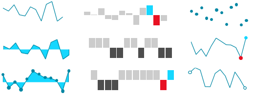

# {{ site.framework_name }} Sparkline Overview

__RadSparkline__ is a set of controls that show an information graphic. The controls are characterized by small size, excellent performance and lightweight. By definition, the sparkline is mainly used to outline trends. However, it is very flexible in terms of data points generation and can contain from just a few points, to as many as thousands of data points.

In terms of data visualization, RadSparkline is comparable to [RadCartesianChart](). However, in order to maximize performance, the spark lines do not utilize this many visual indicators. They also don't use an x or y axis, or multiple axes.





## Key Features

* __Different visualization types__: You can use the controls from the sparkline suite to visualize your data using line, points, bars, etc. Read more about this in the [Sparkline Types]() article.

* __Indicators__: The indicators are visual markers that can be used to annotate the data point positions or highlight values from the plotted data. Read more about this in the [Indicators]() article.

* __Horizontal axis__: The sparkline allows you to draw a horizontal axis that can be used to annotate the data trend. Read more about this in the [Axis]() article.

>tip Check out the [Getting Started]() help article that shows how to use the controls in a basic scenario.

> Check out the online demos at [demos.telerik.com](https://demos.telerik.com/silverlight/#BulletGraph/FirstLook)[demos.telerik.com](https://demos.telerik.com/wpf/)


## Telerik UI for WPF Support and Learning Resources

* [Telerik UI for WPF Sparklines Homepage](https://www.telerik.com/products/wpf/sparklines.aspx)
* [Get Started with the Telerik UI for WPF Sparklines]()
* [Telerik UI for WPF API Reference](https://docs.telerik.com/devtools/wpf/api/)
* [Getting Started with Telerik UI for WPF Components]()
* [Telerik UI for WPF Virtual Classroom (Training Courses for Registered Users)](https://learn.telerik.com/learn/course/external/view/elearning/16/telerik-ui-for-wpf) 
* [Telerik UI for WPF Sparklines Forums](https://www.telerik.com/forums/wpf)
* [Telerik UI for WPF Knowledge Base](https://docs.telerik.com/devtools/wpf/knowledge-base)


## See Also
 * [Data Binding]()
 * [Indicators]()
