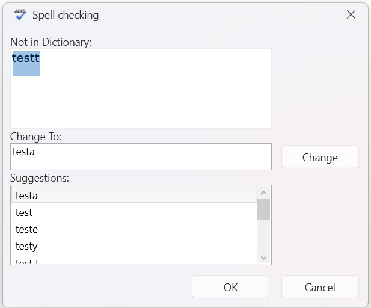

# Window Settings

The `RadSpellChecker` class exposes the `WindowSettings` property which allows you to customize the appearance of the spell checker window. It is of type `WindowSettings` and it exposes the following properties:

* `Top`&mdash;Gets or sets the top position of the window settings in the proofing module.
* `TopOffset`&mdash;Gets or sets the top offset of the proofing window settings (in pixels from the top edge of the screen).
* `Left`&mdash;Gets or sets the left position of the window settings.
* `LeftOffset`&mdash;Gets or sets the left offset of the window settings (in pixels).
* `StartupLocation`&mdash;Gets or sets the starting location for the proofing window when it is opened.
* `Theme`&mdash;Gets or sets the theme settings for the proofing window.
* `IsAddToDictionaryButtonVisible`&mdash;Gets or sets whether the __Add to Dictionary__ button is visible in the proofing window.
* `IsIgnoreAllButtonVisible`&mdash;Gets or sets whether the __Ignore All__ button is visible in the proofing window.
* `IsEditCustomDictionaryButtonVisible`&mdash;Gets or sets whether the __Edit Custom Dictionary__ button is visible in the proofing window.
* `ShowAlertWhenSpellCheckingCompleted`&mdash;Gets or sets whether an alert is shown when spell checking is completed.
* `SpellCheckingWindowsWidth`&mdash;Gets or sets the width of the spell checking windows (in pixels).
* `SpellCheckingWindowsHeight`&mdash;Gets or sets the height of the spell checking windows (in pixels).
* `SpellCheckingWindowsStyle`&mdash;Gets or sets the style settings for the spell checking windows.        

The following example showcases how to hide the __Add to Dictionary__, the __Ignore All__ and the __Edit Custom Dictionary__ buttons in the proofing window:

```C#
    public partial class MainWindow : Window
    {
        static MainWindow()
        {
            RadSpellChecker.WindowSettings.IsAddToDictionaryButtonVisible = false;
            RadSpellChecker.WindowSettings.IsIgnoreAllButtonVisible = false;
            RadSpellChecker.WindowSettings.IsEditCustomDictionaryButtonVisible = false;
        }

        public MainWindow()
        {
            InitializeComponent();
        }

        private void Button_Click(object sender, RoutedEventArgs e)
        {
            RadSpellChecker.Check(this.textBox, SpellCheckingMode.AllAtOnce);
        }
    }
```

__Proofing window with the Add to Dictionary, the Ignore All and the Edit Custom Dictionary buttons hidden:__

