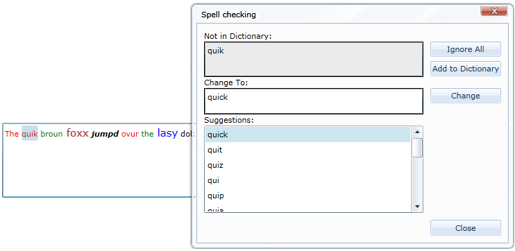

# Overview

Thank you for choosing Telerik __RadSpellChecker__!

__RadSpellChecker__ provides you with the ability to spell check different types of controls. By default (included in Telerik UI for SilverlightWPF) you can use it with TextBox, RichTextBox, RadRichTextBox, RadGridView and DataGrid.





__SpellChecking TextBox, RichTextBox and RadRichtextBox__- the Telerik __RadSpellChecker__ control allows you to check the aforementioned controls for errors:

* Checking words one by one

* Checking all words at once in a separate window

* __SpellChecking RadGridView__ and __DataGrid__ 

* __SpellChecking Custom Controls –__ you can spellcheck any type of control by just implement two interfaces. [Read more]()

* __Multi-Language support__ – you can add dictionaries in any language and use them with RadSpellChecker. [Read more]()

* __Setting Window settings__ – choose one of our themes and apply it to RadSpellChecker’s pop-up windows.

## See Also

 * [Getting Started]()

 * [Working with RadSpellChecker]()

 * [Styles and Templates]()
