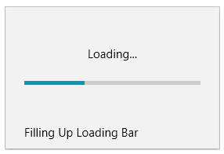

# Animations

RadSplashScreen provides two built-in animations - one for opening and one for closing of the screen. 

The default animations are fade-in and fade-out. To change them, set the __ShowAnimation__ and __HideAnimation__ static properties of the RadSplashScreenManager class.

You can set the properties to any animation object that derives from __RadAnimation__.

#### __[C#] Example 1: Replacing the default show and hide animation__
{{region radsplashscreen-features-animations-0}}	
	RadSplashScreenManager.ShowAnimation = new ScaleAnimation() { MinScale = 0.1, MaxScale = 0.9, Duration = TimeSpan.FromSeconds(2) };
	RadSplashScreenManager.HideAnimation = new ScaleAnimation() { MinScale = 0.9, MaxScale = 0.1, Duration = TimeSpan.FromSeconds(2) };
	
	if (!RadSplashScreenManager.IsSplashScreenActive)
	{
		RadSplashScreenManager.Show();
	}
{{endregion}}

## See Also  
* [Getting Started]()
* [Splash Screen Manager]()