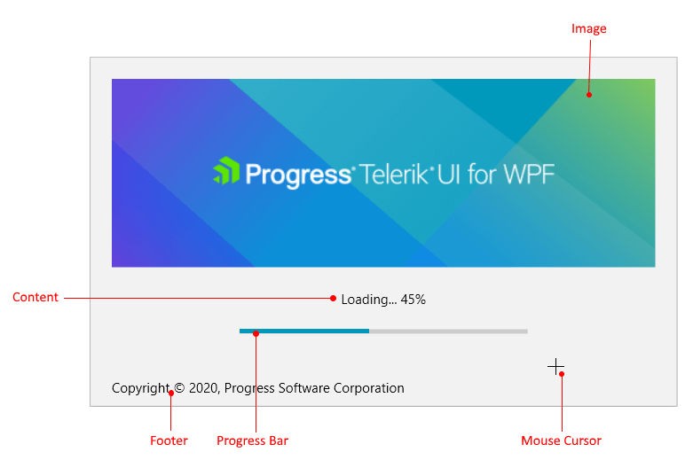

# Splash Screen Manager

RadSplashScreenManager is the class that is used to control the splash screen. The manager allows you to change the splash screen settings and show/hide it.

## Showing and Closing Splash Screen

To show the splash screen, call the __RadSplashScreenManager.Show__ method. This will open a window hosting a __RadSplashScreen__ control. You can replace the RadSplashScreen by using the alternative oveload of the Show method where you can pass a type representing the control that should be displayed. 

#### __[C#] Example 1: Showing a splash screen__
{{region radsplashscreen-features-splashscreenmanager-0}}	
	RadSplashScreenManager.Show();
{{endregion}}

To close the splash screen, call the __RadSplashScreenManager.Close__ method.

#### __[C#] Example 2: Closing a splash screen__
{{region radsplashscreen-features-splashscreenmanager-1}}	
	RadSplashScreenManager.Close();
{{endregion}}

Find more examples in the [Getting Started]() article.

## Settings

RadSplashScreenManager provides several properties that allow you to set up the splash screen.

* __StartupPosition__: A property of type Point that enables you to set the startup position of the splash screen window. If left empty, the splash screen is positioned in the center of the screen.

* __ShowAnimation__: A property of type [RadAnimation](https://docs.telerik.com/devtools/wpf/api/telerik.windows.controls.animation.radanimation) that allows you to set the animation used when the window is opening.

* __HideAnimation__: A property of type [RadAnimation](https://docs.telerik.com/devtools/wpf/api/telerik.windows.controls.animation.radanimation) that allows you to set the animation used when the window is closing.

	>tip Read more about this in the [Animations]() article.

* __IsSplashScreenActive__: A read-only property of type bool that indicates if the splash screen is active (opened). If you intend to show the splash screen a second time, check if the property is __False__ otherwise an exception is thrown. 

* __SplashScreenDataContext__: A property of type object that is set as the DataContext of the control shown in the splash screen window. You can use it to get the default __SplashScreenDataContext__ object or replace it with any other object. 

> All those settings should be set __before the Show method__ call.

#### __[C#] Example 3: Applying manager settings__
{{region radsplashscreen-features-splashscreenmanager-2}}		
	RadSplashScreenManager.StartupPosition = new Point(100, 100);
	RadSplashScreenManager.SplashScreenDataContext = "This is the new data context.";
	RadSplashScreenManager.ShowAnimation = new ScaleAnimation() { MinScale = 0.1, MaxScale = 0.9, Duration = TimeSpan.FromSeconds(2) };
	RadSplashScreenManager.HideAnimation = new ScaleAnimation() { MinScale = 0.9, MaxScale = 0.1, Duration = TimeSpan.FromSeconds(2) };
	
	if (!RadSplashScreenManager.IsSplashScreenActive)
	{
		RadSplashScreenManager.Show();
	}
{{endregion}}

## SplashScreenDataContext

The default value of the `RadSplashScreenManager.SplashScreenDataContext` property is an object of type __SplashScreenDataContext__. This model contains information about the screen's UI and it is passed as a DataContext to the __RadSplashScreen__ control. You can use it to alter the RadSplashScreen settings.

SplashScreenDataContext provides the following settings:

* __ImagePath__: Allows you to set the a string path to the image file that will be shown in the splash screen.

* __Content__: Allows you to change the string content of the splash screen. You can use this property to define a custom text like "Loading" or something similar.

* __Footer__: Allows you to define an additional text shown in the bottom part of the control.

* __MouseCursor__: Allows you to change the mouse cursor shown when you hover the splash screen.

* __IsProgressBarVisible__: Allows you to control the visibility of the progress bar element in the control.

* __IsIndeterminate__: Allows you to define whether the progress bar is in indeterminate state or it shows progress.

* __MinValue__: Allows you to set the minimum value of the progress bar.

* __MaxValue__: Allows you to set the maximum value of the progress bar.

* __ProgressValue__: Allows you to set the current value of the progress bar.

* __HorizontalContentAlignment__: Allows you to set the HorizontalAlignment of the ContentPresenter that shows the Content. Available since the __2020.1.316__ latest internal build version.

* __HorizontalFooterAlignment__: Allows you to set the HorizontalAlignment of the ContentPresenter that shows the footer. Available since the __2020.1.316__ latest internal build version.

* __ImageStretch__: Allows you to set the Stretch of the image. Available since the __2020.1.316__ latest internal build version.

* __ImageWidth__: Allows you to set the Width of the image. Available since the __2020.1.316__ latest internal build version.

* __ImageHeight__: Allows you to set the Height of the image. Available since the __2020.1.316__ latest internal build version.

>tip Read more about the progress visualization in the [Progress Bar]() article.

#### __[C#] Example 4: Applying splash screen settings__
{{region radsplashscreen-features-splashscreenmanager-3}}		
	var dataContext = (SplashScreenDataContext)RadSplashScreenManager.SplashScreenDataContext;
	dataContext.ImagePath = "/SplashScreenWPFApplication;component/Images/splash-screen-image.png";
	dataContext.Content = "Loading... 45%";
	dataContext.IsIndeterminate = false;
	dataContext.MinValue = 0;
	dataContext.MaxValue = 100;	
	dataContext.ProgressValue = 45;
	dataContext.Footer = "Copyright © 2020, Progress Software Corporation";
	dataContext.MouseCursor = Cursors.Cross;
	
	if (!RadSplashScreenManager.IsSplashScreenActive)
	{
		RadSplashScreenManager.Show();
	}
{{endregion}}

>tip You can see how to replace the RadSplashScreen and the SplashScreenDataContext in the [Getting Started](#showing-custom-user-control-in-the-splash-screen) article.

## See Also  
* [Getting Started]()
* [Progress Bar]()
* [Latest Internal Build (LIB)]()