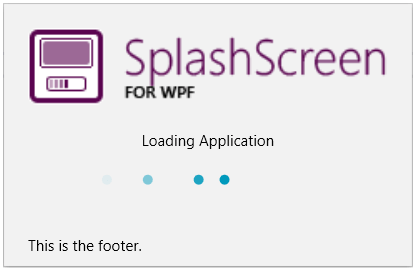
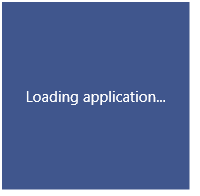

# Getting Started with {{ site.framework_name }} SplashScreen

This tutorial will walk you through the creation of a sample application that shows a splash screen using __RadSplashScreenManager__.

## Adding Telerik Assemblies Using NuGet

To use __RadSplashScreen__ when working with NuGet packages, install the `Telerik.Windows.Controls.Navigation.for.Wpf.Xaml` package. The [package name may vary]() slightly based on the Telerik dlls set - [Xaml or NoXaml]()

Read more about NuGet installation in the [Installing UI for WPF from NuGet Package]() article.

>tip With the 2025 Q1 release, the Telerik UI for WPF has a new licensing mechanism. You can learn more about it [here]().

## Adding Assembly References Manually

If you are not using NuGet packages, you can add a reference to the following assemblies:

* __Telerik.Licensing.Runtime__
* __Telerik.Windows.Controls__
* __Telerik.Windows.Controls.Navigation__

You can find the required assemblies for each control from the suite in the [Controls Dependencies]() help article.

## Showing Splash Screen

To show a splash screen, use the __RadSplashScreenManager__ class. This allows you to display the default RadSplashScreen control or a custom control.

> Note that the splash screen window is running on a separate UI thread.

You can start the splash screen anytime you need to indicate that some work is performed. The following example demonstrates how to show it before the MainWindow is loaded. To do this, call the __RadSplashScreenManager.Show__ method. This displays a window hosting a __RadSplashScreen__ control.

#### __[C#] Example 1: Starting the splash screen on application startup__
{{region radsplashscreen-getting-started-0}}
	public partial class App : Application
	{
		protected override void OnStartup(StartupEventArgs e)
		{
			var dataContext = (SplashScreenDataContext)RadSplashScreenManager.SplashScreenDataContext;
			dataContext.ImagePath = "/SplashScreenWPFApplication;component/Images/splashscreen-for-wpf-image.png";
			dataContext.Content = "Loading Application";
			dataContext.Footer = "This is the footer.";
			
			RadSplashScreenManager.Show();
						
			Thread.Sleep(7000);	

			RadSplashScreenManager.Close();

			base.OnStartup(e);
		}
	}	
{{endregion}}



The splash screen is setup via the __RadSplashScreenManager.SplashScreenDataContext__ object which by default holds an object of type __SplashScreenDataContext__. Read more about the data context in the [Splash Screen Manager]() article.

This example is using `Thread.Sleep` to imitate a loading process, but you can replace this by any code that takes time and notifies you about its actions. Basically, call Show method when you need to display the screen and once your action is completed call the Close method.

## Showing Progress Bar

To enable the progress bar in RadSplashScreen, set the __IsIndeterminate__ property of SplashScreenDataContext to __False__. Then you can control the range and current value via the __ProgressValue__, __MinValue__ and __MaxValue__ properties of the data context. Read more about this in the [Progress Bar]() article.

## Showing Custom User Control in the Splash Screen

RadSplashScreenManager can be used to display any UI element. This means that you can create a custom UserControl and pass its type to the Show method. You can also replace the `RadSplashScreenManager.SplashScreenDataContext` with a custom object that can be used with the UserControl.

#### __[XAML] Example 2: Creating a UserControl__
{{region radsplashscreen-getting-started-1}}
	<UserControl x:Class="RadSplashScreenTest.MyUserControl"
             xmlns="http://schemas.microsoft.com/winfx/2006/xaml/presentation"
             xmlns:x="http://schemas.microsoft.com/winfx/2006/xaml"
             xmlns:mc="http://schemas.openxmlformats.org/markup-compatibility/2006" 
             xmlns:d="http://schemas.microsoft.com/expression/blend/2008" 
             mc:Ignorable="d" d:DesignHeight="450" d:DesignWidth="800"
             Width="{Binding Width}" Height="{Binding Height}">
		<Grid Background="#40568D">
			<TextBlock Text="{Binding Text}" Foreground="White" HorizontalAlignment="Center" VerticalAlignment="Center" />
		</Grid>
	</UserControl>	
{{endregion}}

#### __[C#] Example 3: Defining custom model__
{{region radsplashscreen-getting-started-2}}
	public class MyUserControlViewModel
    {
        public string Text { get; set; }
		public double Width { get; set; }
        public double Height { get; set; }
    }
{{endregion}}

#### __[C#] Example 4: Showing a splash screen with custom control__
{{region radsplashscreen-getting-started-3}}
	RadSplashScreenManager.SplashScreenDataContext = new MyUserControlViewModel() { Text = "Loading applicaiton...", Width = 150, Height = 150 };
	RadSplashScreenManager.Show<MyUserControl>();
{{endregion}}



In case you want to keep the default visualization and add extra content, you can host the `RadSplashScreen` control inside the custom `UserControl`. In this case, if you want to take advantage of the `SplashScreenDataContext` don't forget to manually add the data bindings on the `RadSplashScreen` control.

```xaml
	<UserControl x:Class="RadSplashScreenTest.MyUserControl"
	             xmlns="http://schemas.microsoft.com/winfx/2006/xaml/presentation"
	             xmlns:x="http://schemas.microsoft.com/winfx/2006/xaml"
	             xmlns:mc="http://schemas.openxmlformats.org/markup-compatibility/2006" 
	             xmlns:d="http://schemas.microsoft.com/expression/blend/2008"
		     xmlns:telerik="http://schemas.telerik.com/2008/xaml/presentation">
		<UserContro.Resources>
			<telerik:BooleanToVisibilityConverter x:Key="BooleanToVisibilityConverter" />
		</UserControl.Resources>
		<Grid>
		        <telerik:RadSplashScreen ProgressValue="{Binding ProgressValue}"
						 MinValue="{Binding MinValue}"
						 MaxValue="{Binding MaxValue}"
						 Content="{Binding Content}"
						 IsIndeterminate="{Binding IsIndeterminate}"
						 Footer="{Binding Footer}"
						 ImagePath="{Binding ImagePath}"
						 HorizontalContentAlignment="{Binding HorizontalContentAlignment}"
						 HorizontalFooterAlignment="{Binding HorizontalFooterAlignment}"
						 ImageStretch="{Binding ImageStretch}"
						 ImageWidth="{Binding ImageWidth}"
					 	 ImageHeight="{Binding ImageHeight}"
						 ProgressBarVisibility="{Binding IsProgressBarVisible, Converter={StaticResource BooleanToVisibilityConverter}}"/>
			<!-- extra content here -->
		</Grid>
	</UserControl>
```

## Setting a Theme

The controls from our suite support different themes. You can see how to apply a theme different than the default one in the [Setting a Theme]() help article.

>important Changing the theme using implicit styles will affect all controls that have styles defined in the merged resource dictionaries. This is applicable only for the controls in the scope in which the resources are merged. 

To change the theme, you can follow the steps below:

* Choose between the themes and add reference to the corresponding theme assembly (ex: **Telerik.Windows.Themes.Windows8.dll**). You can see the different themes applied in the **Theming** examples from our [WPF Controls Examples](https://demos.telerik.com/wpf/)[Silverlight Controls Examples](https://demos.telerik.com/silverlight/#Slider/Theming) application.

* Merge the ResourceDictionaries with the namespace required for the controls that you are using from the theme assembly. For the RadSplashScreen, you will need to merge the following resources:

	* __Telerik.Windows.Controls__
	* __Telerik.Windows.Controls.Navigation__

__Example 3__ demonstrates how to merge the ResourceDictionaries so that they are applied globally for the entire application.

#### __[XAML] Example 3: Merge the ResourceDictionaries__  
{{region radsplashscreen-getting-started_7}}
	<Application.Resources>
		<ResourceDictionary>
			<ResourceDictionary.MergedDictionaries>
				<ResourceDictionary Source="/Telerik.Windows.Themes.Windows8;component/Themes/System.Windows.xaml"/>
				<ResourceDictionary Source="/Telerik.Windows.Themes.Windows8;component/Themes/Telerik.Windows.Controls.xaml"/>
				<ResourceDictionary Source="/Telerik.Windows.Themes.Windows8;component/Themes/Telerik.Windows.Controls.Navigation.xaml"/>
			</ResourceDictionary.MergedDictionaries>
		</ResourceDictionary>
	</Application.Resources>
{{endregion}}

>Alternatively, you can use the theme of the control via the [StyleManager](https://docs.telerik.com/devtools/wpf/styling-and-appearance/stylemanager/common-styling-apperance-setting-theme-wpf)[StyleManager](https://docs.telerik.com/devtools/silverlight/styling-and-appearance/stylemanager/common-styling-apperance-setting-theme).

__Figure 1__ shows a RadSplashScreen with the **Windows8** theme applied.

#### __Figure 1: RadSplashScreen with the Windows8 theme__



## Telerik UI for WPF Learning Resources

* [Telerik UI for WPF SplashScreen Component](https://www.telerik.com/products/wpf/splash-screen.aspx)
* [Getting Started with Telerik UI for WPF Components]()
* [Telerik UI for WPF Installation]()
* [Telerik UI for WPF and WinForms Integration]()
* [Telerik UI for WPF Visual Studio Templates]()
* [Setting a Theme with Telerik UI for WPF]()
* [Telerik UI for WPF Virtual Classroom (Training Courses for Registered Users)](https://learn.telerik.com/learn/course/external/view/elearning/16/telerik-ui-for-wpf) 
* [Telerik UI for WPF License Agreement](https://www.telerik.com/purchase/license-agreement/wpf-dlw-s)


## See Also  
* [Splash Screen Manager]()
* [Animations]()
