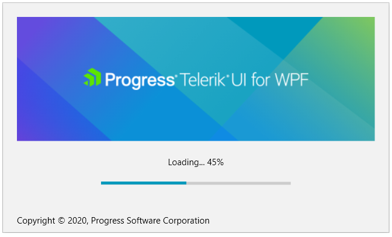

# Overview

RadSplashScreen allows you to display a Telerik themed control that notifies the user that the program is loading. You can customize the image of the splash screen, its animations and loading process visualization.

## Key Features

* __Customizable image content__: The control allows you to easily set the splash screen image.

* __Built-in progress bar__: By default the control shows an indeterminate [RadProgressBar](#indeterminate-state). You can easily change this and indicate some loading progress. Read more in the [Progress Bar]() article.

* __Customizable content/footer UI__: You can customize the content/footer of the splash screen by defining a template or by only setting the Content/Footer properties.

>tip Get started with the control with its [Getting Started]() help article that shows how to use it in a basic scenario.

> Check out the online demo at [demos.telerik.com](https://demos.telerik.com/wpf/).

## See Also

 * [Visual Structure]()