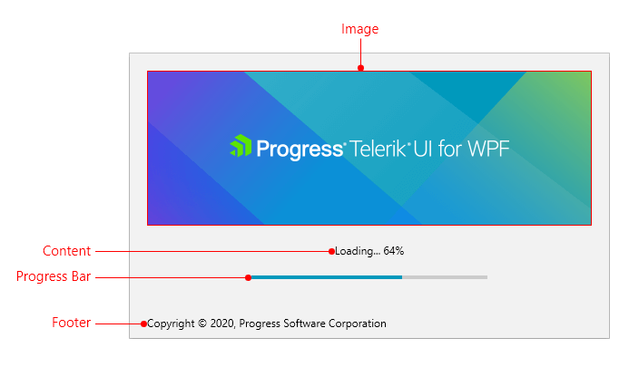

# Visual Structure

This article defines terms and concepts used in the scope of the RadSplashScreen control with which you have to get familiar before you continue to read its documentation. They can also be helpful when contacting our support service in order to describe your issue better.

* __Image__: Displays an image source provided via the ImagePath property of the data context. 

* __Content__: Displays string content. This can be used to indicate that something is loading, showing the current progress value or display any other text information.

* __Progress Bar__: Displays a progress bar that can be used to indicate a loading process. 

* __Footer__: Displays string content. This can be used to show additional text information in the splash screen.

>tip Get started with the control with its [Getting Started]() help article that shows how to use it in a basic scenario.

## See Also  
* [Splash Screen Manager]()
* [Animations]()
* [Progress Bar]()
