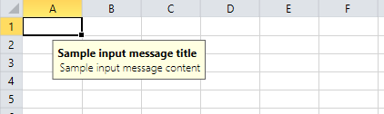
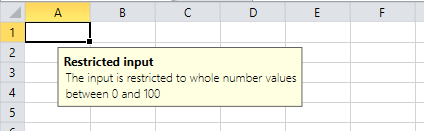
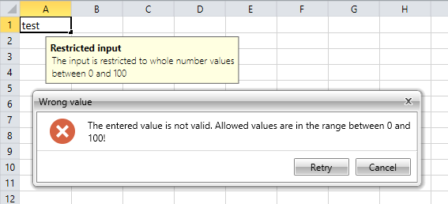
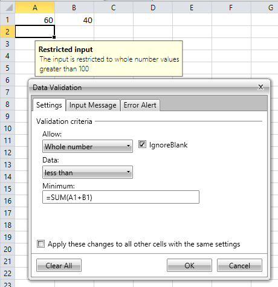
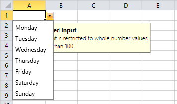

# Data Validation

__Data validation__ is used to control the type of data or the values that users enter into a cell. Compared to [Protection](), data validation does not restrict the user input, but ensures that the entered data complies with certain rules. For example the user may be restricted to enter data only within a certain range of dates, whole numbers, decimal numbers, or from a list of predefined values.

## Data Validation Rules

The data validation rules helps you restrict the user input. Additionally, you can set a message which will be shown when the cell containing the rule is selected once the current workbook is shown in a spreadsheet UI control.

You have the ability to specify how the user will be notified if the rule is not satisfied. There are three types of notifications:

* __Error__: If the user enters invalid data, a message box gives him the following choice:
	* Retry: Try again.
	* Cancel the change.
* __Cancel__: If the user enters invalid data, a message box gives him the following choice:
	* Yes: Override the warning and apply the change.
	* No: Try again. 
	* Cancel: Revert the change.
* __Information__: If the user enters invalid data, a message box gives him the following choice:
	* OK: Override the warning and apply the change. 
	* Cancel: Revert the change.

## Data Validation Rule Types

There are the following data validation rule types: 

* Any value
* Whole number
* Decimal
* List
* Date
* Time
* Text length
* Custom

To be able to create data validation rules you have to pass parameters to the rule. This is done using data validation rule contexts. There are several context types with different parameters which are used for the different types of data validation rules.

### AnyValueDataValidationRuleContext 

The __AnyValueDataValidationRuleContext__ class exposes the following properties:

* __ShowInputMessag__: Specifies whether to show input message or not.
* __InputMessageTitle__: The title of the input message.
* __InputMessageContent__: The content of the input message.
* __ShowErrorMessage__: Specifies whether to show error message or not.
* __ErrorStyle__: Specifies the style of the error message. The possible choices are *Error*, *Warning* and *Information*. 

### SingleArgumentdataValidationRuleContext

__SingleArgumentdataValidationRuleContext__ exposes the properties which the __AnyValueDataValidationRuleContext__ class has, but extends them with the following properties:

* __IgnoreBlank__: Specifies if the validation will ignore blank values and this way consider them as valid values.
* __Argument1__: Тhe argument needed for the validation.
* __CellIndex__: The cell index of the cell based on which the validation rule is created.
* __Worksheet__: The worksheet in which the data validation rule is created.

### NumberDataValidationRuleContext  

__NumberDataValidationRuleContext__ exposes the properties which the __SingleArgumentDataValidationRuleContext__ class has, but extends them with the following properties:

* __ComparisonOperator__: The comparison operator used by the data validation rule.
* __Argument2__: The second argument needed by the data validation rule.

### ListDataValidationRuleContext

__ListDataValidationRuleContext__ exposes the properties which the __SingleArgumentDataValidationRuleContext__ class has, but extends them with the following properties:

* __InCellDropdown__:  Specifies if a drop-down containing the list values of the data validation rule should be shown.

## Any Value Rule

The any value data validation rule is the default rule. It is applied to all cells and it does not perform any data validation. You can simply specify an input message. The error message is never shown because in this rule all values are considered as valid input.

__Example 1__ shows hot to create any value validation rule and set it to a cell.

#### __[C#] Example 1: Apply Any Value Rule__
{{#region radspreadprocessing-features-data-validation_0}}
	AnyValueDataValidationRuleContext context = new AnyValueDataValidationRuleContext();
	context.InputMessageContent = "Sample input message content";
	context.InputMessageTitle = "Sample input message title";
	AnyValueDataValidationRule rule = new AnyValueDataValidationRule(context);
	
	worksheet.Cells[0, 0].SetDataValidationRule(rule);
{{endregion}}

The result from the code snippet in __Example 1__ is shown on the snapshot in __Figure 1__.

#### __Figure 1: Any Value Rule__

## Whole Number Rule

The whole number data validation rule allows you to restrict the user input to whole numbers in a certain range. The range is specified using two arguments and a comparison operator. In some cases, for example when restricting user input in the range between 0 and 100, both arguments are used. In other cases like restricting the input to numbers that are greater than 100, only one of the arguments is used. Additionally, there is an option to ignore the blank values which is turned on by default.

The code snippet in __Example 2__ shows how to create a whole number data validation rule that restricts the user input using two arguments to the range between 0 and 100 and considers blank values as invalid.

#### __[C#] Example 2: Apply Whole Number Rule with Two Arguments__
{{#region radspreadprocessing-features-data-validation_1}}
    CellIndex dataValidationRuleCellIndex = new CellIndex(0, 0);

    NumberDataValidationRuleContext context = new NumberDataValidationRuleContext(worksheet, dataValidationRuleCellIndex);
    context.InputMessageTitle = "Restricted input";
    context.InputMessageContent = "The input is restricted to whole number values between 0 and 100";
    context.ErrorStyle = ErrorStyle.Stop;
    context.ErrorAlertTitle = "Wrong value";
    context.ErrorAlertContent = "The entered value is not valid. Allowed values are in the range between 0 and 100!";
    context.IgnoreBlank = false;
    context.ComparisonOperator = ComparisonOperator.Between;
    context.Argument1 = "0";
    context.Argument2 = "100";

    WholeNumberDataValidationRule rule = new WholeNumberDataValidationRule(context);

    worksheet.Cells[dataValidationRuleCellIndex].SetDataValidationRule(rule);
{{endregion}}

The result from __Example 2__ is shown in __Figure 2__.

#### __Figure 2: Whole Number Rule__

The result from entering value *“test”* in the cell containing the data validation rule is shown on __Figure 3__.

#### __Figure 3: Whole Number Rule Invalid Result__

The code snippet in __Example 3__ shows how to create a whole number data validation rule that restricts the user input with one argument to numbers that are greater than 100.

#### __[C#] Example 3: Apply Whole Number Rule with One Argument__

{{region radspreadprocessing-features-data-validation_2}}
    CellIndex dataValidationRuleCellIndex = new CellIndex(0, 0);

    NumberDataValidationRuleContext context = new NumberDataValidationRuleContext(worksheet, dataValidationRuleCellIndex);
    context.InputMessageTitle = "Restricted input";
    context.InputMessageContent = "The input is restricted to whole number values greater than 100";
    context.ErrorStyle = ErrorStyle.Stop;
    context.ErrorAlertTitle = "Wrong value";
    context.ErrorAlertContent = "The entered value is not valid. Allowed values are all whole number values greater than 100!";
    context.ComparisonOperator = ComparisonOperator.GreaterThan;
    context.Argument1 = "100";

    WholeNumberDataValidationRule rule = new WholeNumberDataValidationRule(context);

    worksheet.Cells[dataValidationRuleCellIndex].SetDataValidationRule(rule);
{{endregion}}

You are allowed to enter any valid [formula]() as a rule argument that returns a number. __Example 4__ shows how to restrict the user input to the values less than the sum of the values in cells A1 and B1.

#### __[C#] Example 4: Apply Whole Number Rule with Formula__

{{region radspreadprocessing-features-data-validation_3}}
    // The value of A1
    worksheet.Cells[0, 0].SetValue(60);
    // The value of B1
    worksheet.Cells[0, 1].SetValue(40);

    CellIndex dataValidationRuleCellIndex = new CellIndex(1, 0);

    NumberDataValidationRuleContext context = new NumberDataValidationRuleContext(worksheet, dataValidationRuleCellIndex);
    context.InputMessageTitle = "Restricted input";
    context.InputMessageContent = "The input is restricted to whole number values greater than 100";
    context.ErrorStyle = ErrorStyle.Warning;
    context.ErrorAlertTitle = "Wrong value";
    context.ErrorAlertContent = "The entered value is not valid. Allowed values are all whole number values greater than 100!";
    context.ComparisonOperator = ComparisonOperator.LessThan;
    context.Argument1 = "=Sum(A1+B1)";

    WholeNumberDataValidationRule rule = new WholeNumberDataValidationRule(context);

    worksheet.Cells[dataValidationRuleCellIndex].SetDataValidationRule(rule);
{{endregion}}

#### __Figure 4: Whole Number Rule Based on Formula__

>Note that the cell index that is passed to the constructor of the __NumberDataValidationRuleContext__ is the cell for which the rule is created. Consider the case in which an area from A2 to C5 is selected using the UI and the active cell is A2. You create the same rule as in __Example 4__ but apply it not just for cell A2, but for the cell range A2:C5. The formula “=SUM(A1+B1)” contains two relative cell references – A1 and B1. If you select the cell C5 and open the data validation dialog you will see that the formula that specifies the minimum value is “=SUM(C4+D4)” instead of “=SUM(A1+B1)”. The relative references in the formula are translated relatively to the cell passed in the constructor of the data validation rule context.

## Decimal Rule

The decimal data validation rule allows you to restrict the user input to decimal numbers in a certain range which is specified using two arguments and a comparison operator. The difference from the whole number Rule is that the decimal rule allows whole and decimal numbers to be entered in the cells.

__Example 5__ demonstrates how to create a decimal data validation rule that restricts the user input to be outside the range between 0 and 100.

#### __[C#] Example 5: Apply Decimal Rule__

{{region radspreadprocessing-features-data-validation_4}}
	CellIndex dataValidationRuleCellIndex = new CellIndex(0, 0);
	
	NumberDataValidationRuleContext context = new NumberDataValidationRuleContext(this.worksheet, dataValidationRuleCellIndex);
	context.InputMessageTitle = "Restricted input";
	context.InputMessageContent = "The input is restricted to decimal number values out of the range between 0 and 100";
	context.ErrorStyle = ErrorStyle.Stop;
	context.ErrorAlertTitle = "Wrong value";
	context.ErrorAlertContent = "The entered value is not valid. Allowed values are all decimal number values out of the range between 0 and 100!";
	context.ComparisonOperator = ComparisonOperator.Between;
	context.Argument1 = "0";
	context.Argument2 = "100";
	
	DecimalDataValidationRule rule = new DecimalDataValidationRule(context);
	
	this.worksheet.Cells[dataValidationRuleCellIndex].SetDataValidationRule(rule);
{{endregion}}

## List Rule

The list data validation rule allows you to restrict the user input to a predefined set of values. Using the __InCellDropdown__ property you can specify if a drop-down list containing the values will be shown next to the cell.

__Example 6__ shows the creation of a list data validation rule that restricts the user input to a day of the week.

#### __[C#] Example 6: Apply Decimal Rule__

{{region radspreadprocessing-features-data-validation_5}}
    CellIndex dataValidationRuleCellIndex = new CellIndex(0, 0);

    ListDataValidationRuleContext context = new ListDataValidationRuleContext(worksheet, dataValidationRuleCellIndex);
    context.InputMessageTitle = "Restricted input";
    context.InputMessageContent = "The input is restricted to the week days.";
    context.ErrorStyle = ErrorStyle.Stop;
    context.ErrorAlertTitle = "Wrong value";
    context.ErrorAlertContent = "The entered value is not valid. Allowed values are the week days!";
    context.InCellDropdown = true;
    context.Argument1 = "Monday, Tuesday, Wednesday, Thursday, Friday, Saturday, Sunday";

    ListDataValidationRule rule = new ListDataValidationRule(context);

    worksheet.Cells[dataValidationRuleCellIndex].SetDataValidationRule(rule);
{{endregion}}

__Figure 5__ shows the result from __Example 6__.

#### __Figure 5: List Rule__

## Date Rule

The date rule allows you to restrict the user input to a certain range of dates which is specified using two arguments and a comparison operator.

__Example 7__ shows how to restrict the user input to the dates in the range between 12 February 2013 and 22 May 2017.

#### __[C#] Example 7: Apply Date Rule__

{{region radspreadprocessing-features-data-validation_6}}
    CellIndex dataValidationRuleCellIndex = new CellIndex(0, 0);

    NumberDataValidationRuleContext context = new NumberDataValidationRuleContext(worksheet, dataValidationRuleCellIndex);
    context.InputMessageTitle = "Restricted input";
    context.InputMessageContent = "The input is restricted to dates in the range from 12 February 2013 to 22 May 2017.";
    context.ErrorStyle = ErrorStyle.Stop;
    context.ErrorAlertTitle = "Wrong value";
    context.ErrorAlertContent = "The entered value is not valid. Allowed values are all dates between 12 February 2013 and 22 May 2017";
    context.ComparisonOperator = ComparisonOperator.Between;
    context.Argument1 = new DateTime(2013, 2, 12).ToShortDateString();
    context.Argument2 = new DateTime(2017, 5, 22).ToShortDateString();

    DateDataValidationRule rule = new DateDataValidationRule(context);

    worksheet.Cells[dataValidationRuleCellIndex].SetDataValidationRule(rule);
{{endregion}}

## Time Rule

The time rule allows you to restrict the user input to a certain range of times which is specified using two arguments and a comparison operator.

The code snippet in __Example 8__ shows how to restrict the user input to the range between 10:25 AM and 3:45 PM:

#### __[C#] Example 8: Apply Time Rule__

{{region radspreadprocessing-features-data-validation_7}}
	CellIndex dataValidationRuleCellIndex = new CellIndex(0, 0);
	
	NumberDataValidationRuleContext context = new NumberDataValidationRuleContext(this.worksheet, dataValidationRuleCellIndex);
	context.InputMessageTitle = "Restricted input";
	context.InputMessageContent = "The input is restricted to times in the range from 10:25 AM to 3:45 PM.";
	context.ErrorStyle = ErrorStyle.Stop;
	context.ErrorAlertTitle = "Wrong value";
	context.ErrorAlertContent = "The entered value is not valid. Allowed values are all times between 10:25 AM to 3:45 PM.";
	context.ComparisonOperator = ComparisonOperator.Between;
	context.Argument1 = new DateTime(2015, 2, 2, 10, 25, 0).ToShortTimeString();
	context.Argument2 = new DateTime(2015, 2, 2, 15, 45, 0).ToShortTimeString();
	
	TimeDataValidationRule rule = new TimeDataValidationRule(context);
	
	this.worksheet.Cells[dataValidationRuleCellIndex].SetDataValidationRule(rule);

{{endregion}}

## Text Length Rule

The text length rule allows you to restrict the user input to text with length in a certain range specified using two arguments and a comparison operator.

__Example 9__ shows how to restrict the user input to text with length between 5 and 10 symbols.

#### __[C#] Example 9: Apply Text Length Rule__

{{region radspreadprocessing-features-data-validation_8}}
	CellIndex dataValidationRuleCellIndex = new CellIndex(0, 0);
	
	NumberDataValidationRuleContext context = new NumberDataValidationRuleContext(this.worksheet, dataValidationRuleCellIndex);
	context.InputMessageTitle = "Restricted input";
	context.InputMessageContent = "The input is restricted to times in the range from 10:25 AM to 3:45 PM.";
	context.ErrorStyle = ErrorStyle.Stop;
	context.ErrorAlertTitle = "Wrong value";
	context.ErrorAlertContent = "The entered value is not valid. Allowed values are all times between 10:25 AM to 3:45 PM.";
	context.ComparisonOperator = ComparisonOperator.Between;
	context.Argument1 = new DateTime(2015, 2, 2, 10, 25, 0).ToShortTimeString();
	context.Argument2 = new DateTime(2015, 2, 2, 15, 45, 0).ToShortTimeString();
	
	TimeDataValidationRule rule = new TimeDataValidationRule(context);
	
	this.worksheet.Cells[dataValidationRuleCellIndex].SetDataValidationRule(rule);
{{endregion}}

## Custom Rule

The custom rule allows you to restrict the user input with a custom condition specified with a formula which results in a __Boolean__ value.

The code snippet in __Example 10__ shows how to restrict the user input to values that are greater or equal to the sum of the values in the cells A1 and B1.

#### __[C#] Example 10: Apply Custom Rule__

{{region radspreadprocessing-features-data-validation_9}}
	CellIndex dataValidationRuleCellIndex = new CellIndex(0, 0);
	
	NumberDataValidationRuleContext context = new NumberDataValidationRuleContext(this.worksheet, dataValidationRuleCellIndex);
	context.InputMessageTitle = "Restricted input";
	context.InputMessageContent = "The input is restricted to times in the range from 10:25 AM to 3:45 PM.";
	context.ErrorStyle = ErrorStyle.Stop;
	context.ErrorAlertTitle = "Wrong value";
	context.ErrorAlertContent = "The entered value is not valid. Allowed values are all times between 10:25 AM to 3:45 PM.";
	context.ComparisonOperator = ComparisonOperator.Between;
	context.Argument1 = new DateTime(2015, 2, 2, 10, 25, 0).ToShortTimeString();
	context.Argument2 = new DateTime(2015, 2, 2, 15, 45, 0).ToShortTimeString();
	
	TimeDataValidationRule rule = new TimeDataValidationRule(context);
	
	this.worksheet.Cells[dataValidationRuleCellIndex].SetDataValidationRule(rule);
{{endregion}}

## Evaluate Rules

In order to check if the cell value satisfies a rule, you have to evaluate the rule using the desired cell value. Each data validation rule implements the __IDataValidationRule__ interface which exposes the __Evaluate()__ method. The method receives as parameters the worksheet in which the value is located, the cell index in which the value will be placed or in which the value is contained, and the value itself.

__Example 11__ demonstrates how to evaluate a rule using the __Evaluate()__ method.

#### __[C#] Example 11: Evaluate Rule__
{{region radspreadprocessing-features-filtering_0}}
    IEnumerable<string> stringItems = new List<string>() { "test", "1%", "1.0" };
    IEnumerable<DateGroupItem> dateItems = new List<DateGroupItem>()
    {
        new DateGroupItem(2013),
        new DateGroupItem(2014, 3)
    };

    ValuesCollectionFilter filter = new ValuesCollectionFilter(0, stringItems, dateItems, true);
{{endregion}}

# See Also

* [Protection]()
* [Formulas]()