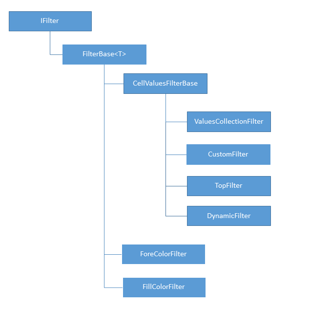

# Filtering

This article describes what is filtering and filters and how to work with them through the document model. It contains the following sections:
      

* [What is Filtering?](#what-is-filtering?)

* [AutoFilter](#autofilter)

* [IFilter](#ifilter)

* [ValuesCollectionFilter](#valuescollectionfilter)

* [CustomFilter](#customfilter)

* [TopFilter](#topfilter)

* [DynamicFilter](#dynamicfilter)

* [ForeColorFilter](#forecolorfilter)

* [FillColorFilter](#fillcolorfilter)

* [Setting a Filter](#setting-a-filter)

* [Reapplying a Filter](#reapplying-a-filter)

* [Removing and Clearing Filters](#removing-and-clearing-filters)

## What is Filtering?

The filtering feature allows the user to hide and show certain rows of a range, based on different criteria. It provides an easy way to work with just the relevant set of data.
        

The information about the filtering applied to a worksheet is contained in the [worksheet]() property __Filter__, which is of type __AutoFilter__. Through it you can set and modify the current range which is filtered and add and remove filters to its columns. Each column can have only one filter applied to it. The interface implemented by all filters is __IFilter__.
        

## AutoFilter

The __AutoFilter__ class exposes the following public members:
        

* __FilterRange__: Property of type __CellRange__. Represents the range to which a filter is currently applied. The worksheet can have only one range filtered at a time. If filtering is not applied, the filtered range is __null__.
            

* __void SetFilters(IEnumerable<IFilter> filters)__: Sets multiple filters on the filtered range and applies them.
            

* __void SetFilter(IFilter filter)__: Sets a single filter on the filtered range and applies it.
            

* __IFilter GetFilter(int relativeColumnIndex)__: Retrieves the filter applied on the column with the specified index.
            

* __bool RemoveFilter(IFilter filter)__: Removes the specified filter and shows all rows which were hidden by it.
            

* __bool RemoveFilter(int relativeColumnIndex)__: Removes the filter applied on the column with the specified index and shows all rows which were hidden by it.
            

* __void ClearFilters()__: Removes all filters and shows all rows of the filtered range.
            

* __void ReapplyFilter(IFilter filter)__: Reapplies the specified filter.
            

* __void ReapplyFilter(int relativeColumnIndex)__: Reapplies the filter applied to the column with the specified index.
            

>The column indices which are used to work with the filters are zero-based and relative to the filtered range.
          

## IFilter

All the filters which can be applied to the filter range implement the __IFilter__ interface. The interface exposes the following members:
        

* __RelativeColumnIndex__: Gets the index of the column to which the filter is applied. The index is relative to the beginning of the filter range.
            

* __object GetValue(Cells cells, int rowIndex, int columnIndex)__: Gets the value of the cell at the specified index. This value is used to determine whether the row should be hidden by the filter.
            

* __bool ShouldShowValue(object value)__: Determines whether the row which contains the specified value should be shown.
            

The __GetValue()__ method provides the value which the __ShouldShowValue()__ method uses to evaluate whether the current row should be hidden or shown.
        

The diagram in __Figure 1__ shows the different types of filters, which inherit the __IFilter__ interface, and the classes which implement them:
        

Figure 1

## ValuesCollectionFilter

The values collection filter is a filter which holds a collection of strings and date group items. If the filter encounters a date in the column it filters, it compares it to the date group items in its collection. If there isn't a date group item which matches it, the row is hidden. If the value is not a date the filter compares the formatted string representation of the cell value with the collection of string values. If it is present in the collection, the row is shown, otherwise it is hidden. If the cell is empty, the filter uses the value of the boolean property __Blank__ to determine whether the row should be shown or hidden.
        

Other than the members of the __IFilter__ interface, the __ValuesCollectionFilter__ class exposes the following members specific to it:
        

* __StringValues__: The collection of strings values.
            

* __DateItems__: The collection of date group items.
            

* __Blank__: The value indicating whether the blank cells will be shown or not.
            

__Example 1__ shows how to create a __ValuesCollectionFilter__.
        

#### __[C#] Example 1: Create ValuesCollectionFilter__

{{region radspreadprocessing-features-filtering_0}}
    IEnumerable<string> stringItems = new List<string>() { "test", "1%", "1.0" };
    IEnumerable<DateGroupItem> dateItems = new List<DateGroupItem>()
    {
        new DateGroupItem(2013),
        new DateGroupItem(2014, 3)
    };

    ValuesCollectionFilter filter = new ValuesCollectionFilter(0, stringItems, dateItems, true);
{{endregion}}

This filter created in __Example 1__ will hide all rows which contain dates which are not within the year of 2013 or within March 2014. It will also hide the rows where the formatted string value of the cell does not correspond to any of the strings of the stringItems list. The blank items will be shown.
        

## CustomFilter

The custom filter is a filter which contains one or two critera which are used to filter the column to which the filter is assigned. If the value of the cell doesn't satisfy the criteria, the respective row is hidden by the filter.
        

Other than the members of the __IFilter__ interface, the __CustomFilter__ class exposes the following members specific to it:
        

* __Criteria1__: Property of type CustomFilterCriteria specisying the first criteria.
            

* __Criteria2__: Property of type CustomFilterCriteria specisying the second criteria. The second critera can be null.
            

* __LogicalOperator__: The logical operator which determines the logical relationship between the critera. It can have two values:
            

	* And
                

	* Or
                

The criteria is represented by the __CustomFilterCriteria__ class. Each criteria contains the following:
        

* __FilterValue__: The value to which the cell value is compared.
            

* __ComparisonOperator__: The operator which indicates how the cell value should compare to the FilterValue. The comparison operator can be:
            

	* EqualsTo

	* GreaterThan

	* GreaterThanOrEqualsTo

	* LessThan

	* LessThanOrEqualsTo

	* NotEqualsTo

__Example 2__ shows how to create a custom filter.
        

#### __[C#] Example 2: Create CustomFilter__

{{region radspreadprocessing-features-filtering_1}}
    CustomFilterCriteria critera1 = new CustomFilterCriteria(ComparisonOperator.EqualsTo, "Test string");
    CustomFilterCriteria critera2 = new CustomFilterCriteria(ComparisonOperator.GreaterThan, "-5");
    CustomFilter filter = new CustomFilter(0, critera1, LogicalOperator.Or, critera2);
{{endregion}}

Note that even though the __FilterValue__ is of type string, internally the filter will attempt to parse it. This is the opposite behavior to the __ValuesCollectionFilter__ which compares only the string representations of the values. In this case, the filter will display all rows which contain a number value greater than -5 or a text value equal to "Test string".
        

## TopFilter

The top filter is a filter which displays a given number or percent of the total values in the column it filters, taking the first top or bottom values. It hides all other rows.
        

Other than the members of the __IFilter__ interface, the __TopFilter__ class exposes the following members specific to it:
        

* __TopFilterType__: The value indicating whether the filter should display the top or bottom values and whether the number of values will be indicated as a number of items or as percent of the total number of items. The top filter type can be:
            

	* TopNumber
                

	* BottomNumber
                

	* TopPercent
                

	* BottomPercent
                

* __Value__: The number of items or the percent of the total number of items which will be displayed by the filter.
            

__Example 3__ shows how to create a top filter.
        

#### __[C#] Example 3: Create TopFilter__

{{region radspreadprocessing-features-filtering_2}}
    TopFilter filter = new TopFilter(0, TopFilterType.BottomPercent, 30);
{{endregion}}

The filter will show the top 30 percent of all values in the filtered column. Note that the filter includes only number values both in its estimate how many values to show and which values to show. If the filtered column includes for example a text value, it will be hidden, even if the filter is supposed to show the top 100 percent of values.
        

## DynamicFilter

The dynamic filter is a filter which shows or hides the rows in the column it filters based on a condition chosen from a set of predetermined conditions.
        

Other than the members of the __IFilter__ interface, the __DynamicFilter__ class exposes only one property specific to it:
        

* __DynamicFilterType__: The type of the dynamic filter, which determines what condition the filter should use to filter the column it is assigned to. The dynamic filter type can be used from the values of the [DynamicFilterType](http://www.telerik.com/help/wpf/t_telerik_windows_documents_spreadsheet_model_filtering_dynamicfiltertype.html) enumaration.
            

__Example 4__ demonstrates how to create a dynamic filter.
        

#### __[C#] Example 4: Create DynamicFilter__

{{region radspreadprocessing-features-filtering_3}}
    DynamicFilter filter = new DynamicFilter(0, DynamicFilterType.LastWeek);
{{endregion}}

The filter will show only the values which are dates and which fall within the week prior to the application of the filter.
        

## ForeColorFilter

The fore color filter hides or displays the cells in the column it filters based on the color of the text in it.
        

Other than the members of the __IFilter__ interface, the __ForeColorFilter__ class exposes only one property specific to it:
        

* __Color__: A __ThemableColor__ object representing the color which should be set on the text of the cell in order for it to be displayed. All other cells of the column are hidden.
            

__Example 5__ demonstrates how to create a fore color filter.
        

#### __[C#] Example 5: Create ForeColorFilter__

{{region radspreadprocessing-features-filtering_4}}
    ThemableColor color = new ThemableColor(Colors.Red);
    ForeColorFilter filter = new ForeColorFilter(0, color);
{{endregion}}

This filter will hide all cells whose text color is not red.
        

## FillColorFilter

The fill color filter hides or displays the cells in the column it filters based on their fill.
        

Other than the members of the __IFilter__ interface, the __FillColorFilter__ class exposes only one property specific to it:
        

* __Fill__: The fill the cell needs to have in order for it to be displayed. All other cells of the column are hidden.
            

__Example 6__ shows hot to create a fill color filter.
        

#### __[C#] Example 6: Create FillColorFilter__

{{region radspreadprocessing-features-filtering_5}}
    IFill fill = new PatternFill(PatternType.Solid, Colors.Red, Colors.Red);
    FillColorFilter filter = new FillColorFilter(0, fill);
{{endregion}}

This filter will hide all cells whose fill is not solid red.
        

## Setting a Filter

In order to set a filter on a range, you need to follow the steps below:
        

1. Set the filter range.
            

#### __[C#] Example 7: Set FilterRange__

{{region radspreadprocessing-features-filtering_6}}
    Worksheet worksheet = workbook.ActiveWorksheet;

    CellRange filterRange = new CellRange(0, 1, 5, 2);
    worksheet.Filter.FilterRange = filterRange;
{{endregion}}

1. Create a filter.
            

#### __[C#] Example 8: Create DynamicFilter__

{{region radspreadprocessing-features-filtering_7}}
    DynamicFilter filter = new DynamicFilter(1, DynamicFilterType.AboveAverage);
{{endregion}}

The relative index specified in the constructor is 1, which means that the filter will be set on the second column of the range, that is, column C.
            

1. Set the filter on the necessary column.
            

#### __[C#] Example 9: Set Filter__

{{region radspreadprocessing-features-filtering_8}}
    worksheet.Filter.SetFilter(filter);
{{endregion}}

Alternatively, you can set the filter through the cell selection like in __Example 10__. This approach will automatically set the filter range anew.
        

#### __[C#] Example 10: Set Filter through Selection__

{{region radspreadprocessing-features-filtering_9}}
    worksheet.Cells[filterRange].Filter(filter);
{{endregion}}

>Keep in mind that the first row of the FilterRange is reserved for column headers and will not be included in the actual filtering.
          

>tip Note that the filter cannot be set before the range. Attempting to do so will cause an exception.
          

## Reapplying a Filter

When a filter is set it is automatically applied. The application of a filter happens only once and if the values or properties of the filtered column change afterwards, the filter needs to be reapplied. This is done by using the overloads of the __ReapplyFilter()__ method. The first overload allows reapplying a filter by the relative index of the column it is applied to. The second - by a __IFilter__ instance.
        

#### __[C#] Example 11: Set FilterRange__

{{region radspreadprocessing-features-filtering_10}}
    worksheet.Filter.ReapplyFilter(1);
{{endregion}}

>tipNote that attempting to reapply filter on a column which is not filtered causes an exception.
          

## Removing and Clearing Filters

Removing and clearing filters is done using the following methods exposed by the __AutoFilter__ class:
        

* __RemoveFilter(IFilter filter)__: Removes the specified filter and shows all rows which were hidden by it. Returns true if successful.
            

* __RemoveFilter(int relativeColumnIndex)__: Removes the filter applied on the column with the specified index and shows all rows which were hidden by it. Returns true if successful.
            

* __ClearFilters()__: Removes all filters and shows all rows of the filtered range.
            

As is the case with the __ReapplyFilter()__ method, you can remove a filter by instance and by relative index of the column it is applied to.
        

#### __[C#] Example 12: Remove Filter__

{{region radspreadprocessing-features-filtering_11}}
    bool success = worksheet.Filter.RemoveFilter(1);
{{endregion}}

In order to remove all applied filters at once use the __ClearFilters()__ method. __ClearFilters()__ will display all rows which were hidden by filtering on the worksheet. However, it will not remove the filtering itself. In order to do this, you need to set the __FilteredRange__ property to __null__.
        

Setting the __FilteredRange__ property to null without removing the filters beforehand will automatically remove them.
        

# See Also

 * [Sorting]()

 * [What is a Worksheet?]()

 * [Document Themes]()

 * [Grouping]()