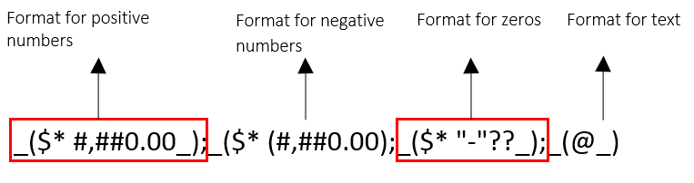

# Format Codes

__RadSpreadProcessing__ allows to control the appearance of the number values using Number Formats. There is a variety of predefined formats and you can define a custom one in case they are not suitable for your scenario. This article explains how to use the codes in order to create your own number format or modify one of the predefined types.

## Overview

A number format could contain up to four sections. Each of them defines a format for different values as shown in __Figure 1__.

Figure 1

These sections are not required and could be omitted. If only one section is specified, its code is used for all numbers. In case the specified sections are two, the first one is used for positive numbers and zeros and the second one for negative numbers.

> If a number format is not explicitly set, the default one is General. It represents an empty string, which has a default behavior for the different types of values.

## Format With Text Values

You could display a combination of text and numbers in a cell by enclosing the text in the format string in double quotation marks or, if it is a single character, you could precede it with a backslash (‘\’).  The ‘@’ sign is useful when you need to include a text typed from the user in the cell.

Table 1
<table>
<tr>
	<th>Number Format Code </th>
	<th>Value  </th>
	<th>Result  </th>
</tr>

<tr>
	<td  rowspan="3">$ 0.00" Salary";$ –0.00" Monthly expenses";;"Invoice for "@</td>
	<td>345</td>
	<td>$345.00 Salary</td>
</tr>

<tr>
	<td>-50</td>
	<td>$-50 Monthly expenses</td>
</tr>

<tr>
	<td>electricity</td>
	<td>Invoice for electricity</td>
</tr>
</table>

> If the format code consists only of an ‘@’ sign, the value in the cell will be visualized as it is typed.

Some characters like the percentage sign (%) do not require using quotation marks when including them in a format code. They are listed in Table 2.

Table 2
<table>
	<tr>
		<td>$</td>
		<td>+</td>
		<td>- (Minus sign)</td>
		<td>/</td>
		<td>(</td>
		<td>)</td>
		<td>:</td>
		<td>!</td>
		<td>^</td>
	</tr>
	
	<tr>
		<td>&</td>
		<td>`</td>
		<td>~</td>
		<td>{</td>
		<td>}</td>
		<td><</td>
		<td>></td>
		<td>=</td>
		<td> (Space character)</td>
	</tr>
</table>

## Decimal Places and Spaces

With the number sign (#) you could display only the significant digits in a number. In order to display non-significant zeros when a number consist of fewer digits than the specified in the format code you could use the numerical character for zero (0).

Table 3
<table>
	<tr>
		<th>Number Format Code </th>
		<th>Value  </th>
		<th>Result  </th>
	</tr>
	<tr>
		<td>####.#</td>
		<td>124.49</td>
		<td>124.5</td>
	</tr>
	
	<tr>
		<td>#.000</td>
		<td>1.2</td>
		<td>1.200</td>
	</tr>
	
	<tr>
		<td>0.#</td>
		<td>.321</td>
		<td>0.3</td>
	</tr>
	<tr>
		<td rowspan=2>#.0#</td>
		<td>11</td>
		<td>11.0</td>
	</tr>
	
	<tr>
		<td>123.456</td>
		<td>123.46</td>
	</tr>
	
	<tr>
		<td rowspan=2># ???/???</td>
		<td>1.25</td>
		<td>1 1/4</td>
	</tr>	
	<tr>
		<td>2.5</td>
		<td>2 1/2</td>
	</tr>	
	<tr>
		<td>#,###</td>
		<td>12000</td>
		<td>12,000</td>
	</tr>	
	<tr>
		<td>#,</td>
		<td>12000</td>
		<td>12</td>
	</tr>	
	<tr>
		<td rowspan=2>00000</td>
		<td>12</td>
		<td>00012</td>
	</tr>	
	<tr>
		<td>1234</td>
		<td>01234</td>
	</tr>	
	<tr>
		<td rowspan=2>"000"#</td>
		<td>12</td>
		<td>00012</td>
	</tr>
	<tr>
		<td>1234</td>
		<td>0001234</td>
	</tr>
</table>

## Colors

With the number format codes you can specify the color of a section in the format code. There are eight colors available:

* Black

* Blue

* Cyan

* Green

* Magenta

* Red

* White

* Yellow

The name of the color must be defined as the first item in a section and enclosed in square brackets. 

## Conditions

The number formats could be applied according to conditions. Each condition is enclosed in square brackets and consists of a comparison operator and a value. For example, the following number format will display numbers that are less than or equal to 50 in a red font and numbers that are greater than 50 in a blue font. 

{{region}}

	[Red][<=50];[Blue][>50]
{{endregion}}

## Date and Time Formatting

The format codes about date and time are listed in Table 4.

Table 4
<table>
	<tr>
		<th>Number Format Code </th>
		<th>Value  </th>
		<th>Result  </th>
	</tr>
	<tr>
		<td>yy</td>
		<td>Years</td>
		<td>00-99</td>
	</tr>	
	<tr>
		<td>yyyy</td>
		<td>Years</td>
		<td>1900-9999</td>
	</tr>	
	<tr>
		<td>m</td>
		<td>Months</td>
		<td>1-12</td>
	</tr>
	<tr>
		<td>mm</td>
		<td>Months</td>
		<td>01-12</td>
	</tr>	
	<tr>
		<td>mmm</td>
		<td>Months</td>
		<td>Jan-Dec</td>
	</tr>
	<tr>
		<td>mmmm</td>
		<td>Months</td>
		<td>January-December</td>
	</tr>
	<tr>
		<td>mmmmm</td>
		<td>Months</td>
		<td>J-D</td>
	</tr>	
	<tr>
		<td>d</td>
		<td>Days</td>
		<td>1-31</td>
	</tr>	
	<tr>
		<td>dd</td>
		<td>Days</td>
		<td>01-31</td>
	</tr>
	<tr>
		<td>ddd</td>
		<td>Days</td>
		<td>Sun-Sat</td>
	</tr>	
	<tr>
		<td>dddd</td>
		<td>Days</td>
		<td>Sunday-Saturday</td>
	</tr>
	<tr>
		<td>h</td>
		<td>Hours</td>
		<td>0-23</td>
	</tr>
	<tr>
		<td>hh</td>
		<td>Hours</td>
		<td>00-23</td>
	</tr>
	<tr>
		<td>m</td>
		<td>Minutes</td>
		<td>0-59</td>
	</tr>
	<tr>
		<td>mm</td>
		<td>Minutes</td>
		<td>00-59</td>
	</tr>
	<tr>
		<td>s</td>
		<td>Seconds</td>
		<td>0-59</td>
	</tr>
	<tr>
		<td>ss</td>
		<td>Seconds</td>
		<td>00-59</td>
	</tr>
	<tr>
		<td>h AM/PM</td>
		<td>Time</td>
		<td>6 AM</td>
	</tr>
	<tr>
		<td>h:mm AM/PM</td>
		<td>Time</td>
		<td>6:15 PM</td>
	</tr>
</table>

# See Also

* [Number Formatting]()