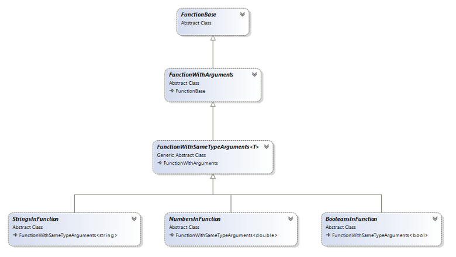

# Custom Functions

This article provides information about the possible approaches for creating a custom function. It contains the following sections:
      

* [Inheriting FunctionBase Abstract Class](#inheriting-functionbase-abstract-class)

* [Functions Inheritance Tree](#functions-inheritance-tree)

* [ArgumentConversionRules](#argumentconversionrules)

* [FunctionInfo](#functioninfo)

* [Get Cell Reference Range Expression from Function](#get-cell-reference-range-expression-from-function)

* [Custom Function Examples](#custom-function-examples)

## Inheriting FunctionBase Abstract Class

The document model provides a powerful API for creating custom functions. All functions must inherit from the abstract __FunctionBase__ class, providing basic methods and properties for each function instance.
        

These are the basic __FunctionBase__ members:
        

* __Name__: Property of type String. It defines the name of the function. The property is used for registering the function, so the name of the function must be unique (case insensitive). If a function with is registered with the same name, it overrides the previous function registered with this name.
            

* __FunctionInfo__: Property of type FunctionInfo. It provides description of the function and its arguments. For a more detailed description of this class, you may follow [this](#functioninfo) link.
            

* __ArgumentConversionRules__: This property describes the way different argument types are interpreted. The _FunctionBase__ API works with 5 argument types (Logical, Number, Text, Reference and Array) and each function may interpret each of these argument types differently. For more information, you may follow [this](#argumentconversionrules) link. <Comment: Please verify my change did not create a technical error.>
            

* __Evaluate__ and __EvaluateOverride__ methods: The function calculations take place in these methods. In order to define a custom function you need to override the __EvaluateOverride__ method so that later you may obtain the function calculations value through the __Evaluate__ method. <Comment: The phrase "you may obtain the function calculations value" is vague to me. What are function calculations?>
            

Additionally each custom function needs to be registered through the __FunctionManager__ class. This is easily done by passing an instance of the function class to the static __Register()__ method.
        

__Example 1__ shows how to register a function class named ArgumentsFunction, which inherits FunctionBase.
        <Comment: Please verify that my rewrite of the previous sentence did not create an error.>

#### __[C#] Example 1: Register custom function__

{{region radspreadprocessing-features-formulas-custom-functions_0}}
    FunctionManager.RegisterFunction(new ArgumentsFunction());
{{endregion}}

## Functions Inheritance Tree

The document model provides an inheritance tree of classes that provide ready to use functionalities for different function types depending on the function arguments and the desired result.
        

__Figure 1__ shows the base abstract function classes.
        

Figure 1: Functions inheritance

* __FunctionBase__: Provides the base functions properties (__Name, FunctionInfo, ArgumentConvertionRules__). Also provides the logic of the __IsArgumentNumberValid()__ method, which handles the logic when an invalid arguments count is inputted by the user. By inheriting __FunctionBase__ you must override the __EvaluateOverride(FunctionEvaluationContext&lt;RadExpression&gt; context)__ method, so you need to handle the whole logic of converting __RadExpression__ arguments to function arguments. <Comment: What do you mean by whole logic?>
            

* __FunctionWithArguments__: Handles the basic logic of converting __RadExpression__'s value to some other value type corresponding to the ArgumentType defined in the FunctionInfo property. By inheriting from this class you need to override the __EvaluateOverride(FunctionEvaluationContext&lt;object&gt; context)__ method and handle an array of already converted function argument values.
            

* __FunctionWithSameTypeArguments<T>__: By inheriting this class you need to override the __EvaluateOverride(FunctionEvaluationContext&lt;T&gt; context)__ method and handle an array of arguments with same type T. <Comment: The phrase "same type T" sounds odd to me.>
            

* __StringInFunctions__, __NumbersInFunction__, __BooleansInFunction__: These classes inherit directly from __FunctionWithSameTypeArguments<String>__, __FunctionWithSameTypeArguments<double>__ and __FunctionWithSameTypeArguments<bool>__. Using them is appropriate in cases when the function has the respective argument type - String, double or Boolean. <Comment: The capitalization of Strong, double and Boolean are not consistent. If they are case sensitive, I suggest you match the case used in the name of the classes.>
            

## ArgumentConversionRules

The __ArgumentConversionRules__ class provides properties that describe the way different function argument types are interpreted. The functions API works with 5 argument types (Logical, Number, Text, Reference and Array) and each function may interpret each of these argument types differently. Additionally, **RadSpreadsheet** allows to be made difference between __direct arguments__ (value passed directly into the formula) and __indirect arguments__ (values that depending on some other cells referencing).
<Comment: The phrase "allows to be made difference between" is unclear to me. I think you mean to say that **RadSpreadsheet** allows you to pass argument types that are direct arguments or indirect arguments.>        

__ArgumentConversionRules__ has the following properties:
        

* __EmptyDirectArgument__: The ArgumentInterpretation of an Empty cell value, passed as a direct argument.
            

* __NumberDirectArgument__: The ArgumentInterpretation of a Number cell value, passed as a direct argument.
            

* __BoolDirectArgument__: The ArgumentInterpretation of a Boolean cell value, passed as a direct argument.
            

* __TextNumberDirectArgument__: The ArgumentInterpretation of a String cell value that may successfully be parsed to a number, passed as a direct argument.
            

* __NonTextNumberDirectArgument__: The ArgumentInterpretation of a String cell value that cannot be parsed to a number, passed as a direct argument.
            

* __EmptyIndirectArgument__: The ArgumentInterpretation of an Empty cell value, passed as an indirect argument.
            

* __NumberIndirectArgument__: The ArgumentInterpretation of a Number cell value, passed as an indirect argument. <Comment: I think I corrected a technical error by changing direct to indirect. Please confirm.>
            

* __BoolIndirectArgument__: The ArgumentInterpretation of a Boolean cell value, passed as an indirect argument.
            

* __TextNumberIndirectArgument__: The ArgumentInterpretation of a String cell value that may successfully be parsed to a number, passed as an indirect argument.
            

* __NonTextNumberIndirectArgument__: The ArgumentInterpretation of a String cell value that cannot be parsed to a number, passed as an indirect argument.
            

* __ArrayArgument__: The ArrayArgumentInterpretaion.
            

The value of these properties are from the enumerations [ArgumentInterpretation](http://www.telerik.com/help/wpf/t_telerik_windows_documents_spreadsheet_expressions_functions_argumentinterpretation.html) and [ArrayArgumentInterpretation](http://www.telerik.com/help/wpf/t_telerik_windows_documents_spreadsheet_expressions_functions_arrayargumentinterpretation.html) and they are set through the constructor of __ArgumentConversionRules__. The default values of these interpretations in the constructor are accordingly __ArgumentInterpretation.UseAsIs__ and __ArrayArgumentInterpretation.UseFirstElement__.
        

__Example 2__ creates an instance of ArgumentConversionRules:
        

#### __[C#] Example 2: Create ArgumentConversionRules__

{{region radspreadprocessing-features-formulas-custom-functions_1}}
    public static readonly ArgumentConversionRules BoolFunctionConversion = new ArgumentConversionRules(
                emptyIndirectArgument: ArgumentInterpretation.Ignore,
                textNumberDirectArgument: ArgumentInterpretation.TreatAsError,
                textNumberIndirectArgument: ArgumentInterpretation.Ignore,
                nonTextNumberDirectArgument: ArgumentInterpretation.TreatAsError,
                nonTextNumberIndirectArgument: ArgumentInterpretation.Ignore,
                arrayArgument: ArrayArgumentInterpretation.UseAllElements);
{{endregion}}

## FunctionInfo

The __FunctionInfo__ class provides properties that describe the purpose of the function and each of its arguments.
        

__FunctionInfo__ has the following properties:
        

* __Category__: The FunctionCategory to which the function belongs.
            

* __Description__: Description of the function as a string value.
            

* __RequiredArgumentsCount__: Returns the number of required arguments of the function. If the user inputs fewer arguments than the RequiredArgumentsCount, an error is raised.
            

* __OptionalArgumentsCount__: Returns the count of the optional arguments group.
            

* __OptionalArgumentsRepetitionCount__: Returns the number of repetitions of the optional group. The valid count of all arguments depends on this value by satisfying the following conditions:
            

* When __OptionalArgumentsRepetionCount <= 1:__

* __ValidArgumentsCount >= RequiredArgumentsCount__

* __ValidArgumentsCount <= RequiredArgumentsCount + OptionalArgumentsCount__

* When __OptionalArgumentsRepetitionsCount > 1:__

* __ValidArgumentsCount = RequiredArgumentsCount + i * OptionalArgumentsCount__

* __i >= 0__

* __i <= OptionalArgumentsRepetitionsCount__

* __i is integer number__

* __IsDefaultValueFunction__: Returns Boolean indicating whether the function is a default value function.
            

* When __true__, the function returns some default value when __all inputted values__ have __ArgumentInterpretation.Ignore__ in the ArgumentConversionRules of the function.
                

* When __false__, the function returns ErrorExpressions.ValueError when __all inputted values__ are invalid even if they have __ArgumentInterpretation.Ignore__ in the ArgumentConversionRules of the function.
                

* __Format__: Returns the CellValueFormat of the function result, if the result needs specific formatting (for example DateTime or Currency).
            

__Example 3__ shows how to create an instance of the FunctionInfo class.
        

#### __[C#] Example 3: Create FunctionInfo__

{{region radspreadprocessing-features-formulas-custom-functions_2}}
    string functionName = "ADD";

    string description = "Adds all the numbers in range of cells.";

    IEnumerable<ArgumentInfo> requiredArguments = new ArgumentInfo[]
    {
        new ArgumentInfo("Number", "number1, number2,... are the numbers to sum. Logical values and text are ignored in cells, included if typed as arguments.", ArgumentType.Number),
    };

    IEnumerable<ArgumentInfo> optionalArguments = new ArgumentInfo[]
    {
        new ArgumentInfo("Number", "number1, number2,... are the numbers to sum. Logical values and text are ignored in cells, included if typed as arguments.", ArgumentType.Number),
    };

    FunctionInfo sumFunctionInfo = new FunctionInfo(functionName, FunctionCategory.MathTrig, description, requiredArguments, optionalArguments, 254, true);
	
{{endregion}}

## Get Cell Reference Range Expression from Function

With the **CellReferenceRangeExpression** class you can obtain and return as a result from the function a reference to a cell range or ranges. Such a reference could be absolute as well as relative. The values of type CellReferenceRangeExpression support automatic invalidation of the function expression that returns the CellReferenceRangeExpression as its result. In other words, when the value in the referenced cell(s) changes, the value of the CellReferenceRangeExpression will be changed automatically.

You can create a CellReferenceRangeExpression object using the **NameConverter.TryConvertToCellReferenceRangeExpression()**, which takes the following parameters:

* **string cellRangesNames**: The string representation of the names of the referenced cells. The string could be a reference to a cell that contains an A1-style reference, a name defined as a reference or a reference to a cell as a text string.
* **Worksheet worksheet**: The Worksheet object that the cell range(s) belongs to.
* **int rowIndex**: The row index of the cell where the CellReferenceRangeExpression is located(created). 
* **int columnIndex**: The column index of the cell where the CellReferenceRangeExpression is located(created). 
* **out CellReferenceRangeExpression expression**: The constructed CellReferenceRangeExpression is returned as an out parameter.

>tipThe usage of CellReferenceRangeExpression is demonstrated in the implementation of the INDIRECT function, available in our [SDK repository](https://github.com/telerik/xaml-sdk/tree/master/Spreadsheet/CustomFunctions).

The API of the CellReferenceRangeExpression allows you to access the different cell reference ranges. This could be done with the **CellReferenceRange** and **CellReferenceRanges** properties.

You can convert a **CellReferenceRange** object to **CellRange** with an extension method from the [ExpressionExtensions](http://docs.telerik.com/devtools/wpf/api/html/T_Telerik_Windows_Documents_Spreadsheet_Expressions_ExpressionExtensions.htm) class:

#### __[C#] Example 4: Convert CellReferenceRange to CellRange__

{{region radspreadprocessing-features-formulas-custom-functions_10}}

	CellRange cellRange = expression.CellReferenceRange.ToCellRange();
{{endregion}}

## Custom Function Examples

__Example 5__ shows a custom function named __"ARGUMENTS"__ inheriting from the __FunctionBase__ class. In the __FunctionInfo__ definition you can see that the function has three required arguments and three optional arguments with __optionalArgumentsRepeatsCount__ equal to 3.
        

The result of the function's calculations is the number of arguments passed to the function, as you can see in the EvaluateOverride() method.
        

__Example 5__ shows how to create the 'ARGUMENTS' function.
<Comment: In the paragraph at the beginning of this section you used __"Arguments"__ and in this caption you used 'ARGUMENTS'. Do they mean the same thing? Is there a reason they aren't the same? In the next example caption you do it different again. I suggest you make them consistent.>        

#### __[C#] Example 5: Create ARGUMENTS function__

{{region radspreadprocessing-features-formulas-custom-functions_3}}
	
    public class Arguments : FunctionBase
    {
        public static readonly string FunctionName = "ARGUMENTS";
        private static readonly FunctionInfo Info;

        public override string Name
        {
            get
            {
                return FunctionName;
            }
        }

        public override FunctionInfo FunctionInfo
        {
            get
            {
                return Info;
            }
        }

        static Arguments()
        {
            string description = "Returns number of used arguments.";

            IEnumerable<ArgumentInfo> requiredArguments = new ArgumentInfo[]
		{
			new ArgumentInfo("First", "First argument.", ArgumentType.Any),
			new ArgumentInfo("Second", "Second argument.", ArgumentType.Any),
			new ArgumentInfo("Third", "Third argument.", ArgumentType.Any),
		};

            IEnumerable<ArgumentInfo> optionalArguments = new ArgumentInfo[]
		{
			new ArgumentInfo("First", "First argument.", ArgumentType.Any),
			new ArgumentInfo("Second", "Second argument.", ArgumentType.Any),
			new ArgumentInfo("Third", "Third argument.", ArgumentType.Any),
		};

            Info = new FunctionInfo(FunctionName, FunctionCategory.MathTrig, description, requiredArguments, optionalArguments, optionalArgumentsRepeatCount: 3);
        }

        protected override RadExpression EvaluateOverride(FunctionEvaluationContext<RadExpression> context)
        {
            return new NumberExpression(context.Arguments.Length);
        }
    }
{{endregion}}

__Example 6__ shows a custom function named "E" that inherits from the __FunctionBase__ class. The function takes no arguments and it always returns the Napier's constant.
        

__Example 6__ shows how to create the 'E' function.
<Comment: Similar to the previous comment, do you mean "E" or 'E' or E? I think it should be consistent. Also, is Napier's constant and E the same?"        

#### __[C#] Example 6: Create E function__

{{region radspreadprocessing-features-formulas-custom-functions_4}}
    public class E : FunctionBase
    {
        public static readonly string FunctionName = "E";
        private static readonly FunctionInfo Info;

        public override string Name
        {
            get
            {
                return FunctionName;
            }
        }

        public override FunctionInfo FunctionInfo
        {
            get
            {
                return Info;
            }
        }

        static E()
        {
            string description = "Returns the Napier's constant.";

            Info = new FunctionInfo(FunctionName, FunctionCategory.MathTrig, description);
        }

        protected override RadExpression EvaluateOverride(FunctionEvaluationContext<RadExpression> context)
        {
            return NumberExpression.E;
        }
    }
{{endregion}}

>tip You can download a runnable project of the previous and several other examples of custom functions from our online SDK repository [here](https://github.com/telerik/xaml-sdk/tree/master/Spreadsheet/CustomFunctions).
          

# See Also

 * [Cell Value Types]()
 
 * [ArgumentInterpretation](http://www.telerik.com/help/wpf/t_telerik_windows_documents_spreadsheet_expressions_functions_argumentinterpretation.html)
 
 * [ArrayArgumentInterpretation](http://www.telerik.com/help/wpf/t_telerik_windows_documents_spreadsheet_expressions_functions_arrayargumentinterpretation.html)
 
 * [CellReferenceRangeExpression API Reference](http://docs.telerik.com/devtools/wpf/api/html/T_Telerik_Windows_Documents_Spreadsheet_Expressions_CellReferenceRangeExpression.htm)

 * [CustomFunctions SDK](https://github.com/telerik/xaml-sdk/tree/master/Spreadsheet/CustomFunctions)
