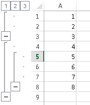
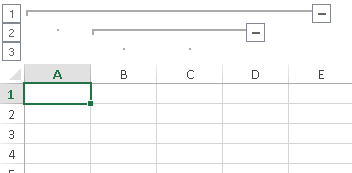

# Grouping

The purpose of this article is to describe what is grouping and how to work with it through the __RadSpreadProcessing__ model. It contains the following sections:

* [What is grouping?](#what-is-grouping)

* [Grouping rows or columns](#grouping-rows-or-columns)

* [Ungrouping Rows or Columns](#ungrouping-rows-or-columns)

* [Getting the Outline Level](#getting-the-outline-level)

## What is Grouping?

Grouping is a mechanism to organize data in sections, in order to be able to show and hide the relevant chunks. 

Each row or column which is part of a group is assigned an outline level, which determines the level of grouping and from there which rows or columns it is grouped with. 

Figure 1

In __Figure 1__, the rows 1, 2, 4 and 8 have outline level value of 1. Rows 5, 6, and 7 have outline level 2. Rows 3 and 9 do not participate in the grouping and have the default value of 0.

The maximum outline level is 7.

## Grouping Rows or Columns

There are two available options when grouping. The first option is to simply assign the outline level property of the rows or columns:

#### __[C#] Example 1: Grouping Columns Using Outline Level__

{{region radspreadprocessing-features-grouping_0}}
	Workbook workbook = new Workbook();
	Worksheet worksheet = workbook.Worksheets.Add();
	
	worksheet.Columns[0].SetOutlineLevel(1);
	worksheet.Columns[1, 2].SetOutlineLevel(2);
	worksheet.Columns[3].SetOutlineLevel(1);
{{#endregion}}

#### __[VB.NET] Example 1: Grouping Columns Using Outline Level__

{{region radspreadprocessing-features-grouping_5}}
	Dim workbook = New Workbook()
	Dim worksheet = workbook.Worksheets.Add()
	
	worksheet.Columns(0).SetOutlineLevel(1)
	worksheet.Columns(1, 2).SetOutlineLevel(2)
	worksheet.Columns(3).SetOutlineLevel(1)
{{#endregion}}

The other option is to use the Group method exposed by the row/column selection classes.

#### __[C#] Example 2: Grouping Columns Using the Group Method__

{{region radspreadprocessing-features-grouping_1}}
	Workbook workbook = new Workbook();
	Worksheet worksheet = workbook.Worksheets.Add();
	
	worksheet.Columns[0, 3].Group();
	worksheet.Columns[1, 2].Group();
{{#endregion}}

#### __[VB.NET] Example 2: Grouping Columns Using the Group Method__

{{region radspreadprocessing-features-grouping_6}}
    Dim workbook = New Workbook()
    Dim worksheet = workbook.Worksheets.Add()

    worksheet.Columns(0, 3).Group()
    worksheet.Columns(1, 2).Group()
{{#endregion}}

Both approaches will result in the following file:

Figure 2

## Ungrouping Rows or Columns

As with grouping, ungrouping can be done both through setting the outline level property of the row or column selection, or by using the Ungroup method exposed by the same classes.

The following code snippets exemplify the two approaches to make these changes in a file:

Figure 3

#### __[C#] Example 3: Ungrouping Columns Using Ouline Level__

{{region radspreadprocessing-features-grouping_2}}
	worksheet.Rows[0, 1].ClearOutlineLevel();
	worksheet.Rows[4, 6].SetOutlineLevel(1);
{{#endregion}}

#### __[VB.NET] Example 3: Ungrouping Columns Using Ouline Level__

{{region radspreadprocessing-features-grouping_7}}
    worksheet.Rows(0, 1).Ungroup()
    worksheet.Rows(4, 6).Ungroup()
{{#endregion}}

You can achieve the same result with the code in __Example 4__:

#### __[C#] Example 4: Ungrouping Columns Using the Ungroup Method__

{{region radspreadprocessing-features-grouping_3}}
	worksheet.Rows[0, 1].Ungroup();
	worksheet.Rows[4, 6].Ungroup();
{{#endregion}}

#### __[VB.NET] Example 4: Ungrouping Columns Using the Ungroup Method__

{{region radspreadprocessing-features-grouping_8}}
    worksheet.Rows(0, 1).ClearOutlineLevel()
    worksheet.Rows(4, 6).SetOutlineLevel(1)
{{#endregion}}

## Getting the outline level

You can get the outline level of a row/column or a group of rows/columns using the code in __Example 5__:

#### __[C#] Example 5: Getting the OutlineLevel__

{{region radspreadprocessing-features-grouping_4}}
	RangePropertyValue<int> outlineLevelRangeValue = worksheet.Rows[0, 1].GetOutlineLevel();
	int outLineLevel = outlineLevelRangeValue.Value;
{{#endregion}}

#### __[VB.NET] Example 5: Getting the OutlineLevel__

{{region radspreadprocessing-features-grouping_4}}
	Dim outlineLevelRangeValue As RangePropertyValue(Of Integer) = worksheet.Rows(0, 1).GetOutlineLevel()
	Dim outLineLevel As Integer = outlineLevelRangeValue.Value
{{#endregion}}

# See Also

* [Filtering]()

* [Sorting]()

