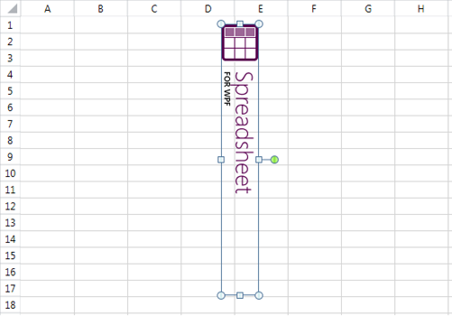

# Shapes and Images

This article briefly describes what are shapes and images, and how to create and work with them.  It contains the following sections:

* [What Are Shapes and Images?](#what-are-shapes-and-images?)

* [Properties of Shapes and Images](#properties-of-shapes-and-images)

* [Creating and Inserting an Image](#creating-and-inserting-an-image)

* [Deleting a Shape](#deleting-a-shape)

* [Changing the Shape's Position and Size](#changing-the-shape's-position-and-size)

* [Relationship Between the Cell Index of the Shape and Its Rotation Angle](#relationship-between-the-cell-index-of-the-shape-and-its-rotation-angle)

## What Are Shapes and Images?

The shapes are objects which represent a visual illustration which can be inserted in a worksheet. In the document model they are represented by the abstract class __FloatingShapeBase__.
        

The image is a kind of shape which is characterized by having an image source. They are represented by the __FloatingImage__ class, which inherits FloatingShapeBase.
        

## Properties of Shapes and Images

Shapes have the following properties:
        

* __CellIndex:__The cell index where the top left corner of the shape is located.
            

* __OffsetX:__The offset between the left side of the shape and the left side of the cell index.
            

* __OffsetY:__The offset between the top of the shape and the top of the cell index.
            

* __Width:__The width of the shape.
            

* __Height:__The height of the shape.
            

* __RotationAngle:__The angle (in degrees) by which the shape is rotated about its center.
            

* __IsHorizontallyFlipped:__Indicates whether the shape has been flipped across the y-axis.
            

* __IsVerticallyFlipped:__Indicates whether the shape has been flipped across the x-axis.
            

* __Name:__The name of the shape.
            

* __Id:__A unique number assigned to the image after it has been added to a worksheet.
            

* __Worksheet:__The worksheet in which the shape is or will be inserted.
            

Images have one additional property:
        

* __ImageSource:__Represents the source of the image.
            

## Creating and Inserting an Image

To insert an image into a worksheet do the following:
        

1. Create a __FloatingImage__ instance as in __Example 1__.
            

1. Configure its properties as in __Example 2__.
            

1. Insert the image into the worksheet as shown in __Example 3__.
            

In order to create an instance of __FloatingImage__ you need the worksheet in which you want to insert the image, the cell index and the offset.
        

#### __[C#] Example 1: Create FloatingImage__

{{region radspreadprocessing-features-shapes-and-images_0}}
	            Worksheet worksheet = this.radSpreadsheet.ActiveWorksheet;
	            FloatingImage image = new FloatingImage(worksheet, new CellIndex(7, 1), 35, 10);
	
	{{endregion}}

The next step is to configure the other properties of the image as needed.
        

#### __[C#] Example 2: Configure image properties__

{{region radspreadprocessing-features-shapes-and-images_01}}
	            FileStream stream = File.Open(@"C:\Users\Velcheva\Desktop\spreadsheet_wpf_46_text.png", FileMode.Open);
	
	            using (stream)
	            {
	                image.ImageSource = new Telerik.Windows.Documents.Media.ImageSource(stream, "png");
	            }
	
	            image.Width = 330;
	            image.Height = 45;
	            image.RotationAngle = 20;
	
	
	{{endregion}}

Insert the image into the collection of shapes of the worksheet.  Note that the worksheet needs to be the same as the one passed in the FloatingImage constructor, otherwise an exception is thrown.
        

#### __[C#] Example 3: Add image to worksheet__

{{region radspreadprocessing-features-shapes-and-images_02}}
	            worksheet.Shapes.Add(image);
	{{endregion}}

## Deleting a Shape

In order to delete a shape from a worksheet, you need the shape's instance. The collection of shapes of the worksheet exposes a __Remove()__ method with two overloads which you can use.
        

__Example 4__ demonstrates how you can remove the image added in __Example 3__.
        

#### __[C#] Delete shape__

{{region radspreadprocessing-features-shapes-and-images_03}}
	            worksheet.Shapes.Remove(image);
	{{endregion}}

## Changing the Shape's Position and Size

After the initial values of the properties of the shapes have been assigned, they can always be changed in order to reposition, resize and rotate the shape. You can change the following characteristics of the shapes:
        

1. Repositioning the shape
            

#### __[C#] Example 5: Move image__

{{region radspreadprocessing-features-shapes-and-images_04}}
	            image.CellIndex = new CellIndex(4, 5);
	            image.OffsetX = 10;
	            image.OffsetY = 10;
	{{endregion}}

1. Changing the shape's width and height
            

#### __[C#] Example 6: Change width and height__

{{region radspreadprocessing-features-shapes-and-images_05}}
	            image.Width -= 50;
	            image.Height += 50;
	{{endregion}}

1. Rotating the shape
            

#### __[C#] Example 7: Rotate__

{{region radspreadprocessing-features-shapes-and-images_06}}
	            image.RotationAngle = 40;
	{{endregion}}

The rotation angle of the shape can affect the __CellIndexM__ property and the offset. The relationship between these properties is described in more detail in the next section of this article.
            

1. Flipping the shape
            

#### __[C#] Example 8: Flip__

{{region radspreadprocessing-features-shapes-and-images_07}}
	            image.IsHorizontallyFlipped = true;
	{{endregion}}

## Relationship Between the Cell Index of the Shape and Its Rotation Angle

The __CellIndex__ of the shape and the cell index where the top left corner of the shape is visually located do not necessarily coincide when there is rotation applied. Consider the following image which has CellIndex B8.
        

If we increase the rotation angle of the image, it will be visualized differently.
        

It appears that the top left cell index is B5, however, the CellIndex property of the image will remain unchanged, B8, as will the offset.
        

This set up is convenient as it allows for more intuitive rotation of the shapes. However, when the rotation angle increases substantially, the underlying CellIndex of the shape might become too distant to be useful. In order to avoid this, once the rotation angle becomes 45° and more, the CellIndex switches to where the top left corner would be at 90° rotation.
        

This is illustrated in the following images:
        

At this point, the CellIndex property of the shape is D1 and the offset is also recalculated accordingly.
        

As rotation increases, the CellIndex of the shape will switch between B8 and D1, depending on what is closer to the visual top left corner of the shape. The result will be the following:
        

* 0° - 45° (excluded): __B8__

* 45° (included) - 135° (excluded): __D1__

* 135° (included) - 225° (excluded): __B8__

* 225° (included) - 315° (excluded): __D1__

* 315° (included) - 360°: __B8__

If the size and the rotation angle of the image will result in a top left position outside of the worksheet, the position will be automatically adjusted to fit inside it. It is important to keep this behavior in mind in order to achieve the desired positioning of the shapes.
        
