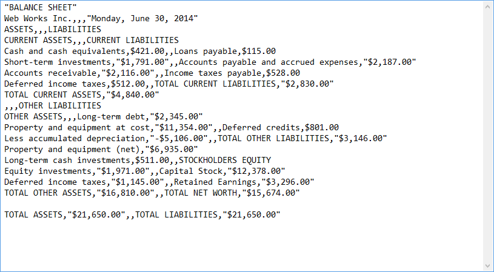

# Csv

Comma-separated values (CSV) format stores tabular data (numbers and text) in plain-text form and is one of the supported formats by __RadSpreadProcessing__ and __RadSpreadsheet__. A CSV file consists of any number of records, separated by line breaks. Each record consists of fields, separated by some other character or string, most commonly a literal comma or tab.

## 
