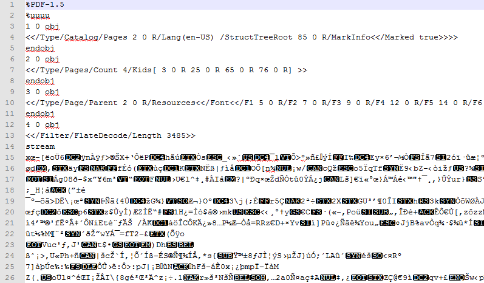

# Pdf

[Portable Document Format](http://en.wikipedia.org/wiki/Portable_Document_Format) (PDF) is a file format used to present documents independently of application software, hardware and operating system. Each PDF file contains a complete description of a fixed-layout flat document, including text, fonts, graphics, and other information needed to display it.
      

PDF File Opened in Text Editor

PdfFormatProvider is compliant with the latest [PDF Reference 1.7](http://www.adobe.com/devnet/pdf/pdf_reference.html).
      

## 
