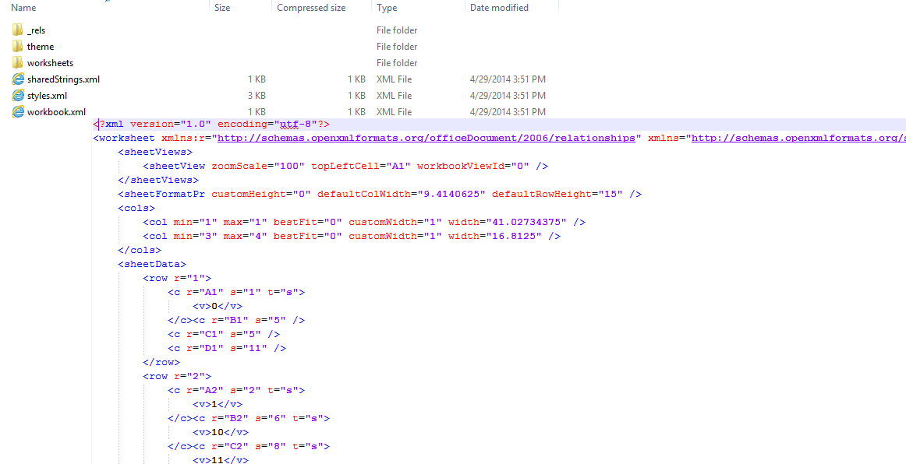

# Xlsx

Xlsx, a part of [Office Open XML](http://en.wikipedia.org/wiki/Office_Open_XML) is a zipped, XML-based file format developed by Microsoft for representing spreadsheets and is one of the supported formats by __RadSpreadProcessing__ and __RadSpreadsheet__.
      

Xlsx File Unzipped

__XlsxFormatProvider__ is compliant with the latest Office Open XML standard - [ECMA-376](http://www.ecma-international.org/publications/standards/Ecma-376.htm) 4th edition, December 2012.
      

## 
