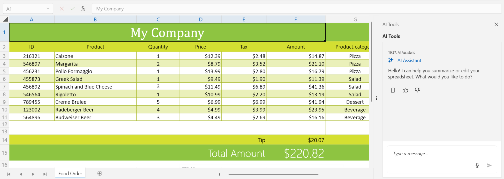
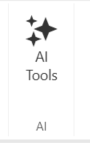

# AI Assistant for RadSpreadsheet

RadSpreadsheet provides an AI-powered assistant that transforms how you interact with spreadsheet data. Instead of manually navigating menus, clicking through dialogs, and writing complex formulas, you can simply describe what you want to accomplish in natural language. The AI assistant understands your intent and executes the necessary operations automatically.

This intelligent feature leverages Large Language Models (LLMs) to perform a wide range of spreadsheet operations through a conversational interface. You can ask questions about your data, request calculations, create and modify worksheets, generate formulas, apply formatting, analyze trends, and even create charts—all by typing or speaking naturally.

**What you can accomplish with the AI Assistant:**

* **Data Analysis** — Ask questions like "What's the average revenue per quarter?" or "Show me the top 5 products by sales" and get instant answers
* **Formula Generation** — Request formulas in plain language: "Calculate the year-over-year growth percentage" without memorizing Excel syntax
* **Worksheet Management** — Create, rename, delete, or reorganize worksheets with simple commands like "Create a new worksheet for Q2 data"
* **Content Manipulation** — Update cell values, clear ranges, or format data by describing the desired outcome: "Format the revenue column as currency"
* **Statistical Calculations** — Compute sums, averages, minimums, maximums, and other statistics across any range without writing formulas
* **Chart Creation** — Generate visual representations of your data: "Create a bar chart comparing monthly expenses"
* **Complex Operations** — Execute multi-step tasks in a single command: "Find all sales over $10,000, calculate the total, and create a summary in a new worksheet"

The AI assistant uses the [AI Agent Tools from the Document Processing Libraries](https://www.telerik.com/document-processing-libraries/documentation/ai-tools/agent-tools/overview), which provides specialized capabilities for spreadsheet manipulation. The integrated chat panel appears alongside your spreadsheet, allowing seamless interaction without interrupting your workflow. You can connect to various AI providers including Azure OpenAI, OpenAI, and local AI models through Ollama.



## Required NuGet Packages

The AI assistant feature requires the installation of several additional packages beyond those needed for the RadSpreadsheet control.

### Required Packages

* Azure.AI.OpenAI
* Microsoft.Extensions.AI.OpenAI
* Microsoft.Extensions.Logging.Debug
* Microsoft.Web.WebView2

>The RadSpreadsheet AI feature uses the [Microsoft.Extensions.AI](https://www.nuget.org/packages/Microsoft.Extensions.AI) abstractions to provide a flexible, extensible AI integration. These packages allow you to connect to various AI providers including Azure OpenAI, OpenAI, Ollama, and other services that implement the `IChatClient` interface. The actual spreadsheet manipulation capabilities are provided by the [AI Agent Tools](https://www.telerik.com/document-processing-libraries/documentation/ai-tools/agent-tools/spreadsheet-document-api).

## Available AI Tools

The `AIToolsProvider` automatically configures five categories of spreadsheet manipulation tools that enable comprehensive interaction with spreadsheet data through natural language. These tools are based on the [Spreadsheet Document API](https://www.telerik.com/document-processing-libraries/documentation/ai-tools/agent-tools/spreadsheet-document-api) from the Document Processing Libraries.

### Read Tools (SpreadProcessingReadAgentTools)

The Read Tools allow the AI agent to extract and analyze data from spreadsheets:

* **Read cell values** — Retrieve values from specific cells or cell ranges
* **Get worksheet information** — Access worksheet names, active worksheet, and worksheet count
* **Analyze cell ranges** — Read data from named ranges and complex selections
* **Extract formatted data** — Retrieve both raw values and formatted text from cells

**Example commands:**
- "What is the value in cell B5?"
- "Show me all data in the range A1:D10"
- "What worksheets are available in this workbook?"

### Write Tools (SpreadProcessingWriteAgentTools)

The Write Tools enable the AI agent to modify spreadsheet content and structure:

* **Set cell values** — Write data to individual cells or ranges
* **Update cell content** — Modify existing cell values with new data
* **Clear cell ranges** — Remove content from specified cells
* **Format cells** — Apply formatting such as number formats, fonts, and colors
* **Merge and unmerge cells** — Combine or separate cells in the spreadsheet

**Example commands:**
- "Set cell A1 to 'Total Revenue'"
- "Write the values 100, 200, 300 into cells B1, B2, and B3"
- "Clear the contents of the range C5:E10"

### Formula Tools (SpreadProcessingFormulaAgentTools)

The Formula Tools allow the AI agent to work with Excel formulas and calculations:

* **Generate formulas** — Create appropriate Excel formulas based on natural language descriptions
* **Apply formulas to cells** — Insert formulas into specific cells or ranges
* **Evaluate expressions** — Calculate results using Excel functions
* **Create complex calculations** — Build nested formulas with multiple functions
* **Reference cell ranges** — Use cell references and named ranges in formulas

**Example commands:**
- "Create a SUM formula in D10 that adds up cells D1 to D9"
- "Apply an AVERAGE formula to calculate the mean of the values in column C"
- "Add a formula to calculate percentage change between column A and column B"

### Worksheet Tools (SpreadProcessingWorksheetAgentTools)

The Worksheet Tools provide AI control over worksheet management:

* **Create worksheets** — Add new worksheets to the workbook
* **Delete worksheets** — Remove existing worksheets
* **Rename worksheets** — Change worksheet names
* **Activate worksheets** — Switch the active worksheet
* **Reorder worksheets** — Change the order of worksheets in the workbook
* **Copy worksheets** — Duplicate existing worksheets

**Example commands:**
- "Create a new worksheet named 'Sales Q1 2025'"
- "Delete the worksheet called 'Temporary Data'"
- "Rename the current worksheet to 'Annual Summary'"
- "Move the 'Revenue' worksheet to the first position"

### Analysis Tools (SpreadProcessingAnalysisAgentTools)

The Analysis Tools enable the AI agent to perform data analysis and generate insights:

* **Statistical calculations** — Compute sums, averages, min/max values, and other statistics
* **Data aggregation** — Group and summarize data across ranges
* **Pattern recognition** — Identify trends and patterns in the data
* **Conditional analysis** — Find data meeting specific criteria
* **Chart generation** — Create visual representations of data
* **Data comparison** — Compare values across different ranges or worksheets

**Example commands:**
- "Find the highest value in the 'Revenue' column"
- "Calculate the average of all positive numbers in the range E1:E50"
- "Generate a chart showing monthly sales trends"
- "What is the total sum of all values in the 'Expenses' worksheet?"
- "Identify cells where the value is greater than 1000"

### Natural Language Processing

All tools work together to process complex, multi-step natural language commands. The AI agent can:

* Interpret context-aware requests
* Execute multiple operations in sequence
* Make intelligent decisions about data placement and formatting
* Handle ambiguous requests by asking clarifying questions
* Provide explanations of actions taken

**Example complex commands:**
- "Analyze the sales data in worksheet 'Q1', calculate the total, and create a summary in a new worksheet"
- "Find all products with revenue over $10,000 and create a filtered list in column F"
- "Create a monthly comparison chart showing the difference between actual and budgeted expenses"

>For detailed information about the underlying AI tools and their capabilities, see the [AI Agent Tools documentation](https://www.telerik.com/document-processing-libraries/documentation/ai-tools/agent-tools/overview) and the [Spreadsheet Document API reference](https://www.telerik.com/document-processing-libraries/documentation/ai-tools/agent-tools/spreadsheet-document-api).

## Enabling the AI Assistant

The AI assistant is represented by a chat panel that allows you to interact with the spreadsheet using natural language. To enable the AI features, set the `IsAIEnabled` property to `true`. This property activates the AI functionality and makes the AI panel available.

#### __Setting IsAIEnabled in XAML__
```XAML
<telerik:RadSpreadsheet x:Name="radSpreadsheet" IsAIEnabled="True" />
```

#### __Setting IsAIEnabled in code-behind__
```C#
this.radSpreadsheet.IsAIEnabled = true;
```

Once enabled, you can show or hide the AI panel using the `IsAIPanelVisible` property.

#### __Controlling AI panel visibility__
```C#
// Show the AI panel
this.radSpreadsheet.IsAIPanelVisible = true;
```

Alternatively, you can use the `ToggleAIPanelCommand` to toggle the panel visibility. This command is useful for binding to buttons or other UI elements.

#### __Using ToggleAIPanelCommand__
```XAML
<Button Content="Toggle AI Panel" 
        Command="{Binding ElementName=radSpreadsheet, Path=ToggleAIPanelCommand}" />
```

### Using the Ribbon Button

When using the `RadSpreadsheetRibbon`, you can display an **AI Assistant** toggle button that allows users to show or hide the AI panel directly from the ribbon UI. Set the `IsAIButtonVisible` property to `true` to display this button.

#### __Configuring RadSpreadsheetRibbon with AI button__
```XAML
<Grid>
    <Grid.RowDefinitions>
        <RowDefinition Height="Auto"/>
        <RowDefinition Height="*"/>
    </Grid.RowDefinitions>

    <telerik:RadSpreadsheetRibbon x:Name="spreadsheetRibbon"
                                   IsAIButtonVisible="True"
                                   RadSpreadsheet="{Binding ElementName=radSpreadsheet, Mode=OneTime}"/>

    <telerik:RadSpreadsheet Grid.Row="1" 
                            x:Name="radSpreadsheet"
                            IsAIEnabled="True" />
</Grid>
```

#### __Configuring RadSpreadsheetRibbon in code-behind__
```C#
this.spreadsheetRibbon.IsAIButtonVisible = true;
this.spreadsheetRibbon.RadSpreadsheet = this.radSpreadsheet;
```

The AI Assistant button appears in the ribbon and enables users to toggle the chat panel on and off. The button is automatically enabled or disabled based on the `IsAIEnabled` property of the associated RadSpreadsheet.



## Setting Up the AI Tools Provider

To connect RadSpreadsheet to an AI service, you need to create an `AIToolsProvider` instance. The `AIToolsProvider` class serves as a bridge between the RadSpreadsheet control and your AI service, providing pre-configured tools for spreadsheet operations.

The `AIToolsProvider` requires two parameters:
- An `IChatClient` instance from Microsoft.Extensions.AI that connects to your chosen AI service
- The `RadSpreadsheet` instance to interact with

>important When using the AI Assistant feature, you need to add the following namespaces to your code file:
>- `using Azure.AI.OpenAI;`
>- `using Microsoft.Extensions.AI;`
>- `using Telerik.Windows.Controls.Spreadsheet.AI;`

#### __Setting up AIToolsProvider__
```C#
this.radSpreadsheet.IsAIEnabled = true;

// Create the AI client (example using Azure OpenAI)
string endpoint = "https://your-resource-name.openai.azure.com/";
string apiKey = "your-api-key";
string deploymentName = "gpt-4";

var azureClient = new AzureOpenAIClient(
    new Uri(endpoint), 
    new System.ClientModel.ApiKeyCredential(apiKey))
    .GetChatClient(deploymentName);

IChatClient chatClient = azureClient.AsIChatClient();

// Create and assign the AI tools provider
var aiToolsProvider = new AIToolsProvider(chatClient, this.radSpreadsheet);
this.radSpreadsheet.AIToolsProvider = aiToolsProvider;
```

>The `AIToolsProvider` automatically registers a comprehensive set of spreadsheet manipulation tools that the AI agent can use, including tools for reading cell values, writing data, generating formulas, creating worksheets, and performing data analysis.

## Adjusting the Maximum Token Count

The `AIToolsProvider` has a default maximum token limit of 128,000 tokens. You can adjust this limit using the `MaxTokenCount` property:

#### __Adjusting MaxTokenCount__
```C#
var aiToolsProvider = new AIToolsProvider(chatClient, this.radSpreadsheet);
aiToolsProvider.MaxTokenCount = 50000;
this.radSpreadsheet.AIToolsProvider = aiToolsProvider;
```

## See Also

* [Getting Started]()
* [RadSpreadsheetRibbon]()
* [AI Agent Tools Overview](https://www.telerik.com/document-processing-libraries/documentation/ai-tools/agent-tools/overview)
* [Spreadsheet Document API](https://www.telerik.com/document-processing-libraries/documentation/ai-tools/agent-tools/spreadsheet-document-api)

