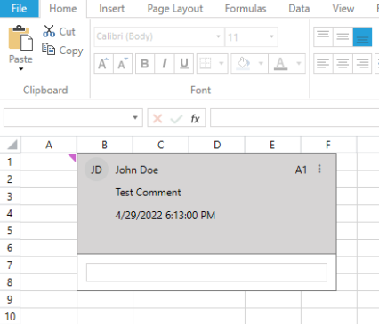
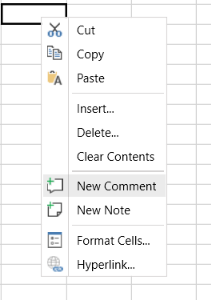
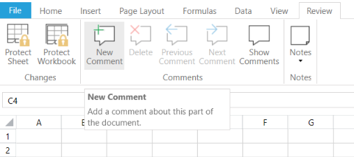
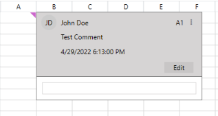
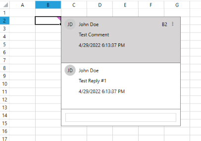
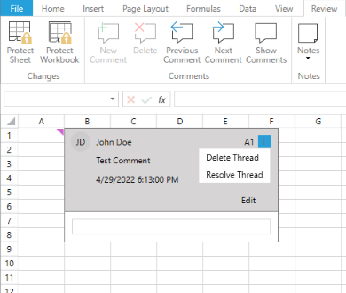

# {{ site.framework_name }} RadSpreadsheet Comments

Since R2 2022 the Spreadsheet control supports working with comments.

Comments are used for leaving information about a cell's data, where each comment can be replied to, thus creating a thread. All Comments can be found in the __Comments__ collection of the worksheet. More information about using Comments in code is available here: [SpreadProcessing Comments](https://docs.telerik.com/devtools/document-processing/libraries/radspreadprocessing/features/comments). 

#### Figure 1: Sample Comment

### Using Comments in your Application

RadSpreadsheet enables working with Comments through its UI. There are two ways for adding Comments, via the context menu and from the Comments group on the Review tab.

#### Figure 2: Add Comment from the context menu

#### Figure 3: Add Comment from the Comments group

As you can see in the above image, the Comments group allows you to perform the following actions:

* __New Comment:__ Adds new comment to the selected cell.
* __Reply Comment:__ Adds a reply to an existing comment. This option is only available when the selected cell already contains a comment.
* __Delete:__ Deletes the comment in the selected cell, including all of its replies. Only available when the selected cell already contains a comment.
* __Previous Comment:__ Selects the previous Comment in the current worksheet. 
* __Next Comment:__ Selects the next Comment in the current worksheet.
* __Show Comments:__ Shows or hides the Comment pane of the current spreadsheet. The pane updates its content upon changing the selected sheet accordingly.

### Editing Comments

To edit a Comment select a cell that contains one, mouse over the Comment content and click "Edit Comment" from the Comments group or from the Comments pane.

#### Figure 4: Edit Comment

### Replying to Comments

To reply to a Comment simply type your reply in its the textbox or select its cell and click "Reply Comment" from the Comments group. 

#### Figure 4: Reply to Comment

### Deleting Comments

To delete a Comment select it and click "Delete Comment" from the context menu or use the comment's hamburger-menu option "Delete Thread". You can also use the "Delete Comment" option in the context menu on a selection of cells to delete any comments they contain. All listed options delete the comments as well as ***all*** of their replies.

#### Figure 5: Delete Comment

### Show Comments

The Comments group allows showing the Comments pane.

#### Figure 6: Show/Hide Comment

