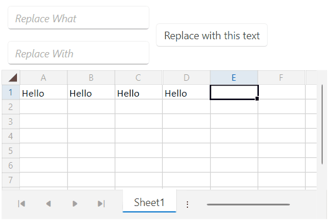
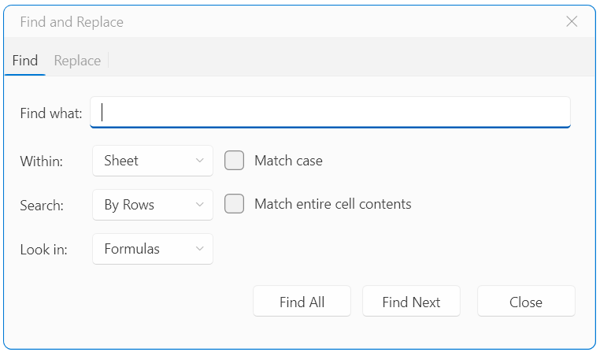
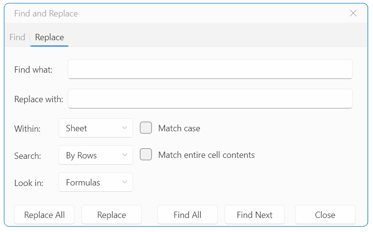

# Find and Replace

The `RadSpreadSheet` control uses the [SpreadProcessing library](https://docs.telerik.com/devtools/document-processing/libraries/radspreadprocessing/overview) as its document model. This library provides the functionality to find and replace text and numbers in a workbook, worksheet, or a specified range of cells. This is done via methods that the `Workbook` and `Worksheet` classes expose.

>tip More information about the find and replace functionality of the SpreadProcessing library can be found in this [article](https://docs.telerik.com/devtools/document-processing/libraries/radspreadprocessing/features/find-and-replace).

The following example showcases how to replace text in the current worksheet via the available API:

#### __[XAML] Defining the RadSpreadsheet and UI elements for thе replace logic__
{{region radspreadsheet-find-and-replace-0}}
    <Grid>
        <Grid.Resources>
            
        </Grid.Resources>
        <Grid.RowDefinitions>
            <RowDefinition Height="Auto"/>
            <RowDefinition Height="*"/>
        </Grid.RowDefinitions>
        <Grid>
            <Grid.ColumnDefinitions>
                <ColumnDefinition Width="Auto"/>
                <ColumnDefinition Width="*"/>
            </Grid.ColumnDefinitions>
            <StackPanel>
                <telerik:RadWatermarkTextBox x:Name="replaceWhatWatermarkTextBox"
                                             WatermarkContent="Replace What"/>
                <telerik:RadWatermarkTextBox x:Name="replaceWithWatermarkTextBox"
                                             WatermarkContent="Replace With"/>
            </StackPanel>
            <telerik:RadButton Content="Replace with this text" 
                               Click="OnReplaceButtonClicked" 
                               Margin="3 0 0 0"
                               HorizontalAlignment="Left"
                               VerticalAlignment="Center"
                               Grid.Column="1"/>
        </Grid>
        <telerik:RadSpreadsheet x:Name="spreadsheet" Grid.Row="1"/>
    </Grid>
{{endregion}}

#### __[C#] Using the avaliable API of the Worksheet class for thе replace logic__
{{region radspreadsheet-find-and-replace-1}}
    private void OnReplaceButtonClicked(object sender, RoutedEventArgs e)
    {
        Worksheet activeWorksheet = this.spreadsheet.ActiveWorksheet;

        ReplaceOptions options = new ReplaceOptions()
        {
            StartCell = new WorksheetCellIndex(activeWorksheet, 0, 0),
            FindBy = FindBy.Rows,
            FindWhat = this.replaceWhatWatermarkTextBox.Text.ToString(),
            ReplaceWith = this.replaceWithWatermarkTextBox.Text.ToString(),
            FindWithin = FindWithin.Sheet,
        };

        if (activeWorksheet.ReplaceAll(options) > 0)
        {
            RadWindow.Alert("Replace was successful!");
        }
    }
{{endregion}}

__RadSpreadsheet with a custom find and replace logic__

## Find and Replace Through the UI

The RadSpreadsheet control provides the option to utilize the find and replace functionality through the UI. To do so, press the __CTRL__ + __F__ keys, in order to open the find and replace window.

__Find and Replace window's Find tab options__

__Find and Replace window's Replace tab options__

