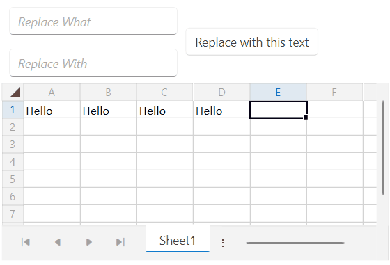
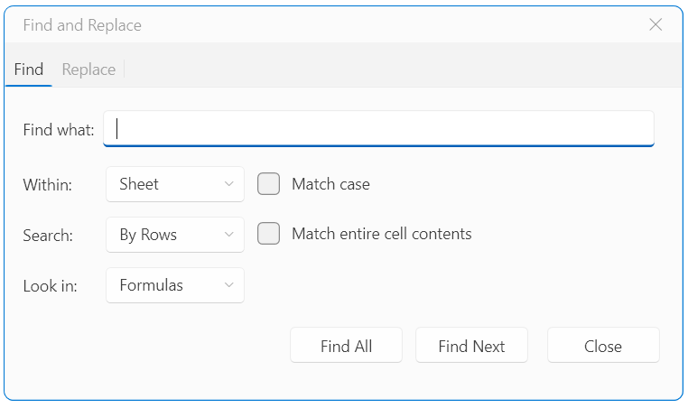
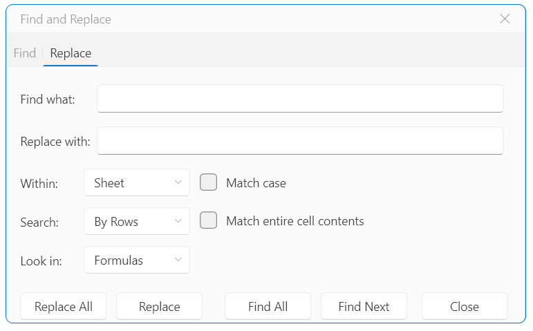

# Find and Replace

The `RadSpreadSheet` control uses the [SpreadProcessing library](https://docs.telerik.com/devtools/document-processing/libraries/radspreadprocessing/overview) as its document model. This library provides the functionality to find and replace text and numbers in a workbook, worksheet, or a specified range of cells. This is done via methods that the `Workbook` and `Worksheet` classes expose.

>tip More information about the find and replace functionality of the SpreadProcessing library can be found in this [article](https://docs.telerik.com/devtools/document-processing/libraries/radspreadprocessing/features/find-and-replace).

The following example showcases how to replace text in the current worksheet via the available API:

__Defining the RadSpreadsheet and UI elements for thе replace logic__
<snippet id='radspreadsheet-features-find-and-replace-block_1-xaml' />

__Using the avaliable API of the Worksheet class for thе replace logic__
<snippet id='radspreadsheet-features-find-and-replace-block_2-cs' />

__RadSpreadsheet with a custom find and replace logic__

## Find and Replace Through the UI

The RadSpreadsheet control provides the option to utilize the find and replace functionality through the UI. To do so, press the __CTRL__ + __F__ keys, in order to open the find and replace window.

__Find and Replace window's Find tab options__

__Find and Replace window's Replace tab options__

