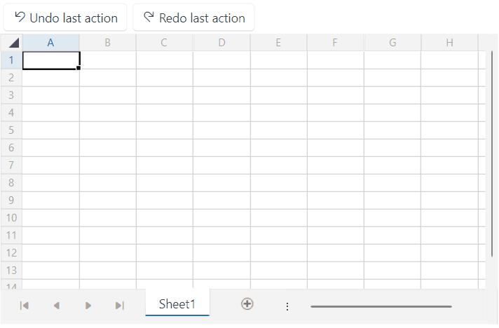

# History

The `RadSpreadSheet` control uses the [SpreadProcessing library](https://docs.telerik.com/devtools/document-processing/libraries/radspreadprocessing/overview) as its document model. This library provides a history functionality that you can access via the `Workbook.History` property of RadSpreadsheet.

>tip More information about the history functionality can be found in this [article](https://docs.telerik.com/devtools/document-processing/libraries/radspreadprocessing/features/history).

The following example showcases how to implement custom undo/redo buttons:

#### __[XAML] Adding buttons in the UI for the Undo and Redo methods__
{{region radspreadsheet-history-0}}
    <Grid>
        <Grid.RowDefinitions>
            <RowDefinition Height="Auto"/>
            <RowDefinition Height="*"/>
        </Grid.RowDefinitions>
        <StackPanel HorizontalAlignment="Left" Orientation="Horizontal">
            <telerik:RadButton Content="Undo last action" 
                               Click="OnUndoButtonClicked">
                <telerik:RadButton.ContentTemplate>
                    <DataTemplate>
                        <StackPanel Orientation="Horizontal">
                            <telerik:RadGlyph Glyph="{StaticResource GlyphUndo}"/>
                            <TextBlock Text="{Binding}" Margin="3 0 0 0"/>
                        </StackPanel>
                    </DataTemplate>
                </telerik:RadButton.ContentTemplate>
            </telerik:RadButton>
            <telerik:RadButton Content="Redo last action"
                               Click="OnRedoButtonClicked">
                <telerik:RadButton.ContentTemplate>
                    <DataTemplate>
                        <StackPanel Orientation="Horizontal">
                            <telerik:RadGlyph Glyph="{StaticResource GlyphRedo}"/>
                            <TextBlock Text="{Binding}" Margin="3 0 0 0"/>
                        </StackPanel>
                    </DataTemplate>
                </telerik:RadButton.ContentTemplate>
            </telerik:RadButton>
        </StackPanel>
        <telerik:RadSpreadsheet x:Name="radSpreadsheet" Grid.Row="1">
            <telerik:RadSpreadsheet.FormatProviders>
                <Txt:TxtFormatProvider/>
                <Csv:CsvFormatProvider/>
            </telerik:RadSpreadsheet.FormatProviders>
        </telerik:RadSpreadsheet>
    </Grid>
{{endregion}}

#### __[C#] Adding the logic for the buttons to execute the Undo and Redo methods__
{{region radspreadsheet-history-1}}
    private void OnUndoButtonClicked(object sender, RoutedEventArgs e)
    {
        this.radSpreadsheet.Workbook.History.Undo();
    }

    private void OnRedoButtonClicked(object sender, RoutedEventArgs e)
    {
        this.radSpreadsheet.Workbook.History.Redo();
    }
{{endregion}}

__RadSpreadsheet with custom redo/undo buttons__

The history functionality is also present in the [RadSpreadsheetRibbon]() element, which is a UI component that you can use together with RadSpreadsheet. Via the Undo and Redo buttons in the top-left corner, you can execute the `Redo` and `Undo` methods of the `History` property.