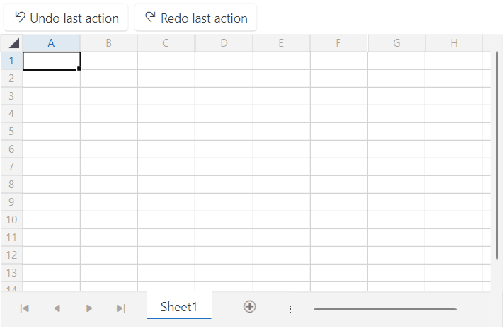

# History

The `RadSpreadSheet` control uses the [SpreadProcessing library](https://docs.telerik.com/devtools/document-processing/libraries/radspreadprocessing/overview) as its document model. This library provides a history functionality that you can access via the `Workbook.History` property of RadSpreadsheet.

>tip More information about the history functionality can be found in this [article](https://docs.telerik.com/devtools/document-processing/libraries/radspreadprocessing/features/history).

The following example showcases how to implement custom undo/redo buttons:

__Adding buttons in the UI for the Undo and Redo methods__
<snippet id='radspreadsheet-features-history-block_1-xaml' />

__Adding the logic for the buttons to execute the Undo and Redo methods__
<snippet id='radspreadsheet-features-history-block_2-cs' />

__RadSpreadsheet with custom redo/undo buttons__

## RadSpreadsheetRibbon

The history functionality is also present in the [RadSpreadsheetRibbon]() element, which is a UI component that you can use together with RadSpreadsheet. Via the undo and redo buttons in the top-left corner, you can execute this logic through the UI.