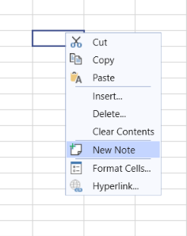
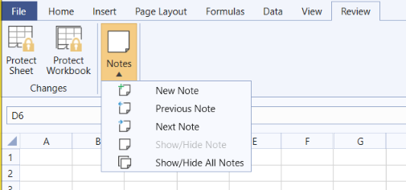
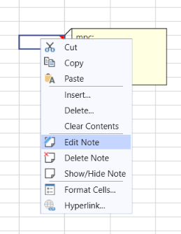
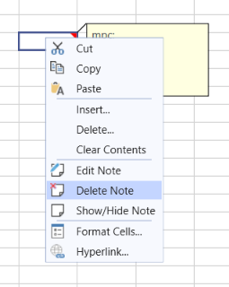
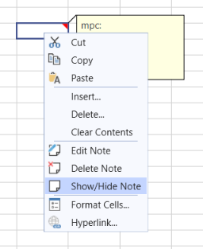

# Notes

Since R1 2022 the Spreadsheet control supports working with notes. The Notes are used for making notes or annotations about the data. All notes can be found in the __Notes__ collection of the worksheet. More information about using notes in code is available here: [SpreadProcessing Notes](https://docs.telerik.com/devtools/document-processing/libraries/radspreadprocessing/features/notes).

#### Figure 1: Sample Note

### Using Notes in your Application

RadSpreadsheet enables working with notes through its UI. There are two ways for adding notes, via the context menu and from the Notes menu on the review tab.

#### Figure 2: Add note from the context menu

#### Figure 3: Add note from the Notes menu

As you can see in the above image, the notes menu allows you to perform the following actions as well:

* __EditNote:__ Puts the note of the current cell in edit mode.
* __Select Previous or Next Note:__ Selects a note depending on the currently selected cell. 
* __Show/Hide Note:__ Shows or hides the note of the current cell. 
* __Show/Hide All Notes:__ Shows or hides all the notes in the current sheet. When enabled all notes will be visible and you will be able to select and edit them. 

### Editing Notes

To edit a note select a cell that contains note and click "Edit Note" from the context menu or from the Note menu in the Review tab.

#### Figure 4: Edit Note

### Deleting Notes

To delete a note select it and click "Delete Note" from the context menu. You can apply the "Delete Note" command on a selection of cells and if there are notes included they will be deleted as well.

#### Figure 4: Delete Note

### Show/Hide a Note

The context menu allows you to show/hide a note as well. 

#### Figure 5: Show/Hide Note

