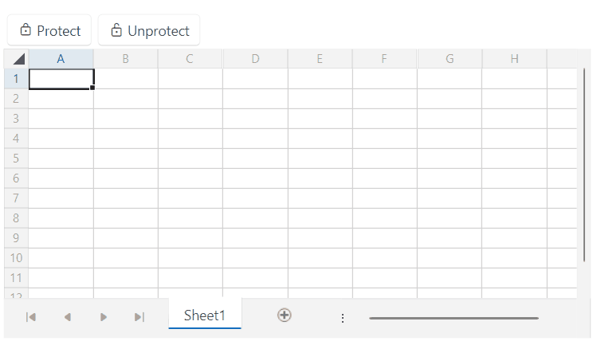

# Protection

The `RadSpreadSheet` control uses the [SpreadProcessing library](https://docs.telerik.com/devtools/document-processing/libraries/radspreadprocessing/overview) as its document model. This library provides the functionality to apply protection on a workbook or a worksheet level. Both the `Workbook` and `Worksheet` classes expose the `Protect` and `Unprotect` methods that will allow you to set a password to secure them. 

>tip More information about the protection functionality of the SpreadProcessing library can be found in the [Workbook Protection](https://docs.telerik.com/devtools/document-processing/libraries/radspreadprocessing/features/protection/workbook) and [Worksheet Protection](https://docs.telerik.com/devtools/document-processing/libraries/radspreadprocessing/features/protection/worksheet) articles.

The following example showcases how to protect and unprotect the current worksheet:

#### __[XAML] Defining the RadSpreadsheet and the buttons for protecting and uprotecting the current worksheet__
{{region radspreadsheet-protection-0}}
    <Grid>
        <Grid.RowDefinitions>
            <RowDefinition Height="Auto"/>
            <RowDefinition Height="*"/>
        </Grid.RowDefinitions>
        <StackPanel HorizontalAlignment="Left" Orientation="Horizontal">
            <telerik:RadButton Content="Protect" 
                               Click="OnProtectButtonClicked">
                <telerik:RadButton.ContentTemplate>
                    <DataTemplate>
                        <StackPanel Orientation="Horizontal">
                            <telerik:RadGlyph Glyph="{StaticResource GlyphLock}"/>
                            <TextBlock Text="{Binding}" Margin="3 0 0 0"/>
                        </StackPanel>
                    </DataTemplate>
                </telerik:RadButton.ContentTemplate>
            </telerik:RadButton>
            <telerik:RadButton Content="Unprotect"
                               Click="OnUnprotectButtonClicked">
                <telerik:RadButton.ContentTemplate>
                    <DataTemplate>
                        <StackPanel Orientation="Horizontal">
                            <telerik:RadGlyph Glyph="{StaticResource GlyphUnlock}"/>
                            <TextBlock Text="{Binding}" Margin="3 0 0 0"/>
                        </StackPanel>
                    </DataTemplate>
                </telerik:RadButton.ContentTemplate>
            </telerik:RadButton>
        </StackPanel>
        <telerik:RadSpreadsheet x:Name="radSpreadsheet" Grid.Row="1">
            <telerik:RadSpreadsheet.FormatProviders>
                <Txt:TxtFormatProvider/>
                <Csv:CsvFormatProvider/>
            </telerik:RadSpreadsheet.FormatProviders>
        </telerik:RadSpreadsheet>
    </Grid>
    {{endregion}}

#### __[C#] Adding logic to the buttons__
{{region radspreadsheet-protection-1}}
    private void OnProtectButtonClicked(object sender, RoutedEventArgs e)
    {
        this.radSpreadsheet.ActiveWorksheet.Protect("Telerik", WorksheetProtectionOptions.Default);
    }

    private void OnUnprotectButtonClicked(object sender, RoutedEventArgs e)
    {
        this.radSpreadsheet.ActiveWorksheet.Unprotect("Telerik");
    }
{{endregion}}

__RadSpreadsheet with protected/unprotected worksheet__

## RadSpreadsheetRibbon

The protection functionality is also present in the [RadSpreadsheetRibbon]() element, which is a UI component that you can use together with RadSpreadsheet. You can find the protection logic in the __Changes__ ribbon group of the __Review__ tab.