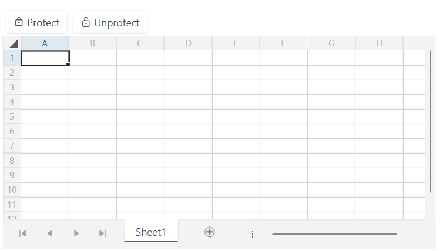

# Protection

The `RadSpreadSheet` control uses the [SpreadProcessing library](https://docs.telerik.com/devtools/document-processing/libraries/radspreadprocessing/overview) as its document model. This library provides the functionality to apply protection on a workbook or a worksheet level. Both the `Workbook` and `Worksheet` classes expose the `Protect` and `Unprotect` methods that will allow you to set a password to secure them. 

>tip More information about the protection functionality of the SpreadProcessing library can be found in the [Workbook Protection](https://docs.telerik.com/devtools/document-processing/libraries/radspreadprocessing/features/protection/workbook) and [Worksheet Protection](https://docs.telerik.com/devtools/document-processing/libraries/radspreadprocessing/features/protection/worksheet) articles.

The following example showcases how to protect and unprotect the current worksheet:

__Defining the RadSpreadsheet and the buttons for protecting and uprotecting the current worksheet__
<snippet id='radspreadsheet-features-protection-block_1-xaml' />

__Adding logic to the buttons__
<snippet id='radspreadsheet-features-protection-block_2-cs' />

__RadSpreadsheet with protected/unprotected worksheet__

## RadSpreadsheetRibbon

The protection functionality is also present in the [RadSpreadsheetRibbon]() element, which is a UI component that you can use together with RadSpreadsheet. You can find the protection logic in the __Changes__ ribbon group of the __Review__ tab.