# Charts

The charts enable you to summarize the data in your spreadsheet document and make it easily readable and understandable. With RadSpreadsheet you can show charts as well as add, remove and manipulate chart objects in your spreadsheet documents.

## Using Charts in Your Application

>important To visualize a chart, RadSpreadsheet uses [RadChartView](), so you must add a reference to **Telerik.Windows.Controls.Chart.dll**.

RadSpreadsheet enables you working with charts through its UI. You can add a chart through the Insert Chart dialog  which can be opened from the Insert tab of [RadSpreadsheetRibbon](). The dialog shows all of the available types of charts along with a preview of how the chart would look like when filled with the selected data.

>noteTo be able to see the charts, you must select at least two consecutive cells, otherwise you will get an error message. In case they don't contain any values, the charts will be shown empty. 

#### Figure 1: Insert Chart dialog
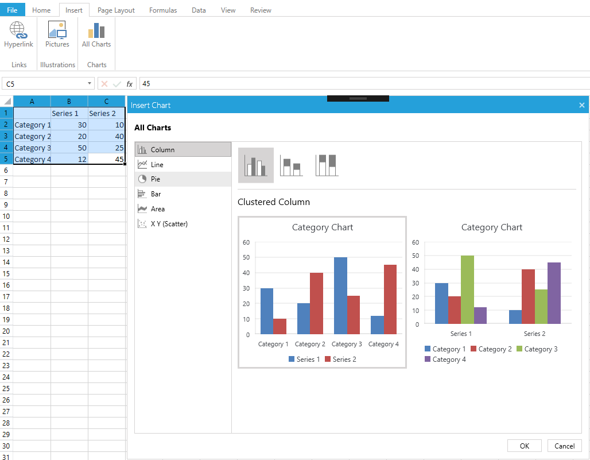

## Supported Chart Types

### Column Charts

Column/bar charts are used to display values as sets of vertical columns, grouped by category. The length of the bars is proportional to the values that they represent. With this type of charts you can easily compare values in different categories. 

| Clustered column        | Stacked column | 100% stacked column |
| ----------------------- |:--------------:| -------------------:|
| 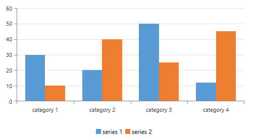 | 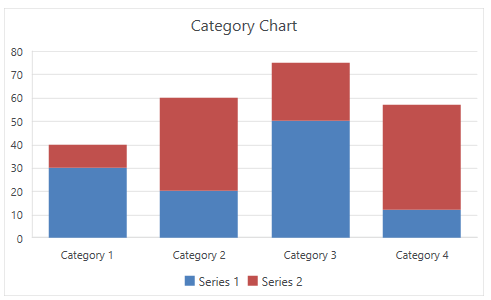 | 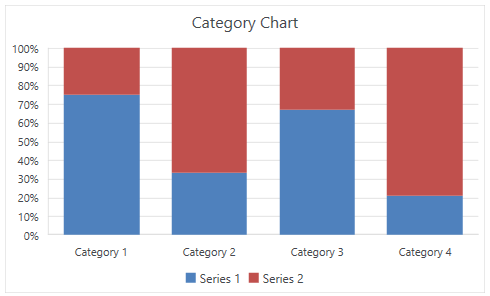| 

### Bar Charts

Bar charts are analogical to the column charts, except the orientation of the bars. These charts use horizontal bars instead of vertical columns to display the values and their categories.

| Clustered bar           | Stacked bar    | 100% stacked bar    |
| ----------------------- |:--------------:| -------------------:|
| 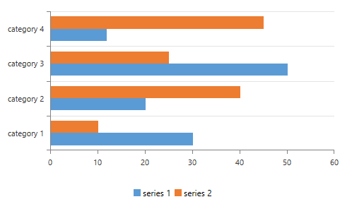 | 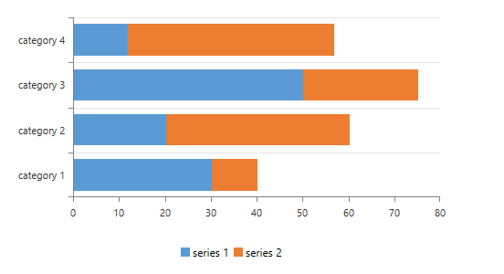 | 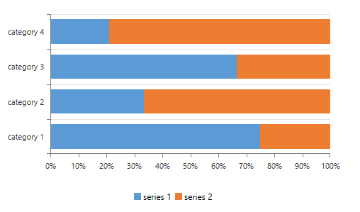|

### Line Charts

The line chart shows the category data distributed on the horizontal axis and all the values are distributed along the vertical axis. With this type of charts you can visualize continuous data over time on an evenly scaled axis. It is pretty helpful when you need to show trends in data at equal intervals, like months, years, or other periods.

| Clustered line          | Stacked line   | 100% stacked line   |
| ----------------------- |:--------------:| -------------------:|
| 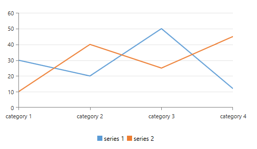 |  | 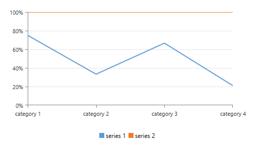|

### Pie and Doughnut Charts
	
Pie charts are useful for comparing the values of different points in a single series. The data points in a pie chart are shown as a percentage of the whole pie. The doughnut chart is identical to the pie. However, it can contain more than a single series and can be visualized with a hole in the middle of the shape.

| Pie         | Doughnut  | 
| ----------- |:----------| 
| 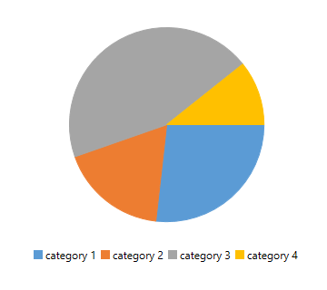 | 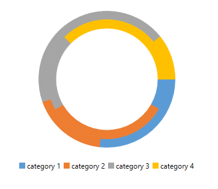 |

### Area Charts

Area charts can be used to plot change over time and draw attention to the total value across a trend. Since the area chart shows the sum of the plotted values as well, it visualized how the different parts contribute to the end result of the data.

| Clustered area          | Stacked area   | 100% stacked area   |
| ----------------------- |:--------------:| -------------------:|
| 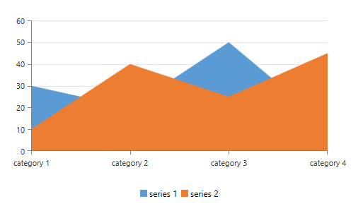 | 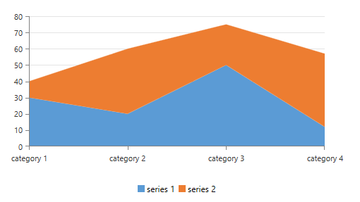 | 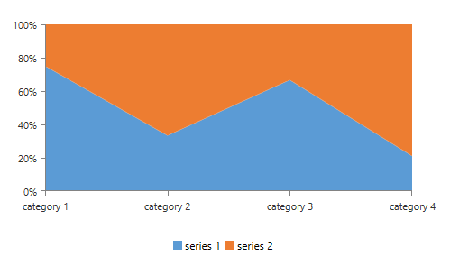|

## Manipulating Charts in Code

You can work with charts programmatically as well. For more information about the available API, refer to the documentation of the library used as a model of RadSpreadsheet - RadSpreadProcessing: [Charts API](https://docs.telerik.com/devtools/document-processing/libraries/radspreadprocessing/features/charts/overview).