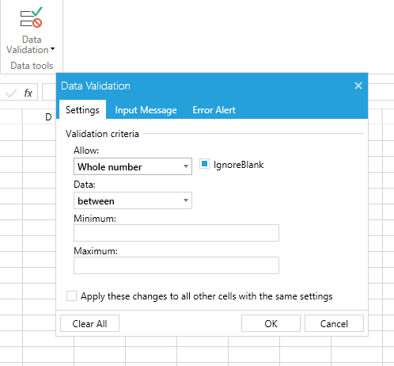
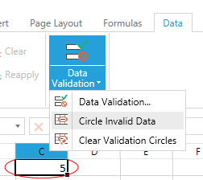

# Data Validation

Data validation is a feature of __RadSpreadsheet__ that helps you define restrictions on what data can be entered in a cell. This is achieved by defining data validation rules which consist of a rule type, one or more arguments and a comparison operator for some of the rule types. You can specify messages that users will see before editing a cell or after entering invalid data.


## How to Set Data Validation Rules

You can easily set data validation rules using the data validation dialog which can be shown from the Data tab in the predefined RibbonView. __Figure 1__ shows the dialog.

#### __Figure 1: Data Validation Dialog__




>tip Detailed information on the different validation rules is available in the [Data Validation for SpreadProcessing article](https://docs.telerik.com/devtools/document-processing/libraries/radspreadprocessing/features/data-validation).


The dialog contains two other tabs - one allowing to customize the input message that is shown when the cell is selected, and one allowing to change the alert shown when there is an error in the cell.


## Circle Invalid Data

Data Validation allows you to turn on the option to circle invalid data. This way you can always see if there is any invalid data in your document. You can toggle this option using the ribbon or through code.


__Figure 2__ shows hot to turn the option on and the result when invalid data is present in the worksheet.


#### __Figure 2: Circle Invalid Data__




__Example 1__ shows the use of the two methods that toggle this functionality - __CircleInvalidData()__ and __ClearInvalidDataCircles()__.

__Example 1: Turn on and off Invalid Data Circles.__

```C#
	if (showCircles)
	{
	    this.radSpreadsheet.ActiveWorksheetEditor.CircleInvalidData();
	}
	else
	{
	    this.radSpreadsheet.ActiveWorksheetEditor.ClearInvalidDataCircles();
	}
```
```VB.NET
	If showCircles Then
		Me.radSpreadsheet.ActiveWorksheetEditor.CircleInvalidData()
	Else
		Me.radSpreadsheet.ActiveWorksheetEditor.ClearInvalidDataCircles()
	End If
```

## See Also

* [Data Validation for SpreadProcessing article](https://docs.telerik.com/devtools/document-processing/libraries/radspreadprocessing/features/data-validation)
