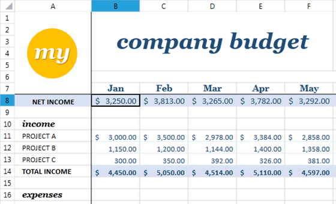
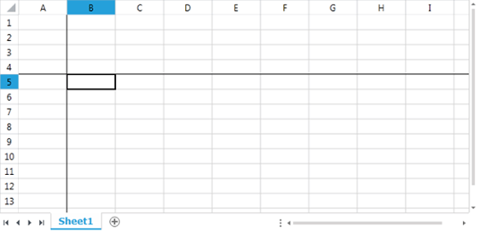
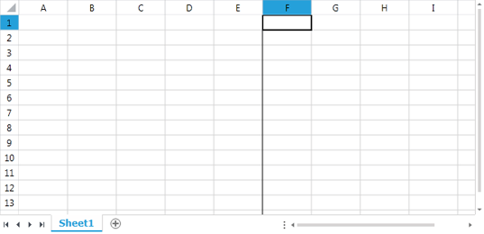
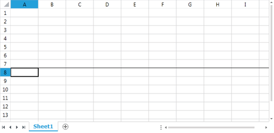
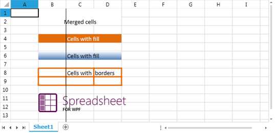
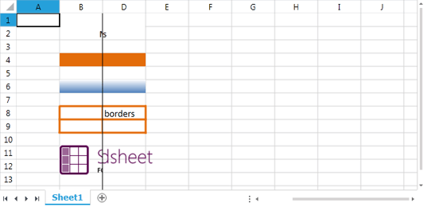

# Freeze Panes


The __RadSpreadsheet__ allows the user to open documents that contains 1048576 rows and 16384 columns in a single sheet. But sometimes it is difficult to read and understand very large spreadsheets. When you scroll too far to the right or down, you lose the headings that are located at the top and down the left side of the worksheet. Without the headings, it’s hard to keep track of which column or row of data you are looking at.
      

To avoid this problem you can use the __Freeze Panes__ feature so specific rows and columns of the spreadsheet remains visible at all times. If you have a company budget for example you may want to see the months and the budget items at all times:



In the scenario shown above the dark lines shows where the panes are frozen. If you scroll up or down the cells above the dark line will stay frozen and will not move, but the cells below it will be scrolled. If you scroll left or right, the column A will stay frozen and the cells on the right from the dark line will be scrolled.
      

## Freeze Panes

You can achieve this behavior using the __FreezePanes()__ method of the active worksheet editor. The method takes as parameter the cell you want to be the top left cell of the scrollable part of the document, which is B8 in the example above, and freeze.
        

The following code will produce freeze panes like the example below:
        

#### __C#__

```C#	
	            RadWorksheetEditor worksheetEditor = radSpreadsheet.ActiveWorksheetEditor;
	            worksheetEditor.FreezePanes(new CellIndex(4, 1));
	```



Note that the cell you want to freeze have to be visible at the moment you freeze, if not the visible area will be frozen in the middle.
        

If you want to freeze panes so there are only two panes you have to freeze using a cell index located at the top or left edge of the visible area. For example if you want to split visible area vertically like shown on the image below you have to freeze on cell F1:



But if you want to split the visible area horizontally you like shown on the image bellow you have to freeze on cell A8:



Here is an example showing what happens when frozen panes splits merged cells, cells with applied fill, cells with borders and images:



Here is the same scenario but when scrolled with one cell to the right:



## Unfreeze Panes

To unfreeze panes simply you need to use the __UnfreezePanes()__ method of the __RadWorksheetEditor__:
        

#### __C#__

```C#	
	            RadWorksheetEditor worksheetEditor = radSpreadsheet.ActiveWorksheetEditor;
	            worksheetEditor.UnfreezePanes();
```

