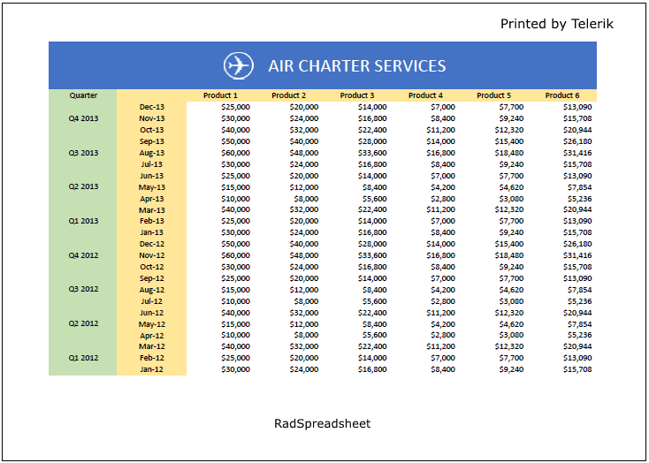
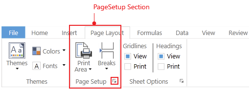
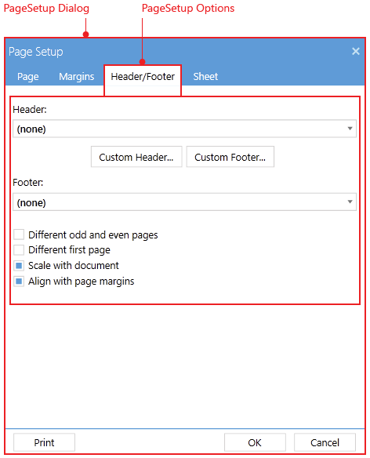
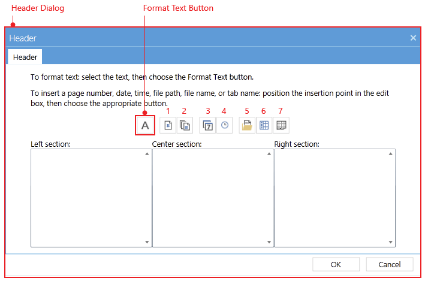

# Headers and Footers

Headers and Footers functionality allows you add rich text content in the page margins when exporting a worksheet to pages. This feature is useful in scenarios like [exporting to PDF](http://docs.telerik.com/devtools/document-processing/libraries/radspreadprocessing/formats-and-conversion/pdf/pdfformatprovider), [printing]() or [import/export to XLSX](http://docs.telerik.com/devtools/document-processing/libraries/radspreadprocessing/formats-and-conversion/xlsx/xlsxformatprovider). 

## Overview

RadSpreadsheet allows you add headers and/or footers at the top or bottom of a worksheet. The applied headers and footers are not displayed on the worksheet when the document is visualized in an application — they appear on the printed pages and in the exported PDF document only. 

#### **Figure 1: Headers and footers in a spreadsheet document**

## Insert Header and Footer

You can insert headers or footers through the **Header/Footer tab** of the **Page Setup dialog** of the ribbon.

#### **Figure 2: Page Setup section in ribbon**

#### **Figure 3: Header/Footer options in the Page Setup dialog**

This dialog allows you apply different settings to the header/footer:

* **Header**: Allows you set the content of the header using predefined templates.

* **Footer**: Allows you set the content of the footer using predefined templates.

	> The *Custom Header...* and *Custom Footer...* buttons will open respectively the Header and the Footer dialogs.

* **Different odd and even pages**: Indicates whether there should be different headers and footers for the odd and for the even pages. When this setting is enabled, you can set the content of the odd and even headers/footers through the *Header* and *Footer* dialogs respectively.

* **Different first page**: Allows you set different header and footer on the first page. When this setting is enabled, you can set the content of the headers/footers through the *Header* and *Footer* dialogs respectively. The header/footer for the first page could be set through the additional First Page Header/Footer tab of this dialog.

	> Depending on whether the *Different first page* and *Different odd and even pages* settings are enabled or not, different tabs are availabe in the *Header* and *Footer* dialogs.

* **Scale with document**: Indicates whether headers and footers should be scaled along with the document when being rendered. When this option is disabled, headers and footers are always rendered at 100% scale.

* **Align with page margins**: Indicates whether headers and footers should align with the left and right margins of the document. When this setting is disabled, headers and footers are aligned with the default left and right margins.

## Custom Header/Footer

The content of the header/footer is customizable and you can choose the text that will be included. This could be done through the *Custom Header...* and *Custom Footer...* buttons in the Page Setup dialog. They will open a new dialog that gives you the ability to insert the desired content.

* **Left section**: Represents the content of the left header/footer section. The content of this section is flowing from the left to the right page margin with left horizontal alignment.

* **Center section**: Represents the content of the center header/footer section. The content of this section is flowing from the left to the right page margin with horizontal alignment center.

* **Right section**: Represents the content of the right header/footer section. The content of this section is flowing from the left to the right page margin with right horizontal alignment.

Have in mind that the amount of content that can be inserted the three sections of a header/footer is limited and depends on the available space for rendering them. In case you exceed this limitation, a dialog will appear to notify that you will need to decrease the inserted content.

#### **Figure 4: Header dialog**

Along with the text in the header/footer sections, you can insert several fields that will be evaluated depending on the current context of the header/footer. The available options are shown in **Figure 4**.

1. **Insert Page Number**: Allows you to insert a page number field. This field is evaluated for each page and is rendered as the current page number value.

2. **Insert Number of Pages**: Allows you to insert a number of pages field. This field is evaluated and displayed as the total number of pages.

3. **Insert Date**: Allows you to insert a date field. This field is evaluated as the date on which the printing or PDF export has started.

4. **Insert Time**: Allows you to insert a time field. This field is evaluated as the time when the printing or PDF export has started.

5. **Insert File Path**: Allows you to insert the file folder field. This field is evaluated as the full folder path to the currently opened file. Note that when exporting a Workbook, this field is evaluated as empty string because the Workbook instance is not related to any concrete file in the file system.

6. **Insert File Name**: Allows you to insert a Workbook name field. This field is evaluated as the Workbook Name property value.

7. **Insert Sheet Name**: Allows you to insert a Sheet name field. This field is evaluated as the Sheet Name property value.

> You can format the text of each section through the *Format Text* button.

# See Also

* [Headers and Footers for SpreadProcessing article](http://docs.telerik.com/devtools/document-processing/libraries/radspreadprocessing/features/headers-and-footers)
* [Printing]()
