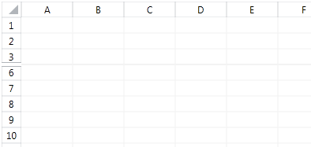
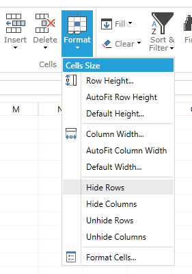
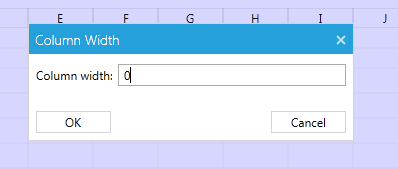
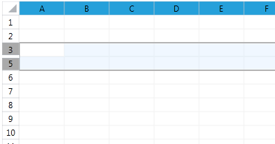

# Hidden Rows and Columns

This article describes what hidden rows and columns are and how to work with them through the RadSpreadsheet UI. It contains the following sections:

* [What are Hidden Rows and Columns](#what-are-hidden-rows-and-columns)
* [Hiding](#hiding)
* [Unhiding](#unhiding)

## What are Hidden Rows and Columns

The hidden rows and columns are rows and columns which are not visible to the user but can be freely hidden and shown. When a group of rows or columns is hidden, the corresponding headings are replaced by a thumb to indicate their state.

## Hiding

There are several methods to hide rows and columns.

### Using the Ribbon and the Context Menu

The RadSpreadsheet ribbon and context menu provide a Hide option, which you can use to hide rows and columns after making a selection. The ribbon button is located in the Cells group, under the Format menu. 

While the option of the ribbon menu is always available, for the context menu it will appear only when an entire row or column is selected.

### Setting the Size to Zero

Another option which will automatically hide a row or a column is to set its size to zero. You can do this by dragging the border of its heading or by using the dialog, which you can also find in the Cells group, under the Format menu.

>tip Please, note that this behavior is different from the behavior of the [model](https://docs.telerik.com/devtools/document-processing/libraries/radspreadprocessing/working-with-rows-and-columns/hidden-rows-columns) where setting the size of the rows and columns will not affect their hidden state. 

## Unhiding

Similarly to hiding rows and columns, they can be unhidden by using the following approaches.

### Using the Ribbon and the Context Menu

The ribbon and context menu unhide options are located at the same location as the hide options. However, in order to use the ribbon and context menu to unhide rows and columns, you need to first make a selection. As the hidden elements are not visible, this is done by making a selection which includes the preceding and the following rows or columns.

Following this, the ribbon and context menu options items can be used.

### Setting the Size or Using Auto Fit

Similarly to hiding rows and columns, you can unhide them by dragging the thumb which has appeared on the place of their heading. In addition, you can also apply auto fit to them. This is done by double-clicking the thumb.

>tip The autofit behavior of the columns is different from the behavior of the columns. An empty column will not expand when autofitted, unlike an empty row.

## See Also
 * [Hidden Rows and Columns in the Model](https://docs.telerik.com/devtools/document-processing/libraries/radspreadprocessing/working-with-rows-and-columns/hidden-rows-columns)