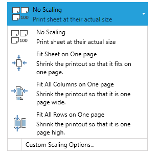
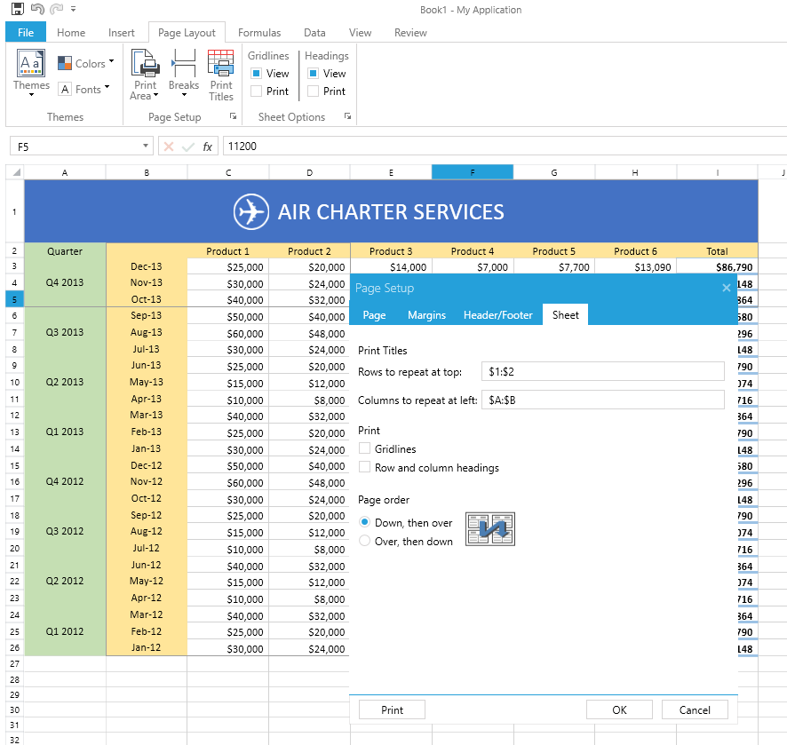
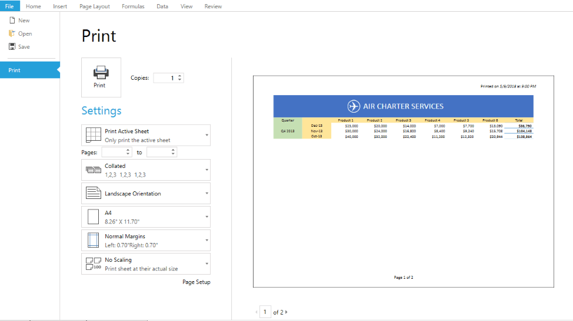

# Printing

Printing in __RadSpreadsheet__ allows you to prepare and display spreadsheet data in the most suitable way depending on your needs. Using different printing options such as defining the print page, the scale factor or whether to print gridlines, you can customize the way to present your data. Additionally, __Print Area__ and __Page Breaks__ allows to print only what you need to print and separate big documents on pages just the way you want your data to be separated. Together with printing on a real printer, __RadSpreadsheet’s__ printing gives you the opportunity to export your spreadsheet data in different file formats with the help of virtual printers.

This article presents the Printing functionality of __RadSpreadsheet__ and demonstrates how to specify what and how to print the document. 

## How to print RadSpreadsheet?

__RadSpreadsheet__ provides you with variety of options for organizing and preparing the document’s data for printing.
        

Using the __PrintWhatSettings__ class you can specify:
        

* __ExportWhat__: An enumeration specifying whether to print the __Active Sheet__, the __Entire Workbook__ or the current __Selection__.

* __IncludeHiddenSheets__: Bolean value indicating whether to include the hidden sheets or to skip them. Default value is `false`.
            

* __IgnorePrintArea__: Boolean value indicating whether or not to ignore print area when printing worksheets. 

#### Figure 1: Choose what you would like to print 



Printing __RadSpreadsheet__ is easily done programmatically through the __Print()__ method, which prints according to some given __PrintWhatSettings__ instance. 
       

#### [C#] Example 1: Print RadSpreadsheet programmatically

```C#

	PrintWhatSettings printWhatSettings = new PrintWhatSettings(ExportWhat.ActiveSheet, false);
	this.radSpreadsheet.Print(printWhatSettings);
```



Depending on whether you want to show a __PrintDialog__ before printing, you can use some of the following __RadSpreadsheet’s__ Print() method overloads:
          

* __Print(PrintWhatSettings printWhatSettings, string printDescription = null)__: Prints depending on specified PrintWhatSettings instance, showing a __PrintDialog__, so that the user can choose a printer and set some printer -specific options from the dialog.
              

* __Print(PrintWhatSettings printWhatSettings, PrintDialog printDialog, string printDescription = null)__: Prints depending on specified __PrintWhatSettings__ instance. This overload prints silently (without showing the __PrintDialog__) by using an already initialized __PrintDialog__ instance.
                        

#### [C#] Example 1: Print RadSpreadsheet programmatically

```C#

	PrintWhatSettings printWhatSettings = new PrintWhatSettings(ExportWhat.ActiveSheet, false);
	
	// Prints showing the print dialog.
	this.radSpreadsheet.Print(printWhatSettings);
	
	// Prints silently to the default printer without showing the print dialog.
	this.radSpreadsheet.Print(printWhatSettings, new PrintDialog());
	
```



## Worksheet Page Setup

When you need to set different print option such as page size, print titles, page orientation, or when you want to print the spreadsheet grid lines, you can set this options using the worksheet's page setup. For more detailed information you can check the [WorksheetPageSetup](https://docs.telerik.com/devtools/document-processing/libraries/radspreadprocessing/features/worksheetpagesetup) topic.        

>You can apply headers and footers to the printed document. For more details on how to achieve this, refer to the [Headers and Footers]() topic.

## Scaling

If your worksheet contains a lot of data, you can use the scaling options provided by RadSpreadsheet to reduce the size of the worksheet so it can better fit on the printed page. There are several options to help you in achieving this:

- **No Scaling**: This is the default value. The sheet is printed at its actual size.
- **Fit Sheet on One page**: Shrinks the data so that it is printed on a single page.
- **Fit All Columns on One page**: Shrinks the data so that it is printed on a single page wide.
- **Fit All Rows on One page**: Shrinks the data so that it is printed on a single page height.
- **Custom Scaling options**: The custom options enable you to set a scale factor according to your preferences or specify a particular number of pages the worksheet should be printed on. 

All the scaling options are available in the Print Preview as well as in the Page Setup dialog. If you would like to set them programmatically, you can do so through the [WorksheetPageSetup](https://docs.telerik.com/devtools/document-processing/libraries/radspreadprocessing/features/worksheetpagesetup).


#### Figure 2: Scaling options


## Print Titles

RadSpreadsheet comes with a built-in functionality to set rows and/or columns to be repeated on each printed page so that you can keep the titles for the data always visible. You can choose whether to set row(s) or column(s), or event both through the Page Setup dialog. This dialog is available under the Page Setup section of the Page Layout tab of RadSpreadsheet's ribbon:

#### Figure 3: Print titles


The WorksheetPageSetup class also enables you set the print titles in code. For more information, check the [WorksheetPageSetup](https://docs.telerik.com/devtools/document-processing/libraries/radspreadprocessing/features/worksheetpagesetup) topic.

## Print Preview

In order to preview the pages before printing, you can use the __PrintPreviewControl__ class and set its __RadSpreadsheet property__ to the __RadSpreadsheet__ instance that you want to be previewed. This control will provide a ready-to-use functionality for previewing print pages and setting different print options.
        

>Note that in Silverlight there's no way to access the actual printer settings due to security limitations of the framework and the settings of the PrintDialog take precedence. In other words, to print to A3 paper (or with Landscape orientation), you will need to specify this both for RadSpreadsheet in the print preview control and for the printer in the PrintDialog.


The following code snippet shows how to integrate the print preview with RadRibbonView's backstage.
        

#### [XAML] Example 2: Integrate the print preview with RadRibbonView's backstage

```XAML

	        <telerik:RadRibbonBackstageItem Header="Print" IsDefault="false">
	            <spreadsheetControls:PrintPreviewControl RadSpreadsheet="{Binding Path=RadSpreadsheet, Mode=OneTime}" />
	        </telerik:RadRibbonBackstageItem>
```


#### Figure 4: Print preview



## See Also

* [Headers and Footers]()
* [WorksheetPageSetup](https://docs.telerik.com/devtools/document-processing/libraries/radspreadprocessing/features/worksheetpagesetup)
