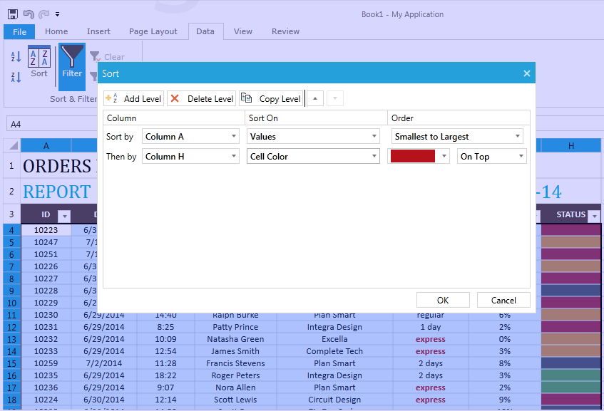
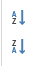
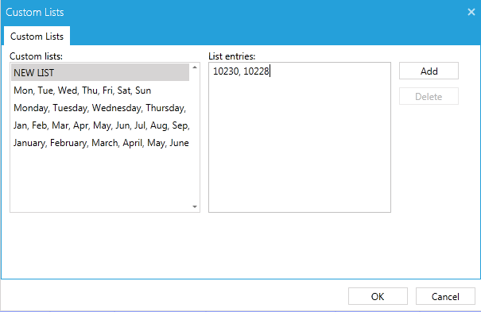
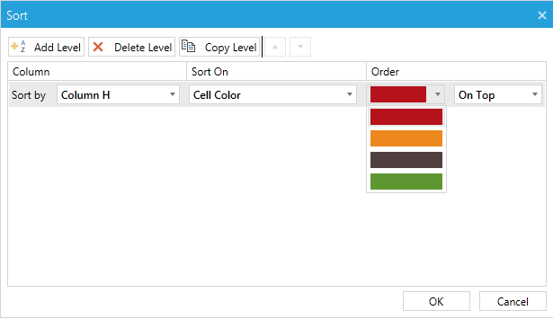

# Sorting

This article describes what is sorting and how to work with it through the __RadSpreadsheet__ UI.

## What Is Sorting?

The sorting feature allows the user to arrange the data according to one or more sorting conditions.
        

More than one condition may be applied to each column of the range.
        

The conditions are applied in order. The range is first sorted according to the first condition. If there are repeating values in the column to which the first condition is applied, the next condition is used to sort these rows.
        

A brief description of each type of sorting condition can be found in the RadSpreadProcessing section of the documentation [here](https://docs.telerik.com/devtools/document-processing/libraries/radspreadprocessing/features/sorting).
        

## Sorting Dialog

The sorting dialog provides access to all sorting functionality. Through it you can add, remove and rearrange all types of sorting conditions. __Figure 1__ shows the dialog
        

Figure 1: Sorting Dialog

On top of the dialog shown in Figure 1 you can take advantage of the following options.
        

* Add Level: Adds a new sorting condition.
            

* Delete Level: Removes the selected sorting condition.
            

* Copy Level: Copies the sorting condition.
            

* Arrow keys: Arrange the sorting conditions in the order you’d like them to be applied.
            

The sorted range is the range which was selected when the dialog was open, so you need to select the desired range before opening the dialog.
        

## Adding Values Sort Condition

There are a few ways to add a values sort condition. The sorting dialog allows most control over the process. In order to use the dialog to add a values sort condition, you need to perform the following steps:
        

1. Select the range you would like to be sorted.
            

1. Open the sorting dialog.
            

1. In the Column drop down menu, specify by which column you would like the range to be sorted.
            

1. In the Sort On drop down menu, specify "Values".
            

1. In the Order drop down menu specify the desired order: Ascending, i.e. Smallest to Largest or Descending, i.e. Largest to Smallest.
            

1. Press OK.
            

Another option to add a values sort condition is to use the sorting buttons next to the button which opens the sort dialog.
        

Figure 2: Sorting buttons

These button in __Figure 2__ automatically add a values sort condition to the first column of the selected range. If you use the first button the order will be ascending, and for the second - descending.
        

The third way to add a values sort condition is through the filtering popup, if you have enabled filtering to the sheet [Filtering](). In this popup you will find the familiar buttons: Sort A to Z and Sort Z to A. These buttons will add a values sort condition to the respective columns of the filtered range.
        

## Adding Custom Sort Condition

You can add a custom sort condition through the sorting dialog. You need to perform the following steps:
        

1. Select the range you would like to be sorted.
            

1. Open the sorting dialog.
            

1. In the Column drop down menu, specify by which column you would like the range to be sorted.
            

1. In the Sort On drop down menu, specify "Values".
            

1. In the Order drop down menu specify __Custom__.
            

1. These steps will open a new dialog in which you can specify the custom list according to which you'd like to have the values ordered. You can use one of the predefined, or enter your values in the List entries text box as demonstrated on __Figure 3__ and chose Add.
            

Figure 3: Custom Lists Dialog

1. Press OK to go back to the sorting dialog.
            

1. Press OK to close the dialog and apply the sorting
            

## Adding Color Sort Condition

There are two ways to add a fill or fore color sort condition. The first is again through the sorting dialog by following these steps:
        

1. Select the range you would like to be sorted.
            

1. Open the sorting dialog.
            

1. In the Column drop down menu, specify by which column you would like the range to be sorted.
            

1. In the Sort On drop down menu, specify "Cell Color" or "Font Color".
            

1. Two new drop down menus shown on __Figure 4__ will appear.
            

Figure 4: Sorting Dialog Color Condition

1. Use the first of the drop down menus to specify the color
            

1. Use the second of the drop down menus to specify whether rows with this color should be ordered on the top or on the bottom of the sort order.
            

1. Press OK.
            

The other way to add a sort condition is through the filtering popup. When you open the filtering popup, you will find a __Sort by Color__ option shown on __Figure 5__ , which will be enabled if you have different fore colors or fill colors in the column of the filtered range. Choosing a color will automatically set the rows with this fill color or fore color on the top of the sort order.
        

Figure 5: Filtering Popus Sorting by Color

## See Also
 * [Model Sorting](https://docs.telerik.com/devtools/document-processing/libraries/radspreadprocessing/features/sorting)

 * [Filtering]()
