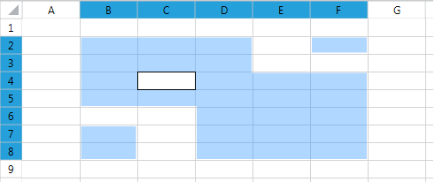
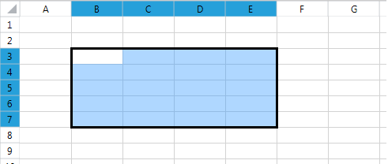
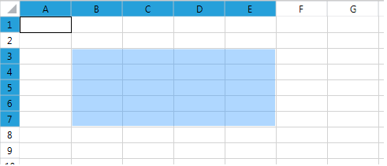
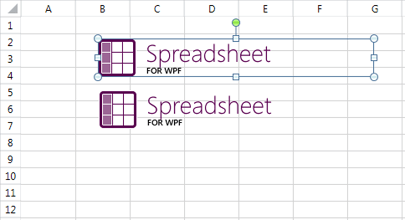
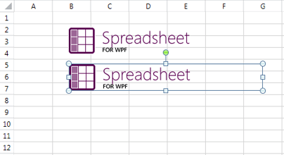
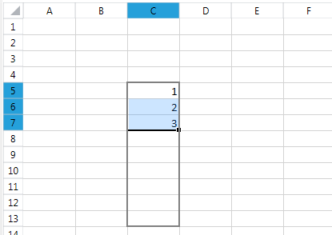
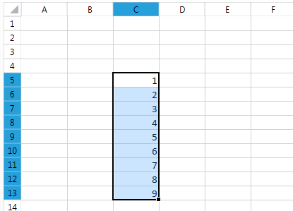
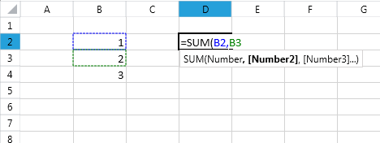
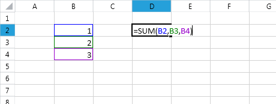
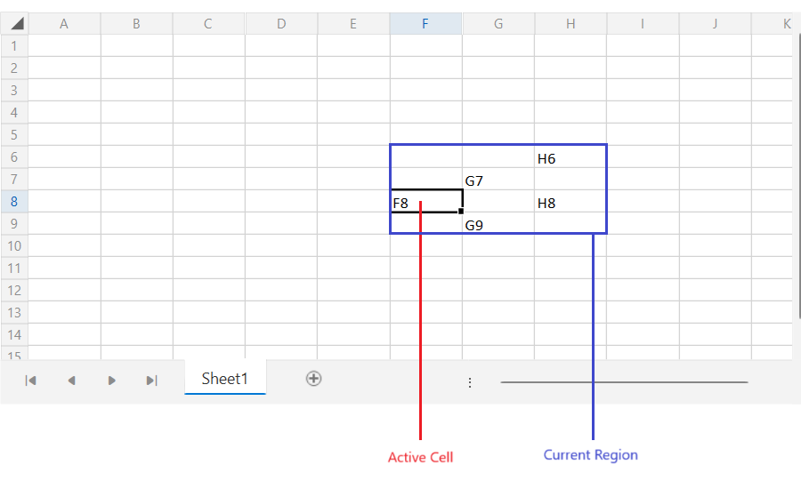

# Working with Selection

This article aims to present the API of the `Selection` class and demonstrate how to retrieve and change the current selection and also store and restore its state.       

## What is Selection?

In order to interact with the working surface of `RadSpreadsheet`, the user creates a UI selection. The selection can be two types: cell selection and shape selection.        

The cell selection designates a region(s) of cells and performs a given action onto these cells. The selection can be a single cell, a rectangular region of cells, or a composition of rectangular regions. The UI selection can contain numerous selected cells, however, only one of the cells is active at a time.

The shape selection can contain one or more shapes.        

## Selection Properties

The [RadWorksheetEditor](https://docs.telerik.com/devtools/wpf/api/telerik.windows.controls.spreadsheet.worksheets.radworksheeteditor) class exposes a `Selection` property of type `Selection` that provides rich API for retrieving and changing the UI Selection of the `RadSpreadsheet`. 

The class `Selection` exposes several properties that provide information about the selected cells. The following list outlines the properties of Selection:        

* `ActiveCell`&mdash;Returns a `CellSelection` instance containing the active cell.            

* `ActiveCellMode`&mdash;Gets or sets the `ActiveCellMode` to either `Display` or `Edit`.            

* `ActiveCellIndex`&mdash;The CellIndex of the ActiveCell.            

* `ActiveRange`&mdash;The CellRange containing the ActiveCell.            

* `SelectedRanges`&mdash;The collection of selected ranges.            

* `IsRowSelection`&mdash;A Boolean value indicating if the selection is a single row selection.            

* `IsColumnSelection`&mdash;A Boolean value indicating if the selection is a single column selection.            

* `Cells`&mdash;Returns an object that represents the cells contained in the selection.            

* `Rows`&mdash;Returns object that describes the contained rows.            

* `Columns`&mdash;Returns object that describes the contained columns.            

* `IsCellSelection`&mdash;Gets a value indicating whether the active selection at the moment is cell selection or shape selection.

* `FillSelection`&mdash;Gets the fill selection.

* `ShapeSelection`&mdash;Returns an object that represents the shapes contained in the selection.

* `CurrentRegion`&mdash;Returns a `CellRange` object containing all adjacent non-empty cells around the active cell of the selection. The current range ends when it reaches blank cells in each direction around the active cell.

The cell selection and the properties related to it can be accessed and used, also when the current active selection is shape selection. In such case, while the shape selection is the one which is visible, the underlying cell selection continues to exist.        

## Retrieving the Active Cell and All Selected Cells

To get the region of cells that are currently selected, first you need to get the `Selection` property of the `RadWorksheetEditor`. Once you have an instance of the Selection class, you can use its `Cells` property to retrieve the selected regions.        

The `Selection` class also exposes an `ActiveCell` property that designates the current active cell.

#### __[C#] Change ActiveCellMode to Edit__  
{{region radspreadsheet-ui-working-with-selection_0}}
    Selection selection = this.radSpreadsheet.ActiveWorksheetEditor.Selection;
    selection.ActiveCellMode = ActiveCellMode.Edit;
{{endregion}}

#### __[VB.NET] Change ActiveCellMode to Edit__  
{{region radspreadsheet-ui-working-with-selection_0}}
    Dim selection As Selection = Me.radSpreadsheet.ActiveWorksheetEditor.Selection
    selection.ActiveCellMode = ActiveCellMode.Edit
{{endregion}}

## Changing the UI Selection

The UI cell selection can be a single cell or a rectangular region of cells. If you hold down the `Ctrl` key, you can select multiple rectangular regions of cells. Note that these cell ranges do not have to be adjacent. In fact, they can be dispersed across the worksheet and can even intersect. The next several examples aim to illustrate how to create one and multiple-region selection through the API of the `RadSpreadsheet`.

The UI shape selection can consist of a single shape or more. If you hold down the `Ctrl` key you can add multiple shapes to the selection or remove them from it. If you remove all shapes from the shape selection, the cell selection will become the active selection automatically. The cells included in the selection will be the cells which were selected when this selection was used last.        

The `Selection` class exposes an additional overloads of the `Select()` method, that offers flexible ways to change the UI selection. All of the overloads have an optional `bool` parameter named `clearSelection`. The parameter indicates whether the current selection will be cleared. When set to `true`, the parameter will cause the current selection to be wiped out. When set to `false`, the newly selected region will be added to the existing selection.        

One of the `Select()` overloads provides a `CellIndex` parameter that points to the cell to be selected (or added to the selection). 

  

#### __[C#] Using the clearSelection parameter of Select()__  
{{region radspreadsheet-ui-working-with-selection_1}}
    Selection selection = this.radSpreadsheet.ActiveWorksheetEditor.Selection;
    selection.Select(new CellIndex(0, 0), false);
{{endregion}}

#### __[VB.NET] Using the clearSelection parameter of Select()__  
{{region radspreadsheet-ui-working-with-selection_1}}
    Dim selection As Selection = Me.radSpreadsheet.ActiveWorksheetEditor.Selection
    selection.Select(New CellIndex(0, 0), False)
{{endregion}}

The `Selection` class also offers a `Select()` method that takes a `CellRange` object as an argument. The overload selects (or adds to the current selection) the designated region and makes the top left cell to be the active one.         

#### __[C#] Select the C3:D4 cell region__  
{{region radspreadsheet-ui-working-with-selection_2}}
    Selection selection = this.radSpreadsheet.ActiveWorksheetEditor.Selection;
    selection.Select(new CellRange(0, 0, 2, 2));
{{endregion}}

#### __[VB.NET] Select the C3:D4 cell region__  
{{region radspreadsheet-ui-working-with-selection_2}}  
    Dim selection As Selection = Me.radSpreadsheet.ActiveWorksheetEditor.Selection
    selection.Select(New CellRange(0, 0, 2, 2))
{{endregion}}

Another overload of the Select() method takes as input two **CellIndex** instances that indicate the start and the end cell indexes of the selected region. Note that unlike the Select(CellRange) method, this overload makes the cell with the start CellIndex the active one. The following snippet illustrates how use the method to select the region B7 to E3. Note that the active cell is B7, not B3.

The following example shows how to achieve the result from the above image through the RadSpreadsheet API.

#### __[C#] Select a region with a specific active cell__  
{{region radspreadsheet-ui-working-with-selection_3}}
    Selection selection = this.radSpreadsheet.ActiveWorksheetEditor.Selection;
    selection.Select(6, 1, 2, 4);
{{endregion}}

#### __[VB.NET] Select a region with a specific active cell__  
{{region radspreadsheet-ui-working-with-selection_3}}
    Dim selection As Selection = Me.radSpreadsheet.ActiveWorksheetEditor.Selection
    selection.Select(6, 1, 2, 4)
{{endregion}}

A similar logic applies to the `Select` method overloads which take shape objects as parameters.        

The result from the image can be achieved with the following sample code.

#### __[C#] Select a shape__   
{{region radspreadsheet-ui-working-with-selection_7}}
    Selection selection = this.radSpreadsheet.ActiveWorksheetEditor.Selection;

    FloatingImage image = this.radSpreadsheet.ActiveWorksheet.Images.First() as FloatingImage;
    selection.Select(image);
{{endregion}}

#### __[VB.NET] Select a shape__
{{region radspreadsheet-ui-working-with-selection_7}}
    Dim selection As Selection = Me.radSpreadsheet.ActiveWorksheetEditor.Selection
    Dim image As FloatingImage = TryCast(Me.radSpreadsheet.ActiveWorksheet.Images.First(), FloatingImage)
    selection.Select(image)
{{endregion}}

If you would like to select the second image while deselecting the first one, this can be achieved with the following code:        

#### __[C#] Select a shape and clear the previous selection__  
{{region radspreadsheet-ui-working-with-selection_8}}
    Selection selection = this.radSpreadsheet.ActiveWorksheetEditor.Selection;
    
    FloatingImage image2 = this.radSpreadsheet.ActiveWorksheet.Images.ElementAt(1) as FloatingImage;
    selection.Select(image2, true);
{{endregion}}

#### __[VB.NET] Select a shape and clear the previous selection__  
{{region radspreadsheet-ui-working-with-selection_8}}    
    Dim selection As Selection = Me.radSpreadsheet.ActiveWorksheetEditor.Selection
    Dim image2 As FloatingImage = TryCast(Me.radSpreadsheet.ActiveWorksheet.Images.ElementAt(1), FloatingImage)
    selection.Select(image2, True)
{{endregion}}

Note that even though the `clearSelection` parameter is set to `true`, this will clear only the shape selection. The underlying cell selection will remain intact and will become visible in its previous state if the shape selection becomes empty.        

## Selecting All Cells in a Worksheet

The `Selection` class exposes a `SelectAll()` method that selects all cells in the worksheet. Keep in mind, though, that each worksheet contains over 16 000 columns and 1 000 000 rows. That said, performing a computationally intensive task on all cells may slow down the performance of `RadSpreadsheet`. To avoid such issues in performance crucial scenarios we highly recommend you to select only the `UsedCellRange` of the worksheet. This is a property of `Worksheet` class that returns a `CellRange` starting from __A1__ to the bottom-right cell that comprises all cells containing a value. You can read more about it in the [Iterating Used Cells](https://docs.telerik.com/devtools/document-processing/libraries/radspreadprocessing/working-with-cells/iterating-used-cells) topic.        
        
#### __[C#] Using SelectAll() and UsedCellRange with the Select(CellRange) method__  
{{region radspreadsheet-ui-working-with-selection_4}}
    Selection selection = this.radSpreadsheet.ActiveWorksheetEditor.Selection;
    selection.SelectAll();

    CellRange usedRange = this.radSpreadsheet.ActiveWorksheet.UsedCellRange;
    selection.Select(usedRange);
{{endregion}}

#### __[VB.NET] Using SelectAll() and UsedCellRange with the Select(CellRange) method__  
{{region radspreadsheet-ui-working-with-selection_4}}
    Dim selection As Selection = Me.radSpreadsheet.ActiveWorksheetEditor.Selection
    selection.SelectAll()

    Dim usedRange As CellRange = Me.radSpreadsheet.ActiveWorksheet.UsedCellRange
    selection.Select(usedRange)
{{endregion}}

## Selection Events

`RadSpreadsheet` has several selection events exposed by ActiveWorksheetEditor you can subscribe to:          

* `SelectionUpdate`&mdash;Raised when the selection is updated in any way, this may mean that a change has only begun or it has finished.            

* `SelectionChanging`&mdash;Raised when an update of the selection has begun.            

* `SelectionChanged`&mdash;Raised when the update of the selection has finished.            

* `SelectionChangingCanceled`&mdash;Raised when an update was started but subsequently cancelled.            

* `ActiveCellModeChanged`&mdash;Raised when the mode of the active cell changes, from Display to Edit or vice versa.            

* `SelectionTypeChanged`&mdash;Raised when the active selection changes between cell selection and shape selection.

#### __[C#] Subscribe to SelectionChanged__  
{{region radspreadsheet-ui-working-with-selection_10}}
    this.radSpreadsheet.ActiveWorksheetEditor.Selection.SelectionChanged += this.Selection_SelectionChanged;
{{endregion}}

#### __[VB.NET] Subscribe to SelectionChanged__  
{{region radspreadsheet-ui-working-with-selection_10}}
    Me.radSpreadsheet.ActiveWorksheetEditor.Selection.SelectionChanged += Me.Selection_SelectionChanged
{{endregion}}

In some scenarios when you make a complex selection and want an event to be fired only once (at the end of this complex selection) it is convenient to use `BeginUpdate` and `EndUpdate` methods.        

#### __[C#] Make a complex selection from three parts while triggering SelectionChanged only once__  
{{region radspreadsheet-ui-working-with-selection_5}}  
    Selection selection = this.radSpreadsheet.ActiveWorksheetEditor.Selection;
    selection.BeginUpdate();

    selection.Select(new CellRange(4, 3, 8, 5));
    selection.Select(new CellRange(5, 2, 3, 3), clearSelection: false);
    selection.Select(new CellIndex(2, 1), clearSelection: false);

    selection.EndUpdate();
{{endregion}}

#### __[VB.NET] Make a complex selection from three parts while triggering SelectionChanged only once__  
{{region radspreadsheet-ui-working-with-selection_5}}
    Dim selection As Selection = Me.radSpreadsheet.ActiveWorksheetEditor.Selection
    selection.BeginUpdate()

    selection.Select(New CellRange(4, 3, 8, 5))
    selection.Select(New CellRange(5, 2, 3, 3), clearSelection:=False)
    selection.Select(New CellIndex(2, 1), clearSelection:=False)

    selection.EndUpdate()
{{endregion}}

## Saving and Restoring the Selection

With the Spreadsheet API you have the ability to save the current selection in a `SelectionState` instance and later easily restore the selection with a single method call. For such scenarios the `Selection` class exposes two methods: `CreateSelectionState` and `RestoreSelectionState` that save and restore the selection, respectively.        

The following example makes a single `CellRange` selection and saves it in a `SelectionState` object. After adding some new cells to the selection the old selection is restored through the `RestoreSelectionState` method        

#### __[C#] Save and restore Selection__  
{{region radspreadsheet-ui-working-with-selection_6}}
    Selection selection = this.radSpreadsheet.ActiveWorksheetEditor.Selection;
    selection.Select(new CellRange(4, 3, 8, 5));

    SelectionState selectionState = selection.CreateSelectionState();

    selection.Select(new CellRange(5, 2, 3, 3), clearSelection: false);
    selection.Select(new CellIndex(2, 1), clearSelection: false);

    selection.RestoreSelectionState(selectionState);
{{endregion}}

#### __[VB.NET] Save and restore Selection__  
{{region radspreadsheet-ui-working-with-selection_6}}
    Dim selection As Selection = Me.radSpreadsheet.ActiveWorksheetEditor.Selection
    selection.Select(New CellRange(4, 3, 8, 5))

    Dim selectionState As SelectionState = selection.CreateSelectionState()

    selection.Select(New CellRange(5, 2, 3, 3), clearSelection:=False)
    selection.Select(New CellIndex(2, 1), clearSelection:=False)

    selection.RestoreSelectionState(selectionState)
{{endregion}}

## Filling the Selection with Data

The automatic filling of data in the Spreadsheet can also be performed through the selection to ease the access to the feature. This is done by using the fill handle, which can be found at the bottom right corner of the current selection, provided that this selection consists of only one range.
        
>tip More information concerning automatically filling data is available in `RadSpreadProcessing`s documentation that represents the model of `RadSpreadsheet`. Check the [Repeat Values](https://docs.telerik.com/devtools/document-processing/libraries/radspreadprocessing/features/fill-data-automatically/repeat-values) and [Series](https://docs.telerik.com/devtools/document-processing/libraries/radspreadprocessing/features/fill-data-automatically/series) articles.          

In order to use the fill handle, select the initial set of data, click and hold the handle and drag it in the desired direction.

The initially selected area will remain marked while the part of selection you are dragging will be colored in grey.

Once you've selected the desired range, you can drop the selection. The selected range will be filled with data the same way as it would be if you had used the autofill data series.

With the Spreadsheet API you have the ability to listen and to manipulate the automatic filling of data process.

### FillSelection properties

* `IsEnabled**`&mdash;Gets or sets a value indicating whether to enable or disable the Fill Handle feature.
* `IsStarted**`&mdash;Gets or sets a value indicating whether the fill selection is started or not.
* `SelectedRange`&mdash;Gets a value returning the selected CellRange.
* `LastActivePosition`&mdash;Gets a value returning the cell index of the last active position of the pointer.

### FillSelection Events

* `FillSelectionChanged`&mdash;Occurs when the FillSelection is changed.
* `IsEnabledChanged`&mdash;Occurs when the IsEnabled is changed.

#### __[C#] Disable Fill Selection__  
{{region radspreadsheet-ui-working-with-selection_9}}
    Selection selection = this.radSpreadsheet.ActiveWorksheetEditor.Selection;

    FillSelection fillSelection = selection.FillSelection;
    fillSelection.IsEnabled = false;
{{endregion}}

#### __[VB.NET] Disable Fill Selection__  
{{region radspreadsheet-ui-working-with-selection_9}}
    Dim selection As Selection = Me.radSpreadsheet.ActiveWorksheetEditor.Selection
    
    Dim fillSelection As FillSelection = selection.FillSelection
    fillSelection.IsEnabled = False
{{endregion}}

## Using Selection to Complete Formulas

The selection object can be used to help entering formulas and to give visual cues for understanding these which are already there. 

In order to use the selection to enter a formula, start typing it by entering the equals (=) sign. Then, use the mouse to select other cells and enter operators between them. On each click references to the cells or ranges will be entered in the formula. Just as with the regular mode of the selection, holding down the `Ctrl` key selects multiple ranges and the `Shift` key can be used to expand the current selection.

This mode of the selection can be also used when entering the arguments of a function and is available both in the cell editor and the formula bar.

When a formula is already entered and you would like to see the references used in it, enter edit mode and they will be selected automatically.

## Working with the Current Region

The current region concept is represented by a `CellRange` object that contains all adjacent non-empty cells around the active cell of the `Selection` object. The range expands around the active cell in all directions, until it reaches empty cells.

The range can be accessed with the `CurrentRegion` property of the `Selection` object.

#### __[C#] Getting the current region__  
{{region radspreadsheet-ui-working-with-selection-10}}
	Selection selection = this.radSpreadsheet.ActiveWorksheetEditor.Selection; 
	CellRange currentRegion = selection.CurrentRegion;
{{endregion}}

To select the current region, call the `SelectCurrentRegion` method of the `CellPosition` object.

#### __[C#] Selecting the current region programmatically__  
{{region radspreadsheet-ui-working-with-selection-11}}
	Selection selection = this.radSpreadsheet.ActiveWorksheetEditor.Selection; 
	CellPosition activePosition = selection.ActiveRange.ActivePosition;
	bool result = activePosition.SelectCurrentRegion();
{{endregion}}

The current region can be selected also using the `Ctrl+Shift+*` keyboard combination.
