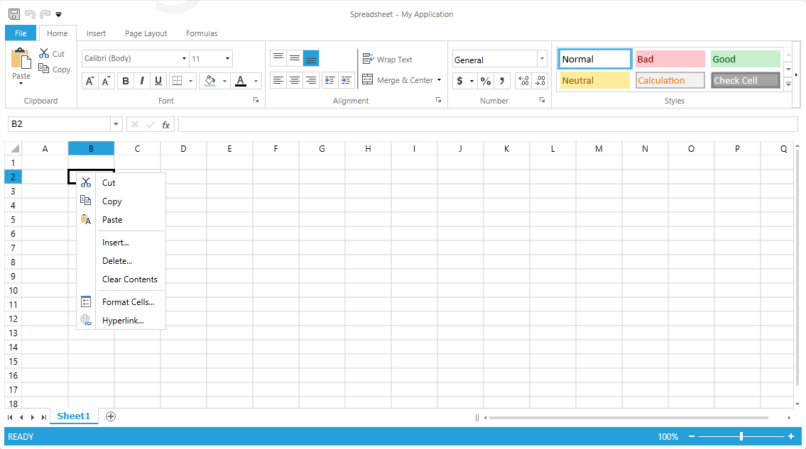

# Context Menu

By default the WorksheetEditor of RadSpreadsheet does not have a context menu. However, the control exposes a __WorksheetEditorContextMenu__ property of type __RadContextMenu__ that allows you to plug and arrange easily a context menu. This article demonstrates how to assign the editor a menu using XAML.
      

>tip RadContextMenu is a flexible control that aims to provide additional commands and features. You will be able to find more information regarding RadContextMenu in the section of our online documentation dedicated to the control [here]().
        

## Set Worksheet Editor's Context Menu

You can find an example of this in our SDK repository [here](https://github.com/telerik/xaml-sdk), the example is listed as __Spreadsheet / WorksheetEditorContextMenu__. It sets up a simple menu with several commands: cut, copy, paste, clear contents. Also the menu has two items allow the user to insert and delete cells respectively. The context menu also contains items that open the FormatCells and Hyperlink dialogs. The following image illustrates the result of the sample code in the article: 

Note that the code defines a RadSpreadsheet instance with DataContext set to the CommandDescriptors property. This is necessary since the items of the menu use the commands exposed by the current set of command descriptors of RadSpreadsheet. Also, several of the bindings use a BoolToVisibilityValueConverter. This is required since some of the commands offered in the menu are not available all of the time. For example, changing the active cell mode to edit mode replaces the set of command descriptors and some of the new descriptors are disabled while the active editor is opened. Using the BoolToVisibilityValueConverter ensures that only the items for enabled descriptors will be visible. In this particular scenario, if the user opens a context menu when the editor is in edit mode, the insert, delete, format cells and hyperlink are not visible.
        

>tip You can download a runnable project of the previous example from our online SDK repository [here](https://github.com/telerik/xaml-sdk), the example is listed as __Spreadsheet / WorksheetEditorContextMenu__.
          
