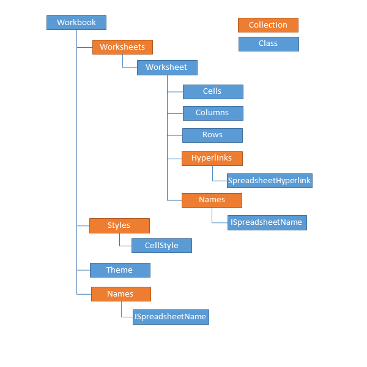

# Getting Started with {{ site.framework_name }} Spreadsheet

This article explains how to add a __RadSpreadsheet__ control to a page in your application.

## Adding Telerik Assemblies Using NuGet

To use __RadSpreadsheet__ when working with NuGet packages, install the `Telerik.Windows.Controls.Spreadsheet.for.Wpf.Xaml` package. The [package name may vary]() slightly based on the Telerik dlls set - [Xaml or NoXaml]()

Read more about NuGet installation in the [Installing UI for WPF from NuGet Package]() article.

>tip With the 2025 Q1 release, the Telerik UI for WPF has a new licensing mechanism. You can learn more about it [here]().

## Adding Assembly References Manually

If you are not using NuGet packages, you can add a reference to the following assemblies:
        
* __Telerik.Licensing.Runtime__
* __Telerik.Windows.Controls.dll__
* __Telerik.Windows.Controls.GridView.dll__
* __Telerik.Windows.Controls.Input.dll__
* __Telerik.Windows.Controls.Navigation.dll__
* __Telerik.Windows.Controls.Spreadsheet.dll__
* __Telerik.Windows.Data.dll__
* __Telerik.Windows.Documents.Core.dll__
* __Telerik.Windows.Documents.Spreadsheet.dll__

For export and import to __XLSX__:

* __Telerik.Windows.Zip.dll__
* __Telerik.Windows.Documents.Spreadsheet.FormatProviders.OpenXml.dll__

To export a document to __PDF__, you will need to add a reference to the corresponding assembly:

* __Telerik.Windows.Documents.Spreadsheet.FormatProviders.Pdf.dll__

Note that in order to import/export in XLSX or export to PDF, the format provider must be registered manually. More information on Import/Export can be found [here]().

If you want to use the sample UI provided in our demos you should add this reference as well:        

* __Telerik.Windows.Controls.RibbonView.dll__
* __Telerik.Windows.Controls.SpreadsheetUI.dll__

## Namespaces

For a bare-bone Spreadsheet control, you only need a declaration of the telerik schema:

<snippet id='radspreadsheet-getting-started-block_1-xaml' />

For the UI that enables the full-featured use of the control, you should also declare:

<snippet id='radspreadsheet-getting-started-block_2-xaml' />

Then, all that is left is to add the __Spreadsheet__ component to the page:

<snippet id='radspreadsheet-getting-started-block_3-xaml' />

## Model

>important __RadSpreadsheet__ operates with a rich document model that is completely decoupled from UI. The documentation of the model can be found in the RadSpreadProcessing section of the documentation for Telerik Document Processing [here](https://docs.telerik.com/devtools/document-processing/libraries/radspreadprocessing/overview).

The primary document that the model uses to manipulate and store data is called a __workbook__. Each __workbook__ contains at least one __worksheet__ that is defined as a collection of cells organized in rows and columns. A __worksheet__ can also be viewed as a tabular working surface that you use to enter and organize your data. Typically, a single __workbook__ holds together several __worksheets__ that contain related information. For example, a workbook named *Annual Budget* can contain four worksheets that split the data for each quarter.

The following diagram illustrates how different parts of the document model fit together:

For more information about the concepts of Workbooks, Worksheets, Cells, and Rows and Columns, as well as the CRUD operations available on them, refer to the RadSpreadProcessing documentation linked above. For detailed information and examples on using the format providers, see the [Import/Export]() article.

## Spreadsheet and RibbonView

__RadSpreadsheet__ is easy to integrate with all kinds of UI thanks to the commanding mechanism that it employs. If you would like to use the control with a [RadRibbonView](), which shows the full potential of the control, you can refer to the [Spreadsheet UI]() topic that describes how you can take advantage of __RadSpreadsheetRibbon__.        

## Open/Save Documents

To open a document, you need to import it and the export functionalities will help you to save one. To work with documents of the formats supported by __RadSpreadsheet__, you should use the format provider classes. For more information on the matter, please check the [Import/Export]() topic.

## Telerik UI for WPF Learning Resources

* [Telerik UI for WPF Spreadsheet Component](https://www.telerik.com/products/wpf/spreadsheet.aspx)
* [Getting Started with Telerik UI for WPF Components]()
* [Telerik UI for WPF Installation]()
* [Telerik UI for WPF and WinForms Integration]()
* [Telerik UI for WPF Visual Studio Templates]()
* [Setting a Theme with Telerik UI for WPF]()
* [Telerik UI for WPF Virtual Classroom (Training Courses for Registered Users)](https://learn.telerik.com/learn/course/external/view/elearning/16/telerik-ui-for-wpf) 
* [Telerik UI for WPF License Agreement](https://www.telerik.com/purchase/license-agreement/wpf-dlw-s)

## See Also

* [Import/Export]()
* [Spreadsheet UI]()
* [SpreadProcessing](https://docs.telerik.com/devtools/document-processing/libraries/radspreadprocessing/overview)
