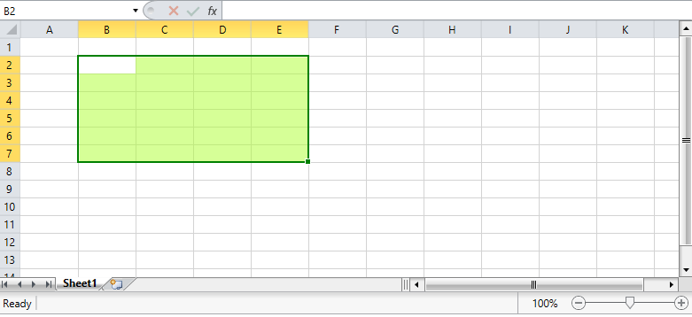

# Customize Selection

RadSpreadsheet exposes several properties that enable you to control the way the selection in the control is rendered. This article describes the available properties and shows you how to work with them.

* **SelectionStroke**: A *dependency property* of type *Brush* that gets or sets the stroke of the selection.

* **SelectionStrokeThickness**: A *dependency property* of type *double* that gets or sets the stroke thickness of the selection.

* **SelectionFill**: A *dependency property* of type *Brush* that gets or sets the fill of the selection. 

* **FillHandleSelectionStroke**: A *dependency property* of type *Brush* that gets or sets the fill handle selection stroke.

**Figure 1** shows an example of a customized selection.

#### **Figure 1: Customized selection in RadSpreadsheet**

The examples below demonstrate one way to customize the properties of the selection in XAML and in code-behind in order to achieve the result shown in the picture above.

__Customizing selection__

<snippet id='radspreadsheet-howto-customize-selection-block_1-xaml' />

__Customizing selection__ 

<snippet id='radspreadsheet-howto-customize-selection-block_2-cs' />
<snippet id='radspreadsheet-howto-customize-selection-block_3-vb' />

## See Also

 * [Customize Row and Column Headers]()