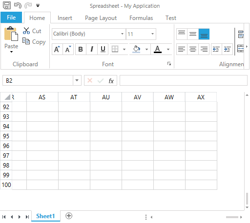

# Restrict the Number of Visible Rows and Columns


By default the document of __RadSpreadsheet__ presents to the user 1048576 rows and 16384 columns. However, it is not always necessary to present the user with the entire worksheet. In certain cases, you may want to restrict the visible area of the document in order to limit the user interaction to a certain range. For such scenarios __RadSpreadsheet__ offers an easy way to reduce the number of visible rows and columns.
      

## Restricting the Number of Visible Rows and Columns

__RadSpreadsheet__ exposes a __VisibleSize__ property of type __SizeI__ that determines the count of the visible rows and columns. The __SizeI__ structure is similar to Size except that internally it uses integer instead of double values. That said, if you would like to set the visible columns and rows to 50 and 100 respectively, you need to create a __SizeI__ with __Width__ set to 50 and __Height__ set to 100 and assign the instance to the __VisiableSize__ property. Here is a sample snippet that illustrates how to achieve this:
        


```C#
	            radSpreadsheet.VisibleSize = new SizeI(50, 100);
```


As a result, __RadSpreadsheet__ displays to the user only 50 columns and 100 rows:



## How it works?

Note that the __VisibleSize__ property affects only the user interface and does not change the count of rows and columns in the document model. In other words, the property restricts the number of rows and columns presented to the user, not the actual number of rows and columns in the worksheets. This has several implications that you need to consider before you start using the feature:
        

* Even though the user is unable to reach the cells that are not visible, you as a developer can assign a value to every cell in the worksheet. Also, you may allow the user to open a file that holds data that exceeds the visible size. RadSpreadsheet does not have a mechanism to notify you that there is data outside the visible range. In such cases it is your responsibility to check whether the VisibleSize is less than the UsedCellRange of the worksheet and correct the number of visible rows and columns.
            

* Since the property restricts the rows and columns that the RadWorksheetEditor presents to the user, all worksheets will be displayed to fit in the restricted size. RadSpreadsheet cannot assign a different size to each individual worksheet out of the box.
            
