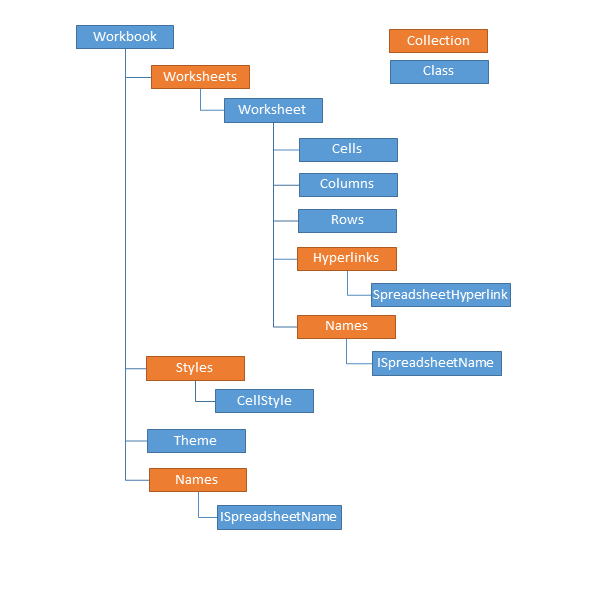

# Model

>important__RadSpreadsheet__ operates with a rich document model that is completely decoupled from UI. The documentation of the model can be found in the RadSpreadProcessing section of the documentation for Telerik Document Processing [here](https://docs.telerik.com/devtools/document-processing/libraries/radspreadprocessing/overview).
        

The primary document that the model uses to manipulate and store data is called a __workbook__. Each __workbook__ contains at least one __worksheet__ that is defined as a collection of cells organized in rows and columns. A __worksheet__ can also be viewed as a tabular working surface that you use to enter and organize your data. Typically, a single __workbook__ holds together several __worksheets__ that contain related information. For example, a workbook named *Annual Budget* can contain four worksheets that split the data for each quarter.      

The following diagram illustrates how different parts of the document model fit together:

The documentation of RadSpreadsheet's document model contains several *Working with ** sections that illustrate general concepts about Workbooks, Worksheets, Cells, and Rows and Columns respectively. Each of these folders covers the fundaments of the class and provides examples about the CRUD operations of the object.      

The documentation also includes a Features folder that contains information about all features currently supported by the model of RadSpreadsheet.      

In the Import/Export section you will find detailed information and multiple examples for using all format providers.
