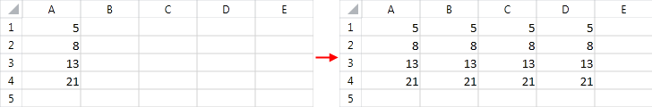

# Repeat Values

__RadSpreadsheet__ allows you to automatically repeat data that has already been entered in your worksheet. The auto fill
        feature is very useful when you would like to copy the contents of a row or a column into its adjacent rows or columns respectively. Thus you can
        easily spread the values into a specified range instead of populating the cells manually.
      

## 

To repeat the values, first you need to create a __CellSelection__ for the range of cells that you want to populate. Note that
          the range should include the values that you would like to repeat. Then, you need to invoke the __FillData()__ method of the
          __CellSelection__ instance and pass appropriate __FillDirection__ as an argument. There are four
          __FillDirection__ values:
        

* __Left__: The values in the rightmost column will be copied to the rest of the columns in the range.
            

* __Up__: The values in the bottom row will be copied to the rest of the rows in the range.
            

* __Right__: The values in the leftmost column will be copied to the rest of the columns in the range.
            

* __Down__: The values in the top row will be copied to the rest of the rows in the range.
            

For example, the following snippet illustrates how the contents of column *A* can be copied to the rest of the columns in
          the range *A1:D4*. The code creates a new worksheet and populates the cells *A1*,
          *A2*, *A3* and *A4* with the values 5, 8, 13 and 21 respectively.
          Further, it invokes the __FillData()__ method for the specified range with __FillDirection Right__.
        

#### __C#__

{{region radspreadsheet-features-auto-fill_0}}
	            Workbook workbook = new Workbook();
	            workbook.Worksheets.Add();
	            Worksheet activeWorksheet = workbook.ActiveWorksheet;
	
	            activeWorksheet.Cells[0, 0].SetValue(5);
	            activeWorksheet.Cells[1, 0].SetValue(8);
	            activeWorksheet.Cells[2, 0].SetValue(13);
	            activeWorksheet.Cells[3, 0].SetValue(21);
	
	            CellRange range = new CellRange(0, 0, 3, 3);
	            activeWorksheet.Cells[range].FillData(FillDirection.Right);
	{{endregion}}

#### __VB__

{{region radspreadsheet-features-auto-fill_0}}
	        Dim workbook As New Workbook()
	        Dim worksheet As Worksheet = workbook.Worksheets.Add()
	
	        worksheet.Cells(0, 0).SetValue(5)
	        worksheet.Cells(1, 0).SetValue(8)
	        worksheet.Cells(2, 0).SetValue(13)
	        worksheet.Cells(3, 0).SetValue(21)
	
	        Dim range As New CellRange(0, 0, 3, 3)
	        worksheet.Cells(range).FillData(FillDirection.Right)
	        '#End Region
	    End Sub
	
	    Public Shared Sub RepeatValuesDown()
	        '#Region radspreadsheet-features-auto-fill_1
	        Dim workbook As New Workbook()
	        Dim worksheet As Worksheet = workbook.Worksheets.Add()
	
	        worksheet.Cells(1, 1).SetValue(34)
	        worksheet.Cells(1, 2).SetValue(55)
	        worksheet.Cells(1, 3).SetValue(89)
	
	        Dim range As New CellRange(1, 1, 3, 3)
	        worksheet.Cells(range).FillData(FillDirection.Down)
	        '#End Region
	    End Sub
	
	End Class

Similarly, you can automatically copy the values of a row to its adjacent rows. The following snippet invokes the __FillData()__ method 
          with __FillDirection Down__ for the range *B2:D4*. The sample code creates an empty worksheet and 
          enters values in the range *B2:D2*. These values will be propagated to the rest of the rows in the specified region.
        

#### __C#__

{{region radspreadsheet-features-auto-fill_1}}
	            Workbook workbook = new Workbook();
	            workbook.Worksheets.Add();
	            Worksheet activeWorksheet = workbook.ActiveWorksheet;
	
	            activeWorksheet.Cells[1, 1].SetValue(34);
	            activeWorksheet.Cells[1, 2].SetValue(55);
	            activeWorksheet.Cells[1, 3].SetValue(89);
	
	            CellRange range = new CellRange(1, 1, 3, 3);
	            activeWorksheet.Cells[range].FillData(FillDirection.Down);
	{{endregion}}

#### __VB__

{{region radspreadsheet-features-auto-fill_1}}
	        Dim workbook As New Workbook()
	        Dim worksheet As Worksheet = workbook.Worksheets.Add()
	
	        worksheet.Cells(1, 1).SetValue(34)
	        worksheet.Cells(1, 2).SetValue(55)
	        worksheet.Cells(1, 3).SetValue(89)
	
	        Dim range As New CellRange(1, 1, 3, 3)
	        worksheet.Cells(range).FillData(FillDirection.Down)
	        '#End Region
	    End Sub
	
	End Class

# See Also

 * [Series]()
