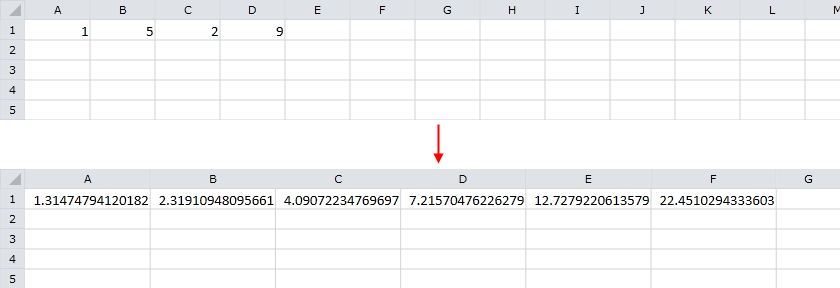
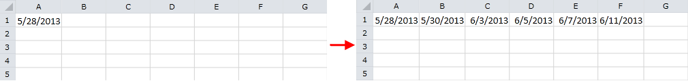
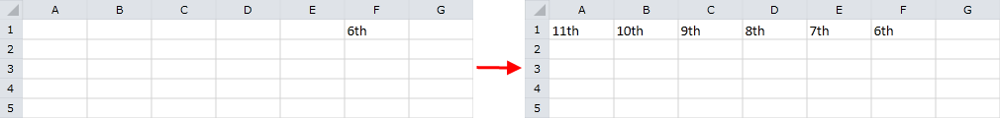

# Series

__RadSpreadsheet__ can automatically construct series of data using a specified pattern or data that is already in the worksheet.
        The Auto Fill feature can continue series of numbers, dates, time periods, or number and text combinations based on start and step values. The automatic
        fill of __RadSpreadsheet__ supports the following series: linear, growth, date and auto fill.
      

To use the auto fill functionality, first you need to create a __CellSelection__ for the range of cells that you want to populate.
        Note that the range should include starting values of the series. The __CellSelection__ offers the following methods for series construction:
      

* [FillDataSeriesLinear](#linear-series): Calculates the value of each cell after the initial values by adding a
            specific __Step__ value to the value of the previous cell.
          

* [FillDataSeriesLinearTrend](#linear-trend-series): Calculates the values of the series using linear fitting algorithm for
            finding the best line for the initial values;
          

* [FillDataSeriesExponential](#exponential-series): Calculates the values of each cell after the initial values by multiplying
            the value of the previous cell by a specific __Step__ value.
          

* [FillDataSeriesExponentialTrend](#exponential-trend-series): Calculates the values of the series using exponential fitting algorithm
            for finding the best exponential curve for your initial values.
          

* [FillDataSeriesDate](#date-series): Fills date values incrementally using a specific __Step__
            value that can represent the number of days, weekdays, months or years.
          

* [FillDataSeriesAuto](#auto-fill-series): Automatically continues complex patterns of numbers, number and text combinations, 
            dates, or time periods. Typically, it uses linear fitting algorithm to find the next value of the series.
          

The rest of the article contains detailed information and examples for each of the aforementioned methods.
      

## Linear Series

The __FillDataSeriesLinear()__ method of the __CellSelection__ class constructs linear series of data. The
          method has two required and one optional parameters. The first parameter is of type __CellOrientation__ and indicates whether
          the series are oriented horizontally or vertically. The second parameter determines the step value that will be added to each cell to continue the series.
          The optional parameter is used to stop the series at a certain value. If this parameter is set and the series reaches the specified stop value, all
          consequent cells will be left empty. The following example creates a new worksheet that has the value *1* cell
          *A1* and *3* in *B1*. The __FillDataSeriesLinear()__
          method is invoked for the cell region *A1:F1*. Thus, the values *1, 3, 5, 7, 9 and 11* appear in the
          range *A1:F1*.
        

#### __C#__

{{region radspreadsheet-features-series_0}}
	
	            Workbook workbook = new Workbook();
	            Worksheet worksheet = workbook.Worksheets.Add();
	
	            worksheet.Cells[0, 0].SetValue(1);
	            worksheet.Cells[0, 1].SetValue(3);
	
	            CellRange range = new CellRange(0, 0, 0, 5);
	            worksheet.Cells[range].FillDataSeriesLinear(CellOrientation.Horizontal, 2);
	
	{{endregion}}

#### __VB__

{{region radspreadsheet-features-series_0}}
	
	        Dim workbook As New Workbook()
	        Dim worksheet As Worksheet = workbook.Worksheets.Add()
	
	        worksheet.Cells(0, 0).SetValue(1)
	        worksheet.Cells(0, 1).SetValue(3)
	
	        Dim range As New CellRange(0, 0, 0, 5)
	        worksheet.Cells(range).FillDataSeriesLinear(CellOrientation.Horizontal, 2)
	
	        '#End Region
	    End Sub
	
	    Public Sub FillSeriesLinearTrend()
	        '#Region radspreadsheet-features-series_1
	
	        Dim workbook As New Workbook()
	        Dim worksheet As Worksheet = workbook.Worksheets.Add()
	
	        worksheet.Cells(0, 0).SetValue(1)
	        worksheet.Cells(0, 1).SetValue(8)
	        worksheet.Cells(0, 2).SetValue(3)
	        worksheet.Cells(0, 3).SetValue(10)
	        worksheet.Cells(0, 4).SetValue(5)
	
	        Dim range As New CellRange(0, 0, 0, 9)
	        worksheet.Cells(range).FillDataSeriesLinearTrend(CellOrientation.Horizontal)
	
	        '#End Region
	    End Sub
	
	    Public Sub FillSeriesExponential()
	        '#Region radspreadsheet-features-series_2
	
	        Dim workbook As New Workbook()
	        Dim worksheet As Worksheet = workbook.Worksheets.Add()
	
	        worksheet.Cells(0, 0).SetValue(1)
	        worksheet.Cells(0, 1).SetValue(3)
	
	        Dim range As New CellRange(0, 0, 0, 5)
	        worksheet.Cells(range).FillDataSeriesExponential(CellOrientation.Horizontal, 4)
	
	        '#End Region
	    End Sub
	
	    Public Sub FillSeriesExponentialTrend()
	        '#Region radspreadsheet-features-series_3
	
	        Dim workbook As New Workbook()
	        Dim worksheet As Worksheet = workbook.Worksheets.Add()
	
	        worksheet.Cells(0, 0).SetValue(1)
	        worksheet.Cells(0, 1).SetValue(5)
	        worksheet.Cells(0, 2).SetValue(2)
	        worksheet.Cells(0, 3).SetValue(9)
	
	        Dim range As New CellRange(0, 0, 0, 5)
	        worksheet.Cells(range).FillDataSeriesExponentialTrend(CellOrientation.Horizontal)
	
	        '#End Region
	    End Sub
	
	    Public Sub FillSeriesDate()
	        '#Region radspreadsheet-features-series_4
	
	        Dim workbook As New Workbook()
	        Dim worksheet As Worksheet = workbook.Worksheets.Add()
	
	        worksheet.Cells(0, 0).SetValue(New DateTime(2013, 5, 28))
	
	        Dim range As New CellRange(0, 0, 0, 9)
	        worksheet.Cells(range).FillDataSeriesDate(CellOrientation.Horizontal, DateUnitType.Weekday, 2)
	
	        '#End Region
	    End Sub
	
	    Public Sub FillSeriesAuto1()
	        '#Region radspreadsheet-features-series_5
	
	        Dim workbook As New Workbook()
	        Dim worksheet As Worksheet = workbook.Worksheets.Add()
	
	        worksheet.Cells(0, 0).SetValue("1st")
	
	        Dim range As New CellRange(0, 0, 0, 5)
	        worksheet.Cells(range).FillDataSeriesAuto(CellOrientation.Horizontal, True)
	
	        '#End Region
	    End Sub
	
	    Public Sub FillSeriesAuto2()
	        '#Region radspreadsheet-features-series_6
	
	        Dim workbook As New Workbook()
	        Dim worksheet As Worksheet = workbook.Worksheets.Add()
	
	        worksheet.Cells(0, 5).SetValue("6th")
	
	        Dim range As New CellRange(0, 5, 0, 0)
	        worksheet.Cells(range).FillDataSeriesAuto(CellOrientation.Horizontal, True)
	
	        '#End Region
	    End Sub
	
	End Class

## Linear Trend Series

The __FillDataSeriesLinearTrend()__ method produces series using a linear fitting algorithm for finding the best line for the
          initial values pattern. The method requires a single argument of type __CellOrientation__ that determines if the series are oriented
          horizontally or vertically. The following example shows how to use __FillDataSeriesLinearTrend()__ to continue series values
          *1, 5* from the range *A1:B1* and result will be series *1, 5, 9, 13, 17, 21*
          in the range *A1:F1*.
        

#### __C#__

{{region radspreadsheet-features-series_1}}
	
	            Workbook workbook = new Workbook();
	            Worksheet worksheet = workbook.Worksheets.Add();
	
	            worksheet.Cells[0, 0].SetValue(1);
	            worksheet.Cells[0, 1].SetValue(8);
	            worksheet.Cells[0, 2].SetValue(3);
	            worksheet.Cells[0, 3].SetValue(10);
	            worksheet.Cells[0, 4].SetValue(5);
	
	            CellRange range = new CellRange(0, 0, 0, 9);
	            worksheet.Cells[range].FillDataSeriesLinearTrend(CellOrientation.Horizontal);
	
	{{endregion}}

#### __VB__

{{region radspreadsheet-features-series_1}}
	
	        Dim workbook As New Workbook()
	        Dim worksheet As Worksheet = workbook.Worksheets.Add()
	
	        worksheet.Cells(0, 0).SetValue(1)
	        worksheet.Cells(0, 1).SetValue(8)
	        worksheet.Cells(0, 2).SetValue(3)
	        worksheet.Cells(0, 3).SetValue(10)
	        worksheet.Cells(0, 4).SetValue(5)
	
	        Dim range As New CellRange(0, 0, 0, 9)
	        worksheet.Cells(range).FillDataSeriesLinearTrend(CellOrientation.Horizontal)
	
	        '#End Region
	    End Sub
	
	    Public Sub FillSeriesExponential()
	        '#Region radspreadsheet-features-series_2
	
	        Dim workbook As New Workbook()
	        Dim worksheet As Worksheet = workbook.Worksheets.Add()
	
	        worksheet.Cells(0, 0).SetValue(1)
	        worksheet.Cells(0, 1).SetValue(3)
	
	        Dim range As New CellRange(0, 0, 0, 5)
	        worksheet.Cells(range).FillDataSeriesExponential(CellOrientation.Horizontal, 4)
	
	        '#End Region
	    End Sub
	
	    Public Sub FillSeriesExponentialTrend()
	        '#Region radspreadsheet-features-series_3
	
	        Dim workbook As New Workbook()
	        Dim worksheet As Worksheet = workbook.Worksheets.Add()
	
	        worksheet.Cells(0, 0).SetValue(1)
	        worksheet.Cells(0, 1).SetValue(5)
	        worksheet.Cells(0, 2).SetValue(2)
	        worksheet.Cells(0, 3).SetValue(9)
	
	        Dim range As New CellRange(0, 0, 0, 5)
	        worksheet.Cells(range).FillDataSeriesExponentialTrend(CellOrientation.Horizontal)
	
	        '#End Region
	    End Sub
	
	    Public Sub FillSeriesDate()
	        '#Region radspreadsheet-features-series_4
	
	        Dim workbook As New Workbook()
	        Dim worksheet As Worksheet = workbook.Worksheets.Add()
	
	        worksheet.Cells(0, 0).SetValue(New DateTime(2013, 5, 28))
	
	        Dim range As New CellRange(0, 0, 0, 9)
	        worksheet.Cells(range).FillDataSeriesDate(CellOrientation.Horizontal, DateUnitType.Weekday, 2)
	
	        '#End Region
	    End Sub
	
	    Public Sub FillSeriesAuto1()
	        '#Region radspreadsheet-features-series_5
	
	        Dim workbook As New Workbook()
	        Dim worksheet As Worksheet = workbook.Worksheets.Add()
	
	        worksheet.Cells(0, 0).SetValue("1st")
	
	        Dim range As New CellRange(0, 0, 0, 5)
	        worksheet.Cells(range).FillDataSeriesAuto(CellOrientation.Horizontal, True)
	
	        '#End Region
	    End Sub
	
	    Public Sub FillSeriesAuto2()
	        '#Region radspreadsheet-features-series_6
	
	        Dim workbook As New Workbook()
	        Dim worksheet As Worksheet = workbook.Worksheets.Add()
	
	        worksheet.Cells(0, 5).SetValue("6th")
	
	        Dim range As New CellRange(0, 5, 0, 0)
	        worksheet.Cells(range).FillDataSeriesAuto(CellOrientation.Horizontal, True)
	
	        '#End Region
	    End Sub
	
	End Class

The following chart illustrates the difference between the initial values and the result. Note that the result values construct the best fit line for the initial data:
        

## Exponential Series

The __FillDataSeriesExponential()__ method calculates the values of each cell after the initial value by multiplying the contents of
          the previous cell by a specified step value. Like FillDataSeriesLinear(), the method has two required and one optional parameter. The first is
          of type __CellOrientation__ and is used to determine whether the orientation of the series is horizontal or vertical. The second
          argument is a double value that indicates the step between each two consecutive values of the series. The optional parameter specifies the stop value of
          the series and is used to stop the series when a certain value is reached. The next example shows how to use the __FillDataSeriesExponential()__
          method to continue series with initial values *1 and 3* that appear in cells *A1 and B1* respectively.
          After the method is invoked the region *A1:F1* contains the following values: *1, 4, 16, 64, 256 and 1024*.
        

#### __C#__

{{region radspreadsheet-features-series_2}}
	
	            Workbook workbook = new Workbook();
	            Worksheet worksheet = workbook.Worksheets.Add();
	
	            worksheet.Cells[0, 0].SetValue(1);
	            worksheet.Cells[0, 1].SetValue(3);
	
	            CellRange range = new CellRange(0, 0, 0, 5);
	            worksheet.Cells[range].FillDataSeriesExponential(CellOrientation.Horizontal, 4);
	
	{{endregion}}

#### __VB__

{{region radspreadsheet-features-series_2}}
	
	        Dim workbook As New Workbook()
	        Dim worksheet As Worksheet = workbook.Worksheets.Add()
	
	        worksheet.Cells(0, 0).SetValue(1)
	        worksheet.Cells(0, 1).SetValue(3)
	
	        Dim range As New CellRange(0, 0, 0, 5)
	        worksheet.Cells(range).FillDataSeriesExponential(CellOrientation.Horizontal, 4)
	
	        '#End Region
	    End Sub
	
	    Public Sub FillSeriesExponentialTrend()
	        '#Region radspreadsheet-features-series_3
	
	        Dim workbook As New Workbook()
	        Dim worksheet As Worksheet = workbook.Worksheets.Add()
	
	        worksheet.Cells(0, 0).SetValue(1)
	        worksheet.Cells(0, 1).SetValue(5)
	        worksheet.Cells(0, 2).SetValue(2)
	        worksheet.Cells(0, 3).SetValue(9)
	
	        Dim range As New CellRange(0, 0, 0, 5)
	        worksheet.Cells(range).FillDataSeriesExponentialTrend(CellOrientation.Horizontal)
	
	        '#End Region
	    End Sub
	
	    Public Sub FillSeriesDate()
	        '#Region radspreadsheet-features-series_4
	
	        Dim workbook As New Workbook()
	        Dim worksheet As Worksheet = workbook.Worksheets.Add()
	
	        worksheet.Cells(0, 0).SetValue(New DateTime(2013, 5, 28))
	
	        Dim range As New CellRange(0, 0, 0, 9)
	        worksheet.Cells(range).FillDataSeriesDate(CellOrientation.Horizontal, DateUnitType.Weekday, 2)
	
	        '#End Region
	    End Sub
	
	    Public Sub FillSeriesAuto1()
	        '#Region radspreadsheet-features-series_5
	
	        Dim workbook As New Workbook()
	        Dim worksheet As Worksheet = workbook.Worksheets.Add()
	
	        worksheet.Cells(0, 0).SetValue("1st")
	
	        Dim range As New CellRange(0, 0, 0, 5)
	        worksheet.Cells(range).FillDataSeriesAuto(CellOrientation.Horizontal, True)
	
	        '#End Region
	    End Sub
	
	    Public Sub FillSeriesAuto2()
	        '#Region radspreadsheet-features-series_6
	
	        Dim workbook As New Workbook()
	        Dim worksheet As Worksheet = workbook.Worksheets.Add()
	
	        worksheet.Cells(0, 5).SetValue("6th")
	
	        Dim range As New CellRange(0, 5, 0, 0)
	        worksheet.Cells(range).FillDataSeriesAuto(CellOrientation.Horizontal, True)
	
	        '#End Region
	    End Sub
	
	End Class

## Exponential Trend Series

The __FillDataSeriesExponentialTrend()__ method calculates the values of the series using exponential fitting algorithm for finding
          the best exponential curve for the initial values. It requires a single argument of type __CellOrientation__ that indicates if the
          series are horizontal or vertical. The next example shows how to use the __FillDataSeriesLinearTrend()__ method to continue series
          with initial values *1 and 5* that appear in cells *A1 and B1* respectively. After the linear trend
          is applied the range *A1:F1* holds the following values: *1, 5, 25, 125, 625 and 3125*.
        

#### __C#__

{{region radspreadsheet-features-series_3}}
	
	            Workbook workbook = new Workbook();
	            Worksheet worksheet = workbook.Worksheets.Add();
	
	            worksheet.Cells[0, 0].SetValue(1);
	            worksheet.Cells[0, 1].SetValue(5);
	            worksheet.Cells[0, 2].SetValue(2);
	            worksheet.Cells[0, 3].SetValue(9);
	
	            CellRange range = new CellRange(0, 0, 0, 5);
	            worksheet.Cells[range].FillDataSeriesExponentialTrend(CellOrientation.Horizontal);
	
	{{endregion}}

#### __VB__

{{region radspreadsheet-features-series_3}}
	
	        Dim workbook As New Workbook()
	        Dim worksheet As Worksheet = workbook.Worksheets.Add()
	
	        worksheet.Cells(0, 0).SetValue(1)
	        worksheet.Cells(0, 1).SetValue(5)
	        worksheet.Cells(0, 2).SetValue(2)
	        worksheet.Cells(0, 3).SetValue(9)
	
	        Dim range As New CellRange(0, 0, 0, 5)
	        worksheet.Cells(range).FillDataSeriesExponentialTrend(CellOrientation.Horizontal)
	
	        '#End Region
	    End Sub
	
	    Public Sub FillSeriesDate()
	        '#Region radspreadsheet-features-series_4
	
	        Dim workbook As New Workbook()
	        Dim worksheet As Worksheet = workbook.Worksheets.Add()
	
	        worksheet.Cells(0, 0).SetValue(New DateTime(2013, 5, 28))
	
	        Dim range As New CellRange(0, 0, 0, 9)
	        worksheet.Cells(range).FillDataSeriesDate(CellOrientation.Horizontal, DateUnitType.Weekday, 2)
	
	        '#End Region
	    End Sub
	
	    Public Sub FillSeriesAuto1()
	        '#Region radspreadsheet-features-series_5
	
	        Dim workbook As New Workbook()
	        Dim worksheet As Worksheet = workbook.Worksheets.Add()
	
	        worksheet.Cells(0, 0).SetValue("1st")
	
	        Dim range As New CellRange(0, 0, 0, 5)
	        worksheet.Cells(range).FillDataSeriesAuto(CellOrientation.Horizontal, True)
	
	        '#End Region
	    End Sub
	
	    Public Sub FillSeriesAuto2()
	        '#Region radspreadsheet-features-series_6
	
	        Dim workbook As New Workbook()
	        Dim worksheet As Worksheet = workbook.Worksheets.Add()
	
	        worksheet.Cells(0, 5).SetValue("6th")
	
	        Dim range As New CellRange(0, 5, 0, 0)
	        worksheet.Cells(range).FillDataSeriesAuto(CellOrientation.Horizontal, True)
	
	        '#End Region
	    End Sub
	
	End Class

The chart below plots two series that contain the initial and result values respectively. Note that the result values form the best fit exponential
          curve for the initial data.
        

## Date Series

The __FillDataSeriesDate()__ method is used to fill date values incrementally using a specific __Step__ that 
          represents the number of days, weekdays, months or years added to each consecutive value. The method has three required and one optional parameters. The 
          first required argument is of type __CellOrientation__ and indicates if the series are horizontal or vertical. The second argument 
          is of type __DateUnitType__ and determines the type of the step value – day, weekday, month or year. The third required parameter 
          specifies the step to be added to each consecutive value. The fourth argument is optional and specifies the stop value of the series. If this parameter 
          is set and the series reaches the specified stop value, all consequent cells will be left empty. The following example shows how to construct series that 
          use *5/28/2013* as a starting point and add two weekdays for each consecutive value:
        

#### __C#__

{{region radspreadsheet-features-series_4}}
	
	            Workbook workbook = new Workbook();
	            Worksheet worksheet = workbook.Worksheets.Add();
	
	            worksheet.Cells[0, 0].SetValue(new DateTime(2013, 5, 28));
	
	            CellRange range = new CellRange(0, 0, 0, 9);
	            worksheet.Cells[range].FillDataSeriesDate(CellOrientation.Horizontal, DateUnitType.Weekday, 2);
	
	{{endregion}}

#### __VB__

{{region radspreadsheet-features-series_4}}
	
	        Dim workbook As New Workbook()
	        Dim worksheet As Worksheet = workbook.Worksheets.Add()
	
	        worksheet.Cells(0, 0).SetValue(New DateTime(2013, 5, 28))
	
	        Dim range As New CellRange(0, 0, 0, 9)
	        worksheet.Cells(range).FillDataSeriesDate(CellOrientation.Horizontal, DateUnitType.Weekday, 2)
	
	        '#End Region
	    End Sub
	
	    Public Sub FillSeriesAuto1()
	        '#Region radspreadsheet-features-series_5
	
	        Dim workbook As New Workbook()
	        Dim worksheet As Worksheet = workbook.Worksheets.Add()
	
	        worksheet.Cells(0, 0).SetValue("1st")
	
	        Dim range As New CellRange(0, 0, 0, 5)
	        worksheet.Cells(range).FillDataSeriesAuto(CellOrientation.Horizontal, True)
	
	        '#End Region
	    End Sub
	
	    Public Sub FillSeriesAuto2()
	        '#Region radspreadsheet-features-series_6
	
	        Dim workbook As New Workbook()
	        Dim worksheet As Worksheet = workbook.Worksheets.Add()
	
	        worksheet.Cells(0, 5).SetValue("6th")
	
	        Dim range As New CellRange(0, 5, 0, 0)
	        worksheet.Cells(range).FillDataSeriesAuto(CellOrientation.Horizontal, True)
	
	        '#End Region
	    End Sub
	
	End Class

Taking a closer look at the result shows that 5/28/2013 is *Tuesday*, 5/30/2013 is *Thursday*, 
          6/3/2013 is *Monday*, 6/5/2013 is *Wednesday*, 6/7/2013 is *Friday*, 
          and 6/11/2013 is *Tuesday*. All of the result dates are weekdays and the step between them is exactly two workdays.
        

## Auto Fill Series

The __FillDataSeriesAuto()__ method automatically constructs complex patterns of numbers, number and text combinations, dates, or 
          time periods. For most cases it uses linear fitting algorithm to find the next value of the series. The method can fill different types of data 
          automatically. For example, if you input *1, 2 and 3* in consecutive cells and use *AutoFill*, the 
          result will be *4, 5, 6 and 7*. Here is a list with supported data for auto fill:
        
<table><th><tr><td>

Initial Selection</td><td>

Extended Series</td></tr></th><tr><td>

1, 2, 3</td><td>

4, 5, 6…</td></tr><tr><td>

9:00</td><td>

10:00, 11:00, 12:00…</td></tr><tr><td>

Mon</td><td>

Tue, Wed, Thu…</td></tr><tr><td>

Monday</td><td>

Tuesday, Wednesday, Thursday…</td></tr><tr><td>

Jan</td><td>

Feb, Mar, Apr…</td></tr><tr><td>

Jan, Apr</td><td>

Jul, Oct, Jan…</td></tr><tr><td>

15-Jan, 15-Apr</td><td>

15-Jul, 15-Oct…</td></tr><tr><td>

2007, 2008</td><td>

2009, 2010, 2011…</td></tr><tr><td>

Q3</td><td>

Q4, Q1, Q2…</td></tr><tr><td>

Quarter3</td><td>

Quarter4, Quarter1, Quarter2…</td></tr><tr><td>

text1, textA</td><td>

text2, textA, text3, textA…</td></tr><tr><td>

Product 1</td><td>

Product 2, Product 3…</td></tr></table>

If you invoke __FillDataSeriesAuto()__ for data that does not appear in the list above, the method will repeat its initial values.
        

Similarly to the rest auto filling methods, __FillDataSeriesAuto()__ takes three arguments. The first parameter is called 
          seriesOrientation and is of type __CellOrientation__. It is used to determine if the series are oriented horizontally or vertically. 
          The second argument specifies the direction of the fill. For example, you can select values from cell *A1 to F1* or from cell 
          *F1 to A1*. The third parameter is optional and is used to define the number of initial values of the series to be used to 
          generate the entire series. The following example shows how to use the __FillDataSeriesAuto()__ method for initial value 
          *1st* set in the cell *A1*. The resulting series filled in the range *A1:F1* 
          are as follows: *1st, 2nd, 3rd, 4th, 5th and 6th*.
        

#### __C#__

{{region radspreadsheet-features-series_5}}
	
	            Workbook workbook = new Workbook();
	            Worksheet worksheet = workbook.Worksheets.Add();
	
	            worksheet.Cells[0, 0].SetValue("1st");
	
	            CellRange range = new CellRange(0, 0, 0, 5);
	            worksheet.Cells[range].FillDataSeriesAuto(CellOrientation.Horizontal, true);
	
	{{endregion}}

#### __VB__

{{region radspreadsheet-features-series_5}}
	
	        Dim workbook As New Workbook()
	        Dim worksheet As Worksheet = workbook.Worksheets.Add()
	
	        worksheet.Cells(0, 0).SetValue("1st")
	
	        Dim range As New CellRange(0, 0, 0, 5)
	        worksheet.Cells(range).FillDataSeriesAuto(CellOrientation.Horizontal, True)
	
	        '#End Region
	    End Sub
	
	    Public Sub FillSeriesAuto2()
	        '#Region radspreadsheet-features-series_6
	
	        Dim workbook As New Workbook()
	        Dim worksheet As Worksheet = workbook.Worksheets.Add()
	
	        worksheet.Cells(0, 5).SetValue("6th")
	
	        Dim range As New CellRange(0, 5, 0, 0)
	        worksheet.Cells(range).FillDataSeriesAuto(CellOrientation.Horizontal, True)
	
	        '#End Region
	    End Sub
	
	End Class

Following is another example that demonstrates the behavior of the __FillDataSeriesAuto()__ method. This time the initial value
          *6th* appears in cell *F1* and the applied auto fill is with reversed direction. Note that the
          constructed __CellRange__ is actually *F1:A1*, instead of *A1:F1*. The
          resulting series are: *11th, 12th, 9th, 8th, 7th and 6th*.
        

#### __C#__

{{region radspreadsheet-features-series_6}}
	
	            Workbook workbook = new Workbook();
	            Worksheet worksheet = workbook.Worksheets.Add();
	
	            worksheet.Cells[0, 5].SetValue("6th");
	
	            CellRange range = new CellRange(0, 5, 0, 0);
	            worksheet.Cells[range].FillDataSeriesAuto(CellOrientation.Horizontal, true);
	
	{{endregion}}

#### __VB__

{{region radspreadsheet-features-series_6}}
	
	        Dim workbook As New Workbook()
	        Dim worksheet As Worksheet = workbook.Worksheets.Add()
	
	        worksheet.Cells(0, 5).SetValue("6th")
	
	        Dim range As New CellRange(0, 5, 0, 0)
	        worksheet.Cells(range).FillDataSeriesAuto(CellOrientation.Horizontal, True)
	
	        '#End Region
	    End Sub
	
	End Class

# See Also
