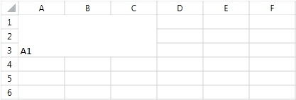
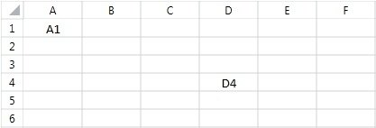

# Merge and Unmerge Cells

__RadSpreadsheet__ allows you to merge two or more adjacent cells into a single cell that spans over multiple rows and columns.
        The content of the top-left cell is displayed in the newly created merged cell. The content of the rest of the cells in the merged region is
        cleared. Once merged, a cell can be easily unmerged back to its compound cells.
      

## Merge Cells

To merge cells you have to create a __CellSelection__ object which determines the region of cells that will be merged.
          The __CellSelection__ class offers two methods that perform different types of merge: __Merge()__ and
          __MergeAcross()__. The former method joins all cells to create one big cell, while the latter combines all cells that
          appear in the same row, thus, creating a merged cell for every row in the selected region.
        

Let's take a closer look at how the two methods for merging change the following worksheet.The following snippet constructs a worksheet that
          will be used as a starting point in the next few examples:
        

#### __C#__

{{region radspreadsheet-model-features-merge-and-unmerge-cells_8}}
	            Workbook workbook = new Workbook();
	            Worksheet worksheet = workbook.Worksheets.Add();
	            worksheet.Cells[0, 0].SetValue("A1");
	            worksheet.Cells[1, 0].SetValue("A2");
	            worksheet.Cells[0, 1].SetValue("B1");
	            worksheet.Cells[1, 1].SetValue("B2");
	{{endregion}}

#### __VB__

{{region radspreadsheet-model-features-merge-and-unmerge-cells_8}}
	        Dim workbook As New Workbook()
	        Dim worksheet As Worksheet = workbook.Worksheets.Add()
	        worksheet.Cells(0, 0).SetValue("A1")
	        worksheet.Cells(1, 0).SetValue("A2")
	        worksheet.Cells(0, 1).SetValue("B1")
	        worksheet.Cells(1, 1).SetValue("B2")
	        '#End Region
	    End Sub
	
	    End Class

The snippet above will produce the following worksheet:
        

The snippet below illustrates how to perform a merge operation on the cell region *A1:B2*:
        

#### __C#__

{{region radspreadsheet-model-features-merge-and-unmerge-cells_0}}
	
	            Workbook workbook = new Workbook();
	            Worksheet worksheet = workbook.Worksheets.Add();
	            CellIndex A1Cell = new CellIndex(0, 0);
	            CellIndex B2Cell = new CellIndex(1, 1);
	
	            worksheet.Cells[A1Cell, B2Cell].Merge();
	
	{{endregion}}

#### __VB__

{{region radspreadsheet-model-features-merge-and-unmerge-cells_0}}
	
	        Dim workbook As New Workbook()
	        Dim worksheet As Worksheet = workbook.Worksheets.Add()
	        Dim A1Cell As New CellIndex(0, 0)
	        Dim B2Cell As New CellIndex(1, 1)
	
	        worksheet.Cells(A1Cell, B2Cell).Merge()
	
	        '#End Region
	    End Sub
	
	    Public Sub MergeAcrossA1B2()
	        '#Region radspreadsheet-model-features-merge-and-unmerge-cells_1
	
	        Dim workbook As New Workbook()
	        Dim worksheet As Worksheet = workbook.Worksheets.Add()
	        Dim A1Cell As New CellIndex(0, 0)
	        Dim B2Cell As New CellIndex(1, 1)
	        worksheet.Cells(A1Cell, B2Cell).MergeAcross()
	
	        '#End Region
	    End Sub
	
	    Public Sub MergeB2C3()
	        '#Region radspreadsheet-model-features-merge-and-unmerge-cells_2
	
	        Dim workbook As New Workbook()
	        Dim worksheet As Worksheet = workbook.Worksheets.Add()
	        Dim B2Cell As New CellIndex(1, 1)
	        Dim C3Cell As New CellIndex(2, 2)
	        worksheet.Cells(B2Cell, C3Cell).Merge()
	
	        '#End Region
	    End Sub
	
	    Public Sub CheckA1IsMerged()
	        '#Region radspreadsheet-model-features-merge-and-unmerge-cells_3
	
	        Dim workbook As New Workbook()
	        Dim worksheet As Worksheet = workbook.Worksheets.Add()
	        Dim A1CellIndex As New CellIndex(0, 0)
	        Dim isA1merged As Boolean = worksheet.Cells.GetIsMerged(A1CellIndex)
	
	        '#End Region
	    End Sub
	
	    Public Sub GetContainingMergedRangeForCellA1()
	        '#Region radspreadsheet-model-features-merge-and-unmerge-cells_4
	
	        Dim workbook As New Workbook()
	        Dim worksheet As Worksheet = workbook.Worksheets.Add()
	        Dim A1CellIndex As New CellIndex(0, 0)
	        Dim mergedCellRange As CellRange
	        Dim canGetContainingMergedCellRange As Boolean = worksheet.Cells.TryGetContainingMergedRange(A1CellIndex, mergedCellRange)
	
	        '#End Region
	    End Sub
	
	    Public Sub GetAllContainingMergedRangesInRange()
	        '#Region radspreadsheet-model-features-merge-and-unmerge-cells_5
	
	        Dim workbook As New Workbook()
	        Dim worksheet As Worksheet = workbook.Worksheets.Add()
	        Dim A1CellIndex As New CellIndex(0, 0)
	        Dim N33CellIndex As New CellIndex(32, 13)
	        Dim A1N33CellRange As New CellRange(A1CellIndex, N33CellIndex)
	        Dim containingMergedCellRanges As IEnumerable(Of CellRange) = worksheet.Cells.GetContainingMergedRanges(A1N33CellRange)
	
	        '#End Region
	    End Sub
	
	    Public Sub GetAllMergedCells()
	        '#Region radspreadsheet-model-features-merge-and-unmerge-cells_6
	
	        Dim workbook As New Workbook()
	        Dim worksheet As Worksheet = workbook.Worksheets.Add()
	        Dim mergedCellRanges As IEnumerable(Of CellRange) = worksheet.Cells.GetMergedCellRanges()
	
	        '#End Region
	    End Sub
	
	    Public Sub UnmergeCells()
	        '#Region radspreadsheet-model-features-merge-and-unmerge-cells_7
	
	        Dim workbook As New Workbook()
	        Dim worksheet As Worksheet = workbook.Worksheets.Add()
	        Dim B2CellIndex As New CellIndex(1, 1)
	        Dim D4CellIndex As New CellIndex(3, 3)
	        Dim B2D4CellSelection As New CellRange(B2CellIndex, D4CellIndex)
	        worksheet.Cells(B2D4CellSelection).Unmerge()
	
	        '#End Region
	    End Sub
	
	    Public Sub StartingPoint()
	        '#Region radspreadsheet-model-features-merge-and-unmerge-cells_8
	        Dim workbook As New Workbook()
	        Dim worksheet As Worksheet = workbook.Worksheets.Add()
	        worksheet.Cells(0, 0).SetValue("A1")
	        worksheet.Cells(1, 0).SetValue("A2")
	        worksheet.Cells(0, 1).SetValue("B1")
	        worksheet.Cells(1, 1).SetValue("B2")
	        '#End Region
	    End Sub
	
	    End Class

As a result of the merge, the four cells appear as one. The content of the newly created cell is equal to the top left cell of the merged region, i.e.
          *A1*. At this point, the values of the rest of the cells in the merged region are cleared, so now cells
          *A2, B1 and B2* have no values.
        

Let’s see how the __MergeAcross()__ method will change the same region in the original worksheet:
        

#### __C#__

{{region radspreadsheet-model-features-merge-and-unmerge-cells_1}}
	
	            Workbook workbook = new Workbook();
	            Worksheet worksheet = workbook.Worksheets.Add();
	            CellIndex A1Cell = new CellIndex(0, 0);
	            CellIndex B2Cell = new CellIndex(1, 1);
	            worksheet.Cells[A1Cell, B2Cell].MergeAcross();
	
	{{endregion}}

#### __VB__

{{region radspreadsheet-model-features-merge-and-unmerge-cells_1}}
	
	        Dim workbook As New Workbook()
	        Dim worksheet As Worksheet = workbook.Worksheets.Add()
	        Dim A1Cell As New CellIndex(0, 0)
	        Dim B2Cell As New CellIndex(1, 1)
	        worksheet.Cells(A1Cell, B2Cell).MergeAcross()
	
	        '#End Region
	    End Sub
	
	    Public Sub MergeB2C3()
	        '#Region radspreadsheet-model-features-merge-and-unmerge-cells_2
	
	        Dim workbook As New Workbook()
	        Dim worksheet As Worksheet = workbook.Worksheets.Add()
	        Dim B2Cell As New CellIndex(1, 1)
	        Dim C3Cell As New CellIndex(2, 2)
	        worksheet.Cells(B2Cell, C3Cell).Merge()
	
	        '#End Region
	    End Sub
	
	    Public Sub CheckA1IsMerged()
	        '#Region radspreadsheet-model-features-merge-and-unmerge-cells_3
	
	        Dim workbook As New Workbook()
	        Dim worksheet As Worksheet = workbook.Worksheets.Add()
	        Dim A1CellIndex As New CellIndex(0, 0)
	        Dim isA1merged As Boolean = worksheet.Cells.GetIsMerged(A1CellIndex)
	
	        '#End Region
	    End Sub
	
	    Public Sub GetContainingMergedRangeForCellA1()
	        '#Region radspreadsheet-model-features-merge-and-unmerge-cells_4
	
	        Dim workbook As New Workbook()
	        Dim worksheet As Worksheet = workbook.Worksheets.Add()
	        Dim A1CellIndex As New CellIndex(0, 0)
	        Dim mergedCellRange As CellRange
	        Dim canGetContainingMergedCellRange As Boolean = worksheet.Cells.TryGetContainingMergedRange(A1CellIndex, mergedCellRange)
	
	        '#End Region
	    End Sub
	
	    Public Sub GetAllContainingMergedRangesInRange()
	        '#Region radspreadsheet-model-features-merge-and-unmerge-cells_5
	
	        Dim workbook As New Workbook()
	        Dim worksheet As Worksheet = workbook.Worksheets.Add()
	        Dim A1CellIndex As New CellIndex(0, 0)
	        Dim N33CellIndex As New CellIndex(32, 13)
	        Dim A1N33CellRange As New CellRange(A1CellIndex, N33CellIndex)
	        Dim containingMergedCellRanges As IEnumerable(Of CellRange) = worksheet.Cells.GetContainingMergedRanges(A1N33CellRange)
	
	        '#End Region
	    End Sub
	
	    Public Sub GetAllMergedCells()
	        '#Region radspreadsheet-model-features-merge-and-unmerge-cells_6
	
	        Dim workbook As New Workbook()
	        Dim worksheet As Worksheet = workbook.Worksheets.Add()
	        Dim mergedCellRanges As IEnumerable(Of CellRange) = worksheet.Cells.GetMergedCellRanges()
	
	        '#End Region
	    End Sub
	
	    Public Sub UnmergeCells()
	        '#Region radspreadsheet-model-features-merge-and-unmerge-cells_7
	
	        Dim workbook As New Workbook()
	        Dim worksheet As Worksheet = workbook.Worksheets.Add()
	        Dim B2CellIndex As New CellIndex(1, 1)
	        Dim D4CellIndex As New CellIndex(3, 3)
	        Dim B2D4CellSelection As New CellRange(B2CellIndex, D4CellIndex)
	        worksheet.Cells(B2D4CellSelection).Unmerge()
	
	        '#End Region
	    End Sub
	
	    Public Sub StartingPoint()
	        '#Region radspreadsheet-model-features-merge-and-unmerge-cells_8
	        Dim workbook As New Workbook()
	        Dim worksheet As Worksheet = workbook.Worksheets.Add()
	        worksheet.Cells(0, 0).SetValue("A1")
	        worksheet.Cells(1, 0).SetValue("A2")
	        worksheet.Cells(0, 1).SetValue("B1")
	        worksheet.Cells(1, 1).SetValue("B2")
	        '#End Region
	    End Sub
	
	    End Class

Note that unlike __Merge()__, the __MergeAcross()__ method creates a new cell for every row.
          Each newly created cell contains the value of the leftmost cell that is in the same row and in the merged region. The value of the rest of the merged
          cells is cleared, so cells *B1* and *B2* have an empty value.
        

If you now try to merge a cell range that intersects with another merged cell range, a third merged cell range will be produced out of the
          top-left and bottom-right cells of the two ranges. The following snippet merges across the region *A1:B2* and then
          performs another merge on the cells in the region *B2:C3*:
        

#### __C#__

{{region radspreadsheet-model-features-merge-and-unmerge-cells_2}}
	
	            Workbook workbook = new Workbook();
	            Worksheet worksheet = workbook.Worksheets.Add();
	            CellIndex B2Cell = new CellIndex(1, 1);
	            CellIndex C3Cell = new CellIndex(2, 2);
	            worksheet.Cells[B2Cell, C3Cell].Merge();
	
	{{endregion}}

#### __VB__

{{region radspreadsheet-model-features-merge-and-unmerge-cells_2}}
	
	        Dim workbook As New Workbook()
	        Dim worksheet As Worksheet = workbook.Worksheets.Add()
	        Dim B2Cell As New CellIndex(1, 1)
	        Dim C3Cell As New CellIndex(2, 2)
	        worksheet.Cells(B2Cell, C3Cell).Merge()
	
	        '#End Region
	    End Sub
	
	    Public Sub CheckA1IsMerged()
	        '#Region radspreadsheet-model-features-merge-and-unmerge-cells_3
	
	        Dim workbook As New Workbook()
	        Dim worksheet As Worksheet = workbook.Worksheets.Add()
	        Dim A1CellIndex As New CellIndex(0, 0)
	        Dim isA1merged As Boolean = worksheet.Cells.GetIsMerged(A1CellIndex)
	
	        '#End Region
	    End Sub
	
	    Public Sub GetContainingMergedRangeForCellA1()
	        '#Region radspreadsheet-model-features-merge-and-unmerge-cells_4
	
	        Dim workbook As New Workbook()
	        Dim worksheet As Worksheet = workbook.Worksheets.Add()
	        Dim A1CellIndex As New CellIndex(0, 0)
	        Dim mergedCellRange As CellRange
	        Dim canGetContainingMergedCellRange As Boolean = worksheet.Cells.TryGetContainingMergedRange(A1CellIndex, mergedCellRange)
	
	        '#End Region
	    End Sub
	
	    Public Sub GetAllContainingMergedRangesInRange()
	        '#Region radspreadsheet-model-features-merge-and-unmerge-cells_5
	
	        Dim workbook As New Workbook()
	        Dim worksheet As Worksheet = workbook.Worksheets.Add()
	        Dim A1CellIndex As New CellIndex(0, 0)
	        Dim N33CellIndex As New CellIndex(32, 13)
	        Dim A1N33CellRange As New CellRange(A1CellIndex, N33CellIndex)
	        Dim containingMergedCellRanges As IEnumerable(Of CellRange) = worksheet.Cells.GetContainingMergedRanges(A1N33CellRange)
	
	        '#End Region
	    End Sub
	
	    Public Sub GetAllMergedCells()
	        '#Region radspreadsheet-model-features-merge-and-unmerge-cells_6
	
	        Dim workbook As New Workbook()
	        Dim worksheet As Worksheet = workbook.Worksheets.Add()
	        Dim mergedCellRanges As IEnumerable(Of CellRange) = worksheet.Cells.GetMergedCellRanges()
	
	        '#End Region
	    End Sub
	
	    Public Sub UnmergeCells()
	        '#Region radspreadsheet-model-features-merge-and-unmerge-cells_7
	
	        Dim workbook As New Workbook()
	        Dim worksheet As Worksheet = workbook.Worksheets.Add()
	        Dim B2CellIndex As New CellIndex(1, 1)
	        Dim D4CellIndex As New CellIndex(3, 3)
	        Dim B2D4CellSelection As New CellRange(B2CellIndex, D4CellIndex)
	        worksheet.Cells(B2D4CellSelection).Unmerge()
	
	        '#End Region
	    End Sub
	
	    Public Sub StartingPoint()
	        '#Region radspreadsheet-model-features-merge-and-unmerge-cells_8
	        Dim workbook As New Workbook()
	        Dim worksheet As Worksheet = workbook.Worksheets.Add()
	        worksheet.Cells(0, 0).SetValue("A1")
	        worksheet.Cells(1, 0).SetValue("A2")
	        worksheet.Cells(0, 1).SetValue("B1")
	        worksheet.Cells(1, 1).SetValue("B2")
	        '#End Region
	    End Sub
	
	    End Class

The result is a merged cell that ranges from *A1* to *C3*.
        

## Get Merged Cell Ranges

In some scenarios you may want to know if a particular cell is part of a merged region. In others, you may need to retrieve all merged ranges. This
          section outlines the possible approaches for getting the merged regions.
        How to check if a cell is merged? 

The Cells class exposes a __GetIsMerged()__ method that allows you determine if a cell belongs to a merged cell. The method
              takes a single parameter of type __CellIndex__ which designates cell you would like to inspect and returns a Boolean value
              that indicates whether the cell is contained in a merged cell. For example, the next snippet checks if cell A1 is in a merged region.
            

#### __C#__

{{region radspreadsheet-model-features-merge-and-unmerge-cells_3}}
	
	            Workbook workbook = new Workbook();
	            Worksheet worksheet = workbook.Worksheets.Add();
	            CellIndex A1CellIndex = new CellIndex(0, 0);
	            bool isA1merged = worksheet.Cells.GetIsMerged(A1CellIndex);
	
	{{endregion}}

#### __VB__

{{region radspreadsheet-model-features-merge-and-unmerge-cells_3}}
	
	        Dim workbook As New Workbook()
	        Dim worksheet As Worksheet = workbook.Worksheets.Add()
	        Dim A1CellIndex As New CellIndex(0, 0)
	        Dim isA1merged As Boolean = worksheet.Cells.GetIsMerged(A1CellIndex)
	
	        '#End Region
	    End Sub
	
	    Public Sub GetContainingMergedRangeForCellA1()
	        '#Region radspreadsheet-model-features-merge-and-unmerge-cells_4
	
	        Dim workbook As New Workbook()
	        Dim worksheet As Worksheet = workbook.Worksheets.Add()
	        Dim A1CellIndex As New CellIndex(0, 0)
	        Dim mergedCellRange As CellRange
	        Dim canGetContainingMergedCellRange As Boolean = worksheet.Cells.TryGetContainingMergedRange(A1CellIndex, mergedCellRange)
	
	        '#End Region
	    End Sub
	
	    Public Sub GetAllContainingMergedRangesInRange()
	        '#Region radspreadsheet-model-features-merge-and-unmerge-cells_5
	
	        Dim workbook As New Workbook()
	        Dim worksheet As Worksheet = workbook.Worksheets.Add()
	        Dim A1CellIndex As New CellIndex(0, 0)
	        Dim N33CellIndex As New CellIndex(32, 13)
	        Dim A1N33CellRange As New CellRange(A1CellIndex, N33CellIndex)
	        Dim containingMergedCellRanges As IEnumerable(Of CellRange) = worksheet.Cells.GetContainingMergedRanges(A1N33CellRange)
	
	        '#End Region
	    End Sub
	
	    Public Sub GetAllMergedCells()
	        '#Region radspreadsheet-model-features-merge-and-unmerge-cells_6
	
	        Dim workbook As New Workbook()
	        Dim worksheet As Worksheet = workbook.Worksheets.Add()
	        Dim mergedCellRanges As IEnumerable(Of CellRange) = worksheet.Cells.GetMergedCellRanges()
	
	        '#End Region
	    End Sub
	
	    Public Sub UnmergeCells()
	        '#Region radspreadsheet-model-features-merge-and-unmerge-cells_7
	
	        Dim workbook As New Workbook()
	        Dim worksheet As Worksheet = workbook.Worksheets.Add()
	        Dim B2CellIndex As New CellIndex(1, 1)
	        Dim D4CellIndex As New CellIndex(3, 3)
	        Dim B2D4CellSelection As New CellRange(B2CellIndex, D4CellIndex)
	        worksheet.Cells(B2D4CellSelection).Unmerge()
	
	        '#End Region
	    End Sub
	
	    Public Sub StartingPoint()
	        '#Region radspreadsheet-model-features-merge-and-unmerge-cells_8
	        Dim workbook As New Workbook()
	        Dim worksheet As Worksheet = workbook.Worksheets.Add()
	        worksheet.Cells(0, 0).SetValue("A1")
	        worksheet.Cells(1, 0).SetValue("A2")
	        worksheet.Cells(0, 1).SetValue("B1")
	        worksheet.Cells(1, 1).SetValue("B2")
	        '#End Region
	    End Sub
	
	    End Class

How to get the containing merged cell range, if the cell is merged?

Another way to check if a cell belongs to a merged range is to use the __TryGetContainingMergedRange()__ method of the
              __Cells__ class.Similarly to the GetIsMerged(), this method returns a Boolean value which indicates if the cell actually is
              contained in a merged cell. It requires a __CellIndex__ parameter that points the cell to be checked. The method also has one
              additional out parameter of type CellRange that holds the merged range of the cell, if the cell belongs to such. The next example demonstrates how
              to use the method.
            

#### __C#__

{{region radspreadsheet-model-features-merge-and-unmerge-cells_4}}
	
	            Workbook workbook = new Workbook();
	            Worksheet worksheet = workbook.Worksheets.Add();
	            CellIndex A1CellIndex = new CellIndex(0, 0);
	            CellRange mergedCellRange;
	            bool canGetContainingMergedCellRange = worksheet.Cells.TryGetContainingMergedRange(A1CellIndex, out mergedCellRange);
	
	{{endregion}}

#### __VB__

{{region radspreadsheet-model-features-merge-and-unmerge-cells_4}}
	
	        Dim workbook As New Workbook()
	        Dim worksheet As Worksheet = workbook.Worksheets.Add()
	        Dim A1CellIndex As New CellIndex(0, 0)
	        Dim mergedCellRange As CellRange
	        Dim canGetContainingMergedCellRange As Boolean = worksheet.Cells.TryGetContainingMergedRange(A1CellIndex, mergedCellRange)
	
	        '#End Region
	    End Sub
	
	    Public Sub GetAllContainingMergedRangesInRange()
	        '#Region radspreadsheet-model-features-merge-and-unmerge-cells_5
	
	        Dim workbook As New Workbook()
	        Dim worksheet As Worksheet = workbook.Worksheets.Add()
	        Dim A1CellIndex As New CellIndex(0, 0)
	        Dim N33CellIndex As New CellIndex(32, 13)
	        Dim A1N33CellRange As New CellRange(A1CellIndex, N33CellIndex)
	        Dim containingMergedCellRanges As IEnumerable(Of CellRange) = worksheet.Cells.GetContainingMergedRanges(A1N33CellRange)
	
	        '#End Region
	    End Sub
	
	    Public Sub GetAllMergedCells()
	        '#Region radspreadsheet-model-features-merge-and-unmerge-cells_6
	
	        Dim workbook As New Workbook()
	        Dim worksheet As Worksheet = workbook.Worksheets.Add()
	        Dim mergedCellRanges As IEnumerable(Of CellRange) = worksheet.Cells.GetMergedCellRanges()
	
	        '#End Region
	    End Sub
	
	    Public Sub UnmergeCells()
	        '#Region radspreadsheet-model-features-merge-and-unmerge-cells_7
	
	        Dim workbook As New Workbook()
	        Dim worksheet As Worksheet = workbook.Worksheets.Add()
	        Dim B2CellIndex As New CellIndex(1, 1)
	        Dim D4CellIndex As New CellIndex(3, 3)
	        Dim B2D4CellSelection As New CellRange(B2CellIndex, D4CellIndex)
	        worksheet.Cells(B2D4CellSelection).Unmerge()
	
	        '#End Region
	    End Sub
	
	    Public Sub StartingPoint()
	        '#Region radspreadsheet-model-features-merge-and-unmerge-cells_8
	        Dim workbook As New Workbook()
	        Dim worksheet As Worksheet = workbook.Worksheets.Add()
	        worksheet.Cells(0, 0).SetValue("A1")
	        worksheet.Cells(1, 0).SetValue("A2")
	        worksheet.Cells(0, 1).SetValue("B1")
	        worksheet.Cells(1, 1).SetValue("B2")
	        '#End Region
	    End Sub
	
	    End Class

How to get all merged cell ranges contained in a given cell range?

Use the __GetContainingMergedRanges()__ method of the __Cells__ class to retrieve all merged cells in a
              specified range. The method takes a single argument of type __CellRange__ that determines the range of the search and returns
              an enumerable that contains all merged cell ranges.
            

#### __C#__

{{region radspreadsheet-model-features-merge-and-unmerge-cells_5}}
	
	            Workbook workbook = new Workbook();
	            Worksheet worksheet = workbook.Worksheets.Add();
	            CellIndex A1CellIndex = new CellIndex(0, 0);
	            CellIndex N33CellIndex = new CellIndex(32, 13);
	            CellRange A1N33CellRange = new CellRange(A1CellIndex, N33CellIndex);
	            IEnumerable<CellRange> containingMergedCellRanges = worksheet.Cells.GetContainingMergedRanges(A1N33CellRange);
	
	{{endregion}}

#### __VB__

{{region radspreadsheet-model-features-merge-and-unmerge-cells_5}}
	
	        Dim workbook As New Workbook()
	        Dim worksheet As Worksheet = workbook.Worksheets.Add()
	        Dim A1CellIndex As New CellIndex(0, 0)
	        Dim N33CellIndex As New CellIndex(32, 13)
	        Dim A1N33CellRange As New CellRange(A1CellIndex, N33CellIndex)
	        Dim containingMergedCellRanges As IEnumerable(Of CellRange) = worksheet.Cells.GetContainingMergedRanges(A1N33CellRange)
	
	        '#End Region
	    End Sub
	
	    Public Sub GetAllMergedCells()
	        '#Region radspreadsheet-model-features-merge-and-unmerge-cells_6
	
	        Dim workbook As New Workbook()
	        Dim worksheet As Worksheet = workbook.Worksheets.Add()
	        Dim mergedCellRanges As IEnumerable(Of CellRange) = worksheet.Cells.GetMergedCellRanges()
	
	        '#End Region
	    End Sub
	
	    Public Sub UnmergeCells()
	        '#Region radspreadsheet-model-features-merge-and-unmerge-cells_7
	
	        Dim workbook As New Workbook()
	        Dim worksheet As Worksheet = workbook.Worksheets.Add()
	        Dim B2CellIndex As New CellIndex(1, 1)
	        Dim D4CellIndex As New CellIndex(3, 3)
	        Dim B2D4CellSelection As New CellRange(B2CellIndex, D4CellIndex)
	        worksheet.Cells(B2D4CellSelection).Unmerge()
	
	        '#End Region
	    End Sub
	
	    Public Sub StartingPoint()
	        '#Region radspreadsheet-model-features-merge-and-unmerge-cells_8
	        Dim workbook As New Workbook()
	        Dim worksheet As Worksheet = workbook.Worksheets.Add()
	        worksheet.Cells(0, 0).SetValue("A1")
	        worksheet.Cells(1, 0).SetValue("A2")
	        worksheet.Cells(0, 1).SetValue("B1")
	        worksheet.Cells(1, 1).SetValue("B2")
	        '#End Region
	    End Sub
	
	    End Class

How to get all merged ranges?

The __GetMergedCellRanges()__ method of the __Cells__ class returns an enumeration holding all merged
              cell ranges in the worksheet.
            

#### __C#__

{{region radspreadsheet-model-features-merge-and-unmerge-cells_6}}
	
	            Workbook workbook = new Workbook();
	            Worksheet worksheet = workbook.Worksheets.Add();
	            IEnumerable<CellRange> mergedCellRanges = worksheet.Cells.GetMergedCellRanges();
	
	{{endregion}}

#### __VB__

{{region radspreadsheet-model-features-merge-and-unmerge-cells_6}}
	
	        Dim workbook As New Workbook()
	        Dim worksheet As Worksheet = workbook.Worksheets.Add()
	        Dim mergedCellRanges As IEnumerable(Of CellRange) = worksheet.Cells.GetMergedCellRanges()
	
	        '#End Region
	    End Sub
	
	    Public Sub UnmergeCells()
	        '#Region radspreadsheet-model-features-merge-and-unmerge-cells_7
	
	        Dim workbook As New Workbook()
	        Dim worksheet As Worksheet = workbook.Worksheets.Add()
	        Dim B2CellIndex As New CellIndex(1, 1)
	        Dim D4CellIndex As New CellIndex(3, 3)
	        Dim B2D4CellSelection As New CellRange(B2CellIndex, D4CellIndex)
	        worksheet.Cells(B2D4CellSelection).Unmerge()
	
	        '#End Region
	    End Sub
	
	    Public Sub StartingPoint()
	        '#Region radspreadsheet-model-features-merge-and-unmerge-cells_8
	        Dim workbook As New Workbook()
	        Dim worksheet As Worksheet = workbook.Worksheets.Add()
	        worksheet.Cells(0, 0).SetValue("A1")
	        worksheet.Cells(1, 0).SetValue("A2")
	        worksheet.Cells(0, 1).SetValue("B1")
	        worksheet.Cells(1, 1).SetValue("B2")
	        '#End Region
	    End Sub
	
	    End Class

## Unmerge cells

Once a cell is merged, __RadSpreadsheet__'s API offers an easy way to split it back to its composing cells. This is
          achieved through the __Unmerge()__ method of the __CellSelection__ class. When this method is invoked it
          unmerges all merged cell ranges that intersect with the selected cell range. For example, consider the following worksheet that has the regions
          *A1:B2* and *D4:E5* merged:
        

The next snippet invokes the __Unmerge()__ method for the region *B2:D4*, which intersects with
          the two merged ranges.
        

#### __C#__

{{region radspreadsheet-model-features-merge-and-unmerge-cells_7}}
	
	            Workbook workbook = new Workbook();
	            Worksheet worksheet = workbook.Worksheets.Add();
	            CellIndex B2CellIndex = new CellIndex(1, 1);
	            CellIndex D4CellIndex = new CellIndex(3, 3);
	            CellRange B2D4CellSelection = new CellRange(B2CellIndex, D4CellIndex);
	            worksheet.Cells[B2D4CellSelection].Unmerge();
	
	{{endregion}}

#### __VB__

{{region radspreadsheet-model-features-merge-and-unmerge-cells_7}}
	
	        Dim workbook As New Workbook()
	        Dim worksheet As Worksheet = workbook.Worksheets.Add()
	        Dim B2CellIndex As New CellIndex(1, 1)
	        Dim D4CellIndex As New CellIndex(3, 3)
	        Dim B2D4CellSelection As New CellRange(B2CellIndex, D4CellIndex)
	        worksheet.Cells(B2D4CellSelection).Unmerge()
	
	        '#End Region
	    End Sub
	
	    Public Sub StartingPoint()
	        '#Region radspreadsheet-model-features-merge-and-unmerge-cells_8
	        Dim workbook As New Workbook()
	        Dim worksheet As Worksheet = workbook.Worksheets.Add()
	        worksheet.Cells(0, 0).SetValue("A1")
	        worksheet.Cells(1, 0).SetValue("A2")
	        worksheet.Cells(0, 1).SetValue("B1")
	        worksheet.Cells(1, 1).SetValue("B2")
	        '#End Region
	    End Sub
	
	    End Class

As a result, the two ranges will be unmerged.
        

# See Also
