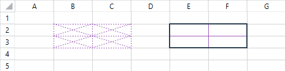
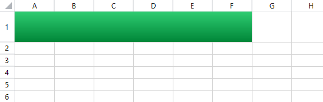

# Get, Set and Clear Cell Properties

Cells are the atomic parts of a worksheet and its basic data units. Each cell can be assigned a value, borders, fill, format, style and much more. .
        This article aims to describe the properties offered by cells and demonstrate how to retrieve and change them. It contains the following sections:
      

* [Get Set and Clear Methods](#get,-set-and-clear-methods)

* [Cell Properties](#cell-properties)

* [Value Property](#value-property)

* [Borders Property](#borders-property)

* [Fill Property](#fill-property)

* [Indent Property](#indent-property)

## Get, Set and Clear Methods

To access cell properties, you have to create a __CellSelection__ object that contains the region of cells you would
          like to change. More information about retrieving __CellSelection__ instances is available in the
          [Accessing Cells of a Worksheet]() article. The following sample creates a selection for cells in the range A1:F6:
        

#### __C#__

{{region radspreadsheet-features-formatting-cells_0}}
	            Workbook workbook = new Workbook();
	            Worksheet worksheet = workbook.Worksheets.Add();
	            CellSelection selection = worksheet.Cells[0, 0, 5, 5];
	{{endregion}}

#### __VB__

{{region radspreadsheet-features-formatting-cells_0}}
	        Dim workbook As New Workbook()
	        Dim worksheet As Worksheet = workbook.Worksheets.Add()
	        Dim selection As CellSelection = worksheet.Cells(0, 0, 5, 5)
	        '#End Region
	    End Sub
	
	    Public Sub GetSetClearIsBold()
	        '#Region radspreadsheet-features-formatting-cells_1
	        Dim workbook As New Workbook()
	        Dim worksheet As Worksheet = workbook.Worksheets.Add()
	        Dim selection As CellSelection = worksheet.Cells(0, 0, 5, 5)
	
	        selection.SetIsBold(True)
	        Dim isBold As Boolean = selection.GetIsBold().Value
	        selection.ClearIsBold()
	        '#End Region
	    End Sub
	
	    Public Sub GetSetCellValue()
	        '#Region radspreadsheet-features-formatting-cells_7
	        Dim workbook As New Workbook()
	        Dim worksheet As Worksheet = workbook.Worksheets.Add()
	        Dim selection As CellSelection = worksheet.Cells(1, 1)
	
	        Dim cellValue As ICellValue = selection.GetValue().Value
	        '#End Region
	
	        '#Region radspreadsheet-features-formatting-cells_2
	        ' set DateTime value
	        selection.SetValue(DateTime.Now)
	
	        ' set double value
	        selection.SetValue(51.345)
	
	        ' set ICellValue
	        Dim value As ICellValue = worksheet.Cells(5, 5).GetValue().Value
	        selection.SetValue(value)
	
	        ' set string value
	        selection.SetValue("Total")
	
	        ' set formula value
	        selection.SetValue("=C1+C10")
	        '#End Region
	    End Sub
	
	    Public Sub GetSetCellBorders()
	        '#Region radspreadsheet-features-formatting-cells_3
	        Dim workbook As New Workbook()
	        Dim worksheet As Worksheet = workbook.Worksheets.Add()
	        Dim purple As New ThemableColor(Color.FromRgb(155, 89, 182))
	        Dim darkBlue As New ThemableColor(Color.FromRgb(44, 62, 80))
	
	        Dim purpleBorders As New CellBorders(New CellBorder(CellBorderStyle.Dotted, purple))
	        worksheet.Cells(1, 1, 2, 2).SetBorders(purpleBorders)
	
	       
	        Dim darkBlueBorders As New CellBorders(New CellBorder(CellBorderStyle.Medium, darkBlue), _ 
	                                               New CellBorder(CellBorderStyle.Medium, darkBlue), _
	                                               New CellBorder(CellBorderStyle.Medium, darkBlue), _
	                                               New CellBorder(CellBorderStyle.Medium, darkBlue), _
	                                               New CellBorder(CellBorderStyle.Thin, purple), _
	                                               New CellBorder(CellBorderStyle.Thin, purple), _
	                                               New CellBorder(CellBorderStyle.None, darkBlue), _
	                                               New CellBorder(CellBorderStyle.None, darkBlue))
	
	        worksheet.Cells(1, 4, 2, 5).SetBorders(darkBlueBorders)
	        '#End Region
	    End Sub
	
	    Public Sub SetPatternFill()
	        '#Region radspreadsheet-features-formatting-cells_4
	        Dim workbook As New Workbook()
	        Dim worksheet As Worksheet = workbook.Worksheets.Add()
	
	        Dim diagonalStripePatternFill As New PatternFill(PatternType.DiagonalStripe, Color.FromRgb(231, 76, 60), Color.FromRgb(241, 196, 15))
	        worksheet.Cells(0, 0, 0, 5).SetFill(diagonalStripePatternFill)
	
	        Dim solidPatternFill As New PatternFill(PatternType.Solid, Color.FromRgb(46, 204, 113), Colors.Transparent)
	        worksheet.Cells(1, 0, 5, 5).SetFill(solidPatternFill)
	        '#End Region
	    End Sub
	
	    Public Sub SetGradientFill()
	        '#Region radspreadsheet-features-formatting-cells_5
	        Dim workbook As New Workbook()
	        Dim worksheet As Worksheet = workbook.Worksheets.Add()
	        worksheet.Rows(0).SetHeight(New RowHeight(50, True))
	
	        Dim greenGradientFill As New GradientFill(GradientType.Horizontal, Color.FromRgb(46, 204, 113), Color.FromRgb(0, 134, 56))
	        worksheet.Cells(0, 0, 0, 5).SetFill(greenGradientFill)
	        '#End Region
	    End Sub
	
	    Public Sub IncreaseDecreaseIndent()
	        '#Region radspreadsheet-features-formatting-cells_6
	        Dim workbook As New Workbook()
	        Dim worksheet As Worksheet = workbook.Worksheets.Add()
	        Dim selection As CellSelection = worksheet.Cells(0, 0, 5, 5)
	
	        selection.IncreaseIndent()
	        selection.DecreaseIndent()
	        '#End Region
	    End Sub
	
	    Public Sub IsIndeterminateExample()
	        '#Region "IsIndeterminateDemo"
	
	        Dim workbook As New Workbook()
	        Dim worksheet As Worksheet = workbook.Worksheets.Add()
	
	        worksheet.Cells(0, 0).SetStyleName("Good")
	        worksheet.Cells(0, 1).SetStyleName("Bad")
	
	        Dim cell00Value As RangePropertyValue(Of String) = worksheet.Cells(0, 0).GetStyleName()
	        'cell at [0, 0] cell00Value.IsIndeterminate is False, cell00Value.Value is Good
	
	        Dim cell01Value As RangePropertyValue(Of String) = worksheet.Cells(0, 1).GetStyleName()
	        'cell at [0, 0] cell01Value.IsIndeterminate is False, cell01Value.Value is Bad
	
	        Dim twoCellsValue As RangePropertyValue(Of String) = worksheet.Cells(0, 0, 0, 1).GetStyleName()
	        'cells at [0, 0, 0, 1] twoCellsValue.IsIndeterminate is True, twoCellsValue.Value is Normal
	
	        '#End Region
	    End Sub
	
	End Class

Once you have a __CellSelection__ instance, you can easily set and retrieve the properties of its cells. Each property is manipulated through
          three methods that get, set and clear the value of the property, respectively. Typically, the set methods take a single argument, which
          indicates the value to be set. Similarly, the clear methods have no parameters and reset the properties to their default values. The get methods,
          however, require more attention.
        

With one minor exception, the get methods of all cell properties  return an object of type __RangePropertyValue<T>__. The class exposes two
          properties that indicate the value of the property for the cell range:
        

* __IsIndeterminate__: Indicates whether the value of the retrieved property is consistent among all cells in the specified
              CellSelection. If the retrieved property has one and the same value for all cells, __IsIndeterminate__ is set to false.
              However, if the value of the retrieved property varies throughout the cells in the CellSelection, the __IsIndetermine__
              property is set to true and the __Value__ property of the __RangePropertyValue<T>__ class is
              set to its default value.
            

* __Value__: Contains the value of the retrieved property. If the __IsIndeterminate__ property is set
              to false, __Value__ contains the value of the retrieved property for the whole CellSelection region. If the
              __IsIndeterminate__ property is set to true, this indicates that the value of the retrieved property is not the same for all
              cells in the CellSelection and the __Value__ property is set to its default value.
            

## Cell Properties

Cells in __RadSpreadsheet__ offer a number of properties that allow you to change their content and appearance. The following list
          outlines all cell properties:
        

* Value

* Border

* Fill

* FontFamily

* FontSize

* ForeColor

* Format

* HorizontalAlignment

* Indent

* IsBold

* IsItalic

* IsWrapped

* StyleName

* Underline

* VerticalAlignment

* IsLocked

As already mentioned, the __CellSelection__ class exposes methods that get, set and clear methods for each of the above properties.
          The names of the methods are constructed through concatenation of the action the method executes (Get, Set, Clear) and the name of the property. For
          example, the methods that get, set and clear the __IsBolod__ property are respectively, __GetIsBold()__,
          __SetIsBold()__ and __ClearIsBold()__. The following snippet illustrates how to use these methods on the region A1:F6:
        

#### __C#__

{{region radspreadsheet-features-formatting-cells_1}}
	            Workbook workbook = new Workbook();
	            Worksheet worksheet = workbook.Worksheets.Add();
	            CellSelection selection = worksheet.Cells[0, 0, 5, 5];
	
	            selection.SetIsBold(true);
	            bool isBold = selection.GetIsBold().Value;
	            selection.ClearIsBold();
	{{endregion}}

#### __VB__

{{region radspreadsheet-features-formatting-cells_1}}
	        Dim workbook As New Workbook()
	        Dim worksheet As Worksheet = workbook.Worksheets.Add()
	        Dim selection As CellSelection = worksheet.Cells(0, 0, 5, 5)
	
	        selection.SetIsBold(True)
	        Dim isBold As Boolean = selection.GetIsBold().Value
	        selection.ClearIsBold()
	        '#End Region
	    End Sub
	
	    Public Sub GetSetCellValue()
	        '#Region radspreadsheet-features-formatting-cells_7
	        Dim workbook As New Workbook()
	        Dim worksheet As Worksheet = workbook.Worksheets.Add()
	        Dim selection As CellSelection = worksheet.Cells(1, 1)
	
	        Dim cellValue As ICellValue = selection.GetValue().Value
	        '#End Region
	
	        '#Region radspreadsheet-features-formatting-cells_2
	        ' set DateTime value
	        selection.SetValue(DateTime.Now)
	
	        ' set double value
	        selection.SetValue(51.345)
	
	        ' set ICellValue
	        Dim value As ICellValue = worksheet.Cells(5, 5).GetValue().Value
	        selection.SetValue(value)
	
	        ' set string value
	        selection.SetValue("Total")
	
	        ' set formula value
	        selection.SetValue("=C1+C10")
	        '#End Region
	    End Sub
	
	    Public Sub GetSetCellBorders()
	        '#Region radspreadsheet-features-formatting-cells_3
	        Dim workbook As New Workbook()
	        Dim worksheet As Worksheet = workbook.Worksheets.Add()
	        Dim purple As New ThemableColor(Color.FromRgb(155, 89, 182))
	        Dim darkBlue As New ThemableColor(Color.FromRgb(44, 62, 80))
	
	        Dim purpleBorders As New CellBorders(New CellBorder(CellBorderStyle.Dotted, purple))
	        worksheet.Cells(1, 1, 2, 2).SetBorders(purpleBorders)
	
	       
	        Dim darkBlueBorders As New CellBorders(New CellBorder(CellBorderStyle.Medium, darkBlue), _ 
	                                               New CellBorder(CellBorderStyle.Medium, darkBlue), _
	                                               New CellBorder(CellBorderStyle.Medium, darkBlue), _
	                                               New CellBorder(CellBorderStyle.Medium, darkBlue), _
	                                               New CellBorder(CellBorderStyle.Thin, purple), _
	                                               New CellBorder(CellBorderStyle.Thin, purple), _
	                                               New CellBorder(CellBorderStyle.None, darkBlue), _
	                                               New CellBorder(CellBorderStyle.None, darkBlue))
	
	        worksheet.Cells(1, 4, 2, 5).SetBorders(darkBlueBorders)
	        '#End Region
	    End Sub
	
	    Public Sub SetPatternFill()
	        '#Region radspreadsheet-features-formatting-cells_4
	        Dim workbook As New Workbook()
	        Dim worksheet As Worksheet = workbook.Worksheets.Add()
	
	        Dim diagonalStripePatternFill As New PatternFill(PatternType.DiagonalStripe, Color.FromRgb(231, 76, 60), Color.FromRgb(241, 196, 15))
	        worksheet.Cells(0, 0, 0, 5).SetFill(diagonalStripePatternFill)
	
	        Dim solidPatternFill As New PatternFill(PatternType.Solid, Color.FromRgb(46, 204, 113), Colors.Transparent)
	        worksheet.Cells(1, 0, 5, 5).SetFill(solidPatternFill)
	        '#End Region
	    End Sub
	
	    Public Sub SetGradientFill()
	        '#Region radspreadsheet-features-formatting-cells_5
	        Dim workbook As New Workbook()
	        Dim worksheet As Worksheet = workbook.Worksheets.Add()
	        worksheet.Rows(0).SetHeight(New RowHeight(50, True))
	
	        Dim greenGradientFill As New GradientFill(GradientType.Horizontal, Color.FromRgb(46, 204, 113), Color.FromRgb(0, 134, 56))
	        worksheet.Cells(0, 0, 0, 5).SetFill(greenGradientFill)
	        '#End Region
	    End Sub
	
	    Public Sub IncreaseDecreaseIndent()
	        '#Region radspreadsheet-features-formatting-cells_6
	        Dim workbook As New Workbook()
	        Dim worksheet As Worksheet = workbook.Worksheets.Add()
	        Dim selection As CellSelection = worksheet.Cells(0, 0, 5, 5)
	
	        selection.IncreaseIndent()
	        selection.DecreaseIndent()
	        '#End Region
	    End Sub
	
	    Public Sub IsIndeterminateExample()
	        '#Region "IsIndeterminateDemo"
	
	        Dim workbook As New Workbook()
	        Dim worksheet As Worksheet = workbook.Worksheets.Add()
	
	        worksheet.Cells(0, 0).SetStyleName("Good")
	        worksheet.Cells(0, 1).SetStyleName("Bad")
	
	        Dim cell00Value As RangePropertyValue(Of String) = worksheet.Cells(0, 0).GetStyleName()
	        'cell at [0, 0] cell00Value.IsIndeterminate is False, cell00Value.Value is Good
	
	        Dim cell01Value As RangePropertyValue(Of String) = worksheet.Cells(0, 1).GetStyleName()
	        'cell at [0, 0] cell01Value.IsIndeterminate is False, cell01Value.Value is Bad
	
	        Dim twoCellsValue As RangePropertyValue(Of String) = worksheet.Cells(0, 0, 0, 1).GetStyleName()
	        'cells at [0, 0, 0, 1] twoCellsValue.IsIndeterminate is True, twoCellsValue.Value is Normal
	
	        '#End Region
	    End Sub
	
	End Class

Using the above approach you can set the value of almost all cell properties. There are a few exceptions to the general get, set and clear rule,
          though, and each of these is described into one of the following sections.
        

## Value Property

The __Value__ property uses an instance of __ICellValue__ to retrieve and change its value. The property
          has support for the following types of cell values, all of which conform to the ICellValue interface: EmptyCellValue, NumberCellValue,
          BooleanCellValue, TextCellValue, FormulaCellValue. Similarly to the other properties, __Value__ has three methods that control
          the property: __GetValue()__, __SetValue()__ and __ClearValue()__. More information
          about different value types is available in the [Cell Value Types]() article.
        

The __GetValue()__ method retrieves the value of the property and returns an instance of
          __RangePropertyValue<ICellValue>__. The __Value__ property of the __RangePropertyValue__
          instance returns the actual value of the selected region. The following example illustrates who to retrieve the value of cell B2:
        

#### __C#__

{{region radspreadsheet-features-formatting-cells_7}}
	            Workbook workbook = new Workbook();
	            Worksheet worksheet = workbook.Worksheets.Add();
	            CellSelection selection = worksheet.Cells[1, 1];
	
	            ICellValue cellValue = selection.GetValue().Value;
	{{endregion}}

#### __VB__

{{region radspreadsheet-features-formatting-cells_7}}
	        Dim workbook As New Workbook()
	        Dim worksheet As Worksheet = workbook.Worksheets.Add()
	        Dim selection As CellSelection = worksheet.Cells(1, 1)
	
	        Dim cellValue As ICellValue = selection.GetValue().Value
	        '#End Region
	
	        '#Region radspreadsheet-features-formatting-cells_2
	        ' set DateTime value
	        selection.SetValue(DateTime.Now)
	
	        ' set double value
	        selection.SetValue(51.345)
	
	        ' set ICellValue
	        Dim value As ICellValue = worksheet.Cells(5, 5).GetValue().Value
	        selection.SetValue(value)
	
	        ' set string value
	        selection.SetValue("Total")
	
	        ' set formula value
	        selection.SetValue("=C1+C10")
	        '#End Region
	    End Sub
	
	    Public Sub GetSetCellBorders()
	        '#Region radspreadsheet-features-formatting-cells_3
	        Dim workbook As New Workbook()
	        Dim worksheet As Worksheet = workbook.Worksheets.Add()
	        Dim purple As New ThemableColor(Color.FromRgb(155, 89, 182))
	        Dim darkBlue As New ThemableColor(Color.FromRgb(44, 62, 80))
	
	        Dim purpleBorders As New CellBorders(New CellBorder(CellBorderStyle.Dotted, purple))
	        worksheet.Cells(1, 1, 2, 2).SetBorders(purpleBorders)
	
	       
	        Dim darkBlueBorders As New CellBorders(New CellBorder(CellBorderStyle.Medium, darkBlue), _ 
	                                               New CellBorder(CellBorderStyle.Medium, darkBlue), _
	                                               New CellBorder(CellBorderStyle.Medium, darkBlue), _
	                                               New CellBorder(CellBorderStyle.Medium, darkBlue), _
	                                               New CellBorder(CellBorderStyle.Thin, purple), _
	                                               New CellBorder(CellBorderStyle.Thin, purple), _
	                                               New CellBorder(CellBorderStyle.None, darkBlue), _
	                                               New CellBorder(CellBorderStyle.None, darkBlue))
	
	        worksheet.Cells(1, 4, 2, 5).SetBorders(darkBlueBorders)
	        '#End Region
	    End Sub
	
	    Public Sub SetPatternFill()
	        '#Region radspreadsheet-features-formatting-cells_4
	        Dim workbook As New Workbook()
	        Dim worksheet As Worksheet = workbook.Worksheets.Add()
	
	        Dim diagonalStripePatternFill As New PatternFill(PatternType.DiagonalStripe, Color.FromRgb(231, 76, 60), Color.FromRgb(241, 196, 15))
	        worksheet.Cells(0, 0, 0, 5).SetFill(diagonalStripePatternFill)
	
	        Dim solidPatternFill As New PatternFill(PatternType.Solid, Color.FromRgb(46, 204, 113), Colors.Transparent)
	        worksheet.Cells(1, 0, 5, 5).SetFill(solidPatternFill)
	        '#End Region
	    End Sub
	
	    Public Sub SetGradientFill()
	        '#Region radspreadsheet-features-formatting-cells_5
	        Dim workbook As New Workbook()
	        Dim worksheet As Worksheet = workbook.Worksheets.Add()
	        worksheet.Rows(0).SetHeight(New RowHeight(50, True))
	
	        Dim greenGradientFill As New GradientFill(GradientType.Horizontal, Color.FromRgb(46, 204, 113), Color.FromRgb(0, 134, 56))
	        worksheet.Cells(0, 0, 0, 5).SetFill(greenGradientFill)
	        '#End Region
	    End Sub
	
	    Public Sub IncreaseDecreaseIndent()
	        '#Region radspreadsheet-features-formatting-cells_6
	        Dim workbook As New Workbook()
	        Dim worksheet As Worksheet = workbook.Worksheets.Add()
	        Dim selection As CellSelection = worksheet.Cells(0, 0, 5, 5)
	
	        selection.IncreaseIndent()
	        selection.DecreaseIndent()
	        '#End Region
	    End Sub
	
	    Public Sub IsIndeterminateExample()
	        '#Region "IsIndeterminateDemo"
	
	        Dim workbook As New Workbook()
	        Dim worksheet As Worksheet = workbook.Worksheets.Add()
	
	        worksheet.Cells(0, 0).SetStyleName("Good")
	        worksheet.Cells(0, 1).SetStyleName("Bad")
	
	        Dim cell00Value As RangePropertyValue(Of String) = worksheet.Cells(0, 0).GetStyleName()
	        'cell at [0, 0] cell00Value.IsIndeterminate is False, cell00Value.Value is Good
	
	        Dim cell01Value As RangePropertyValue(Of String) = worksheet.Cells(0, 1).GetStyleName()
	        'cell at [0, 0] cell01Value.IsIndeterminate is False, cell01Value.Value is Bad
	
	        Dim twoCellsValue As RangePropertyValue(Of String) = worksheet.Cells(0, 0, 0, 1).GetStyleName()
	        'cells at [0, 0, 0, 1] twoCellsValue.IsIndeterminate is True, twoCellsValue.Value is Normal
	
	        '#End Region
	    End Sub
	
	End Class

As the document model supports different types of cell values, the CellSelection class offers multiple overloads of the __SetValue()__
          method that allow you to produce different types of values. For example, if you choose the method that accepts a double instance, the
          __Value__ of the cell will be an instance of NumberCellValue. The __SetValue()__  method has three more
          overloads that take DateTime, string and ICellValue, respectively. The following snippet demonstrates how to set the value of a given selection.
        

#### __C#__

{{region radspreadsheet-features-formatting-cells_2}}
	            // set DateTime value
	            selection.SetValue(DateTime.Now);
	
	            // set double value
	            selection.SetValue(51.345);
	
	            // set ICellValue
	            ICellValue value = worksheet.Cells[5, 5].GetValue().Value;
	            selection.SetValue(value);
	
	            // set string value
	            selection.SetValue("Total");
	
	            // set formula value
	            selection.SetValue("=C1+C10");
	{{endregion}}

#### __VB__

{{region radspreadsheet-features-formatting-cells_2}}
	        ' set DateTime value
	        selection.SetValue(DateTime.Now)
	
	        ' set double value
	        selection.SetValue(51.345)
	
	        ' set ICellValue
	        Dim value As ICellValue = worksheet.Cells(5, 5).GetValue().Value
	        selection.SetValue(value)
	
	        ' set string value
	        selection.SetValue("Total")
	
	        ' set formula value
	        selection.SetValue("=C1+C10")
	        '#End Region
	    End Sub
	
	    Public Sub GetSetCellBorders()
	        '#Region radspreadsheet-features-formatting-cells_3
	        Dim workbook As New Workbook()
	        Dim worksheet As Worksheet = workbook.Worksheets.Add()
	        Dim purple As New ThemableColor(Color.FromRgb(155, 89, 182))
	        Dim darkBlue As New ThemableColor(Color.FromRgb(44, 62, 80))
	
	        Dim purpleBorders As New CellBorders(New CellBorder(CellBorderStyle.Dotted, purple))
	        worksheet.Cells(1, 1, 2, 2).SetBorders(purpleBorders)
	
	       
	        Dim darkBlueBorders As New CellBorders(New CellBorder(CellBorderStyle.Medium, darkBlue), _ 
	                                               New CellBorder(CellBorderStyle.Medium, darkBlue), _
	                                               New CellBorder(CellBorderStyle.Medium, darkBlue), _
	                                               New CellBorder(CellBorderStyle.Medium, darkBlue), _
	                                               New CellBorder(CellBorderStyle.Thin, purple), _
	                                               New CellBorder(CellBorderStyle.Thin, purple), _
	                                               New CellBorder(CellBorderStyle.None, darkBlue), _
	                                               New CellBorder(CellBorderStyle.None, darkBlue))
	
	        worksheet.Cells(1, 4, 2, 5).SetBorders(darkBlueBorders)
	        '#End Region
	    End Sub
	
	    Public Sub SetPatternFill()
	        '#Region radspreadsheet-features-formatting-cells_4
	        Dim workbook As New Workbook()
	        Dim worksheet As Worksheet = workbook.Worksheets.Add()
	
	        Dim diagonalStripePatternFill As New PatternFill(PatternType.DiagonalStripe, Color.FromRgb(231, 76, 60), Color.FromRgb(241, 196, 15))
	        worksheet.Cells(0, 0, 0, 5).SetFill(diagonalStripePatternFill)
	
	        Dim solidPatternFill As New PatternFill(PatternType.Solid, Color.FromRgb(46, 204, 113), Colors.Transparent)
	        worksheet.Cells(1, 0, 5, 5).SetFill(solidPatternFill)
	        '#End Region
	    End Sub
	
	    Public Sub SetGradientFill()
	        '#Region radspreadsheet-features-formatting-cells_5
	        Dim workbook As New Workbook()
	        Dim worksheet As Worksheet = workbook.Worksheets.Add()
	        worksheet.Rows(0).SetHeight(New RowHeight(50, True))
	
	        Dim greenGradientFill As New GradientFill(GradientType.Horizontal, Color.FromRgb(46, 204, 113), Color.FromRgb(0, 134, 56))
	        worksheet.Cells(0, 0, 0, 5).SetFill(greenGradientFill)
	        '#End Region
	    End Sub
	
	    Public Sub IncreaseDecreaseIndent()
	        '#Region radspreadsheet-features-formatting-cells_6
	        Dim workbook As New Workbook()
	        Dim worksheet As Worksheet = workbook.Worksheets.Add()
	        Dim selection As CellSelection = worksheet.Cells(0, 0, 5, 5)
	
	        selection.IncreaseIndent()
	        selection.DecreaseIndent()
	        '#End Region
	    End Sub
	
	    Public Sub IsIndeterminateExample()
	        '#Region "IsIndeterminateDemo"
	
	        Dim workbook As New Workbook()
	        Dim worksheet As Worksheet = workbook.Worksheets.Add()
	
	        worksheet.Cells(0, 0).SetStyleName("Good")
	        worksheet.Cells(0, 1).SetStyleName("Bad")
	
	        Dim cell00Value As RangePropertyValue(Of String) = worksheet.Cells(0, 0).GetStyleName()
	        'cell at [0, 0] cell00Value.IsIndeterminate is False, cell00Value.Value is Good
	
	        Dim cell01Value As RangePropertyValue(Of String) = worksheet.Cells(0, 1).GetStyleName()
	        'cell at [0, 0] cell01Value.IsIndeterminate is False, cell01Value.Value is Bad
	
	        Dim twoCellsValue As RangePropertyValue(Of String) = worksheet.Cells(0, 0, 0, 1).GetStyleName()
	        'cells at [0, 0, 0, 1] twoCellsValue.IsIndeterminate is True, twoCellsValue.Value is Normal
	
	        '#End Region
	    End Sub
	
	End Class

## Borders Property

The __Borders__ property uses a __CellBorders__ object for getting and setting its property value. The
          __CellBorders__ class contains eight instances of type __CellBorder__ that describe respectively the left,
          top, right, bottom, inside horizontal, inside vertical, diagonal up, and diagonal down borders. In turn the __CellBorder__ object
          holds information about the style and color of the border. The __GetBorders()__ method returns an instance of
          RangePropertyValue<CellBorders>.
        

The next snippet demonstrates how to set the value of the Borders of the regions B2:C4 and E2:F4.
        

#### __C#__

{{region radspreadsheet-features-formatting-cells_3}}
	            Workbook workbook = new Workbook();
	            Worksheet worksheet = workbook.Worksheets.Add();
	            ThemableColor purple = new ThemableColor(Color.FromRgb(155, 89, 182));
	            ThemableColor darkBlue = new ThemableColor(Color.FromRgb(44, 62, 80));
	
	            CellBorders purpleBorders = new CellBorders(new CellBorder(CellBorderStyle.Dotted, purple));
	            worksheet.Cells[1, 1, 2, 2].SetBorders(purpleBorders);
	
	            CellBorders darkBlueBorders = new CellBorders(
	                new CellBorder(CellBorderStyle.Medium, darkBlue),   // Left border
	                new CellBorder(CellBorderStyle.Medium, darkBlue),   // Top border
	                new CellBorder(CellBorderStyle.Medium, darkBlue),   // Right border
	                new CellBorder(CellBorderStyle.Medium, darkBlue),   // Bottom border
	                new CellBorder(CellBorderStyle.Thin, purple),       // Inside horizontal border
	                new CellBorder(CellBorderStyle.Thin, purple),       // Inside vertical border
	                new CellBorder(CellBorderStyle.None, darkBlue),     // Diagonal up border
	                new CellBorder(CellBorderStyle.None, darkBlue));    // Diagonal down border
	
	            worksheet.Cells[1, 4, 2, 5].SetBorders(darkBlueBorders);
	{{endregion}}

#### __VB__

{{region radspreadsheet-features-formatting-cells_3}}
	        Dim workbook As New Workbook()
	        Dim worksheet As Worksheet = workbook.Worksheets.Add()
	        Dim purple As New ThemableColor(Color.FromRgb(155, 89, 182))
	        Dim darkBlue As New ThemableColor(Color.FromRgb(44, 62, 80))
	
	        Dim purpleBorders As New CellBorders(New CellBorder(CellBorderStyle.Dotted, purple))
	        worksheet.Cells(1, 1, 2, 2).SetBorders(purpleBorders)
	
	       
	        Dim darkBlueBorders As New CellBorders(New CellBorder(CellBorderStyle.Medium, darkBlue), _ 
	                                               New CellBorder(CellBorderStyle.Medium, darkBlue), _
	                                               New CellBorder(CellBorderStyle.Medium, darkBlue), _
	                                               New CellBorder(CellBorderStyle.Medium, darkBlue), _
	                                               New CellBorder(CellBorderStyle.Thin, purple), _
	                                               New CellBorder(CellBorderStyle.Thin, purple), _
	                                               New CellBorder(CellBorderStyle.None, darkBlue), _
	                                               New CellBorder(CellBorderStyle.None, darkBlue))
	
	        worksheet.Cells(1, 4, 2, 5).SetBorders(darkBlueBorders)
	        '#End Region
	    End Sub
	
	    Public Sub SetPatternFill()
	        '#Region radspreadsheet-features-formatting-cells_4
	        Dim workbook As New Workbook()
	        Dim worksheet As Worksheet = workbook.Worksheets.Add()
	
	        Dim diagonalStripePatternFill As New PatternFill(PatternType.DiagonalStripe, Color.FromRgb(231, 76, 60), Color.FromRgb(241, 196, 15))
	        worksheet.Cells(0, 0, 0, 5).SetFill(diagonalStripePatternFill)
	
	        Dim solidPatternFill As New PatternFill(PatternType.Solid, Color.FromRgb(46, 204, 113), Colors.Transparent)
	        worksheet.Cells(1, 0, 5, 5).SetFill(solidPatternFill)
	        '#End Region
	    End Sub
	
	    Public Sub SetGradientFill()
	        '#Region radspreadsheet-features-formatting-cells_5
	        Dim workbook As New Workbook()
	        Dim worksheet As Worksheet = workbook.Worksheets.Add()
	        worksheet.Rows(0).SetHeight(New RowHeight(50, True))
	
	        Dim greenGradientFill As New GradientFill(GradientType.Horizontal, Color.FromRgb(46, 204, 113), Color.FromRgb(0, 134, 56))
	        worksheet.Cells(0, 0, 0, 5).SetFill(greenGradientFill)
	        '#End Region
	    End Sub
	
	    Public Sub IncreaseDecreaseIndent()
	        '#Region radspreadsheet-features-formatting-cells_6
	        Dim workbook As New Workbook()
	        Dim worksheet As Worksheet = workbook.Worksheets.Add()
	        Dim selection As CellSelection = worksheet.Cells(0, 0, 5, 5)
	
	        selection.IncreaseIndent()
	        selection.DecreaseIndent()
	        '#End Region
	    End Sub
	
	    Public Sub IsIndeterminateExample()
	        '#Region "IsIndeterminateDemo"
	
	        Dim workbook As New Workbook()
	        Dim worksheet As Worksheet = workbook.Worksheets.Add()
	
	        worksheet.Cells(0, 0).SetStyleName("Good")
	        worksheet.Cells(0, 1).SetStyleName("Bad")
	
	        Dim cell00Value As RangePropertyValue(Of String) = worksheet.Cells(0, 0).GetStyleName()
	        'cell at [0, 0] cell00Value.IsIndeterminate is False, cell00Value.Value is Good
	
	        Dim cell01Value As RangePropertyValue(Of String) = worksheet.Cells(0, 1).GetStyleName()
	        'cell at [0, 0] cell01Value.IsIndeterminate is False, cell01Value.Value is Bad
	
	        Dim twoCellsValue As RangePropertyValue(Of String) = worksheet.Cells(0, 0, 0, 1).GetStyleName()
	        'cells at [0, 0, 0, 1] twoCellsValue.IsIndeterminate is True, twoCellsValue.Value is Normal
	
	        '#End Region
	    End Sub
	
	End Class

The result of the above snippet is demonstrated in the next screenshot:
        

## Fill Property

The __Fill__ property uses an __IFill__ object for getting and setting its property value. Currently,
          RadSpreadsheet supports two types of fills that are represented in the document model through the __PatternFill__ and
          __GradientFill__ classes, both of which conform to the __IFill__ interface.
        

As its name suggests, the PatternFill object is used to fill the background of a region of cells using a repeated pattern of shapes. To create a
          PatternFill instance, you need to specify the type of the pattern, the background color and pattern color of the fill. You can choose between
          eighteen types of patterns, such as HorizontalStripe, DiagonalCrossHatch, Gray75Percent and many more. The PatternFill object also allows you to
          set the background of a cell to a solid color. The following sample snippet creates two PatternFill objects with a DiagonalStripe and Solid
          PatternType respectively.
        

#### __C#__

{{region radspreadsheet-features-formatting-cells_4}}
	            Workbook workbook = new Workbook();
	            Worksheet worksheet = workbook.Worksheets.Add();
	
	            PatternFill diagonalStripePatternFill = new PatternFill(PatternType.DiagonalStripe, Color.FromRgb(231, 76, 60), Color.FromRgb(241, 196, 15));
	            worksheet.Cells[0, 0, 0, 5].SetFill(diagonalStripePatternFill);
	
	            PatternFill solidPatternFill = new PatternFill(PatternType.Solid, Color.FromRgb(46, 204, 113), Colors.Transparent);
	            worksheet.Cells[1, 0, 5, 5].SetFill(solidPatternFill);
	{{endregion}}

#### __VB__

{{region radspreadsheet-features-formatting-cells_4}}
	        Dim workbook As New Workbook()
	        Dim worksheet As Worksheet = workbook.Worksheets.Add()
	
	        Dim diagonalStripePatternFill As New PatternFill(PatternType.DiagonalStripe, Color.FromRgb(231, 76, 60), Color.FromRgb(241, 196, 15))
	        worksheet.Cells(0, 0, 0, 5).SetFill(diagonalStripePatternFill)
	
	        Dim solidPatternFill As New PatternFill(PatternType.Solid, Color.FromRgb(46, 204, 113), Colors.Transparent)
	        worksheet.Cells(1, 0, 5, 5).SetFill(solidPatternFill)
	        '#End Region
	    End Sub
	
	    Public Sub SetGradientFill()
	        '#Region radspreadsheet-features-formatting-cells_5
	        Dim workbook As New Workbook()
	        Dim worksheet As Worksheet = workbook.Worksheets.Add()
	        worksheet.Rows(0).SetHeight(New RowHeight(50, True))
	
	        Dim greenGradientFill As New GradientFill(GradientType.Horizontal, Color.FromRgb(46, 204, 113), Color.FromRgb(0, 134, 56))
	        worksheet.Cells(0, 0, 0, 5).SetFill(greenGradientFill)
	        '#End Region
	    End Sub
	
	    Public Sub IncreaseDecreaseIndent()
	        '#Region radspreadsheet-features-formatting-cells_6
	        Dim workbook As New Workbook()
	        Dim worksheet As Worksheet = workbook.Worksheets.Add()
	        Dim selection As CellSelection = worksheet.Cells(0, 0, 5, 5)
	
	        selection.IncreaseIndent()
	        selection.DecreaseIndent()
	        '#End Region
	    End Sub
	
	    Public Sub IsIndeterminateExample()
	        '#Region "IsIndeterminateDemo"
	
	        Dim workbook As New Workbook()
	        Dim worksheet As Worksheet = workbook.Worksheets.Add()
	
	        worksheet.Cells(0, 0).SetStyleName("Good")
	        worksheet.Cells(0, 1).SetStyleName("Bad")
	
	        Dim cell00Value As RangePropertyValue(Of String) = worksheet.Cells(0, 0).GetStyleName()
	        'cell at [0, 0] cell00Value.IsIndeterminate is False, cell00Value.Value is Good
	
	        Dim cell01Value As RangePropertyValue(Of String) = worksheet.Cells(0, 1).GetStyleName()
	        'cell at [0, 0] cell01Value.IsIndeterminate is False, cell01Value.Value is Bad
	
	        Dim twoCellsValue As RangePropertyValue(Of String) = worksheet.Cells(0, 0, 0, 1).GetStyleName()
	        'cells at [0, 0, 0, 1] twoCellsValue.IsIndeterminate is True, twoCellsValue.Value is Normal
	
	        '#End Region
	    End Sub
	
	End Class

The result of the above snippet is illustrated in the screenshot below:
        

The GradientFill is used to set the background of a region of cell to a gradual blending of two colors. To create a GradientFill, you need to specify
          a GradientType, and the two colors that will blend. The following snippet assigns the region A1:F1 a smooth horizontal green gradient.
        

#### __C#__

{{region radspreadsheet-features-formatting-cells_5}}
	            Workbook workbook = new Workbook();
	            Worksheet worksheet = workbook.Worksheets.Add();
	            worksheet.Rows[0].SetHeight(new RowHeight(50, true));
	
	            GradientFill greenGradientFill = new GradientFill(GradientType.Horizontal, Color.FromRgb(46, 204, 113), Color.FromRgb(0, 134, 56));
	            worksheet.Cells[0, 0, 0, 5].SetFill(greenGradientFill);
	{{endregion}}

#### __VB__

{{region radspreadsheet-features-formatting-cells_5}}
	        Dim workbook As New Workbook()
	        Dim worksheet As Worksheet = workbook.Worksheets.Add()
	        worksheet.Rows(0).SetHeight(New RowHeight(50, True))
	
	        Dim greenGradientFill As New GradientFill(GradientType.Horizontal, Color.FromRgb(46, 204, 113), Color.FromRgb(0, 134, 56))
	        worksheet.Cells(0, 0, 0, 5).SetFill(greenGradientFill)
	        '#End Region
	    End Sub
	
	    Public Sub IncreaseDecreaseIndent()
	        '#Region radspreadsheet-features-formatting-cells_6
	        Dim workbook As New Workbook()
	        Dim worksheet As Worksheet = workbook.Worksheets.Add()
	        Dim selection As CellSelection = worksheet.Cells(0, 0, 5, 5)
	
	        selection.IncreaseIndent()
	        selection.DecreaseIndent()
	        '#End Region
	    End Sub
	
	    Public Sub IsIndeterminateExample()
	        '#Region "IsIndeterminateDemo"
	
	        Dim workbook As New Workbook()
	        Dim worksheet As Worksheet = workbook.Worksheets.Add()
	
	        worksheet.Cells(0, 0).SetStyleName("Good")
	        worksheet.Cells(0, 1).SetStyleName("Bad")
	
	        Dim cell00Value As RangePropertyValue(Of String) = worksheet.Cells(0, 0).GetStyleName()
	        'cell at [0, 0] cell00Value.IsIndeterminate is False, cell00Value.Value is Good
	
	        Dim cell01Value As RangePropertyValue(Of String) = worksheet.Cells(0, 1).GetStyleName()
	        'cell at [0, 0] cell01Value.IsIndeterminate is False, cell01Value.Value is Bad
	
	        Dim twoCellsValue As RangePropertyValue(Of String) = worksheet.Cells(0, 0, 0, 1).GetStyleName()
	        'cells at [0, 0, 0, 1] twoCellsValue.IsIndeterminate is True, twoCellsValue.Value is Normal
	
	        '#End Region
	    End Sub
	
	End Class

The result of the above snippet is illustrated in the following screenshot:
        

## Indent Property

In addition to the __GetIndent()__, __SetIndent()__ and __ClearIndent()__ methods,
          CellSelection offers two more methods that are used to increase and decrease the value of the __Indent__ property. Those
          methods are __IncreaseIndent()__ and __DecreaseIndent()__ and neither of them takes arguments.
          The next sample snippet shows how to use those methods:
        

#### __C#__

{{region radspreadsheet-features-formatting-cells_6}}
	            Workbook workbook = new Workbook();
	            Worksheet worksheet = workbook.Worksheets.Add();
	            CellSelection selection = worksheet.Cells[0, 0, 5, 5];
	
	            selection.IncreaseIndent();
	            selection.DecreaseIndent();
	{{endregion}}

#### __VB__

{{region radspreadsheet-features-formatting-cells_6}}
	        Dim workbook As New Workbook()
	        Dim worksheet As Worksheet = workbook.Worksheets.Add()
	        Dim selection As CellSelection = worksheet.Cells(0, 0, 5, 5)
	
	        selection.IncreaseIndent()
	        selection.DecreaseIndent()
	        '#End Region
	    End Sub
	
	    Public Sub IsIndeterminateExample()
	        '#Region "IsIndeterminateDemo"
	
	        Dim workbook As New Workbook()
	        Dim worksheet As Worksheet = workbook.Worksheets.Add()
	
	        worksheet.Cells(0, 0).SetStyleName("Good")
	        worksheet.Cells(0, 1).SetStyleName("Bad")
	
	        Dim cell00Value As RangePropertyValue(Of String) = worksheet.Cells(0, 0).GetStyleName()
	        'cell at [0, 0] cell00Value.IsIndeterminate is False, cell00Value.Value is Good
	
	        Dim cell01Value As RangePropertyValue(Of String) = worksheet.Cells(0, 1).GetStyleName()
	        'cell at [0, 0] cell01Value.IsIndeterminate is False, cell01Value.Value is Bad
	
	        Dim twoCellsValue As RangePropertyValue(Of String) = worksheet.Cells(0, 0, 0, 1).GetStyleName()
	        'cells at [0, 0, 0, 1] twoCellsValue.IsIndeterminate is True, twoCellsValue.Value is Normal
	
	        '#End Region
	    End Sub
	
	End Class

# See Also
