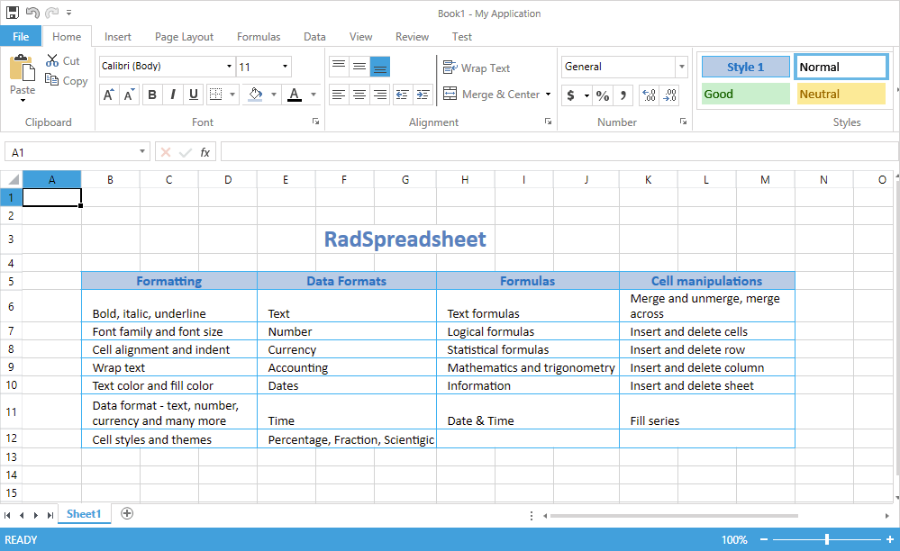

# {{ site.framework_name }} Spreadsheet Overview

Thank you for choosing Telerik __RadSpreadsheet__!

__RadSpreadsheet__ is a control that allows editing tabular data utilizing a variety of cell formatting options, styles and themes. 





>important__RadSpreadsheet__ operates with a rich document model that is completely decoupled from UI. The documentation of the model can be found in the RadSpreadProcessing section of the documentation for Telerik Document Processing [here](https://docs.telerik.com/devtools/document-processing/libraries/radspreadprocessing/overview).

## Features

Some of the features coming out-of-the-box with **RadSpreadsheet** are:

* Insert and delete cells, rows and columns

* Use different **cell formatting**:

	* various fonts and font sizes;	
	* fore color and background color;	
	* bold, italics and underline;	
	* vertical and horizontal cell alignment;	
	* text wrapping;	
	* cell borders;	
	* use cell styles and themes for a more consistent look.

* A battery of **data formatting** options:

	* Number;	
	* Currency;	
	* Accounting;	
	* Date;	
	* Time;	
	* Percentage;	
	* Fraction;	
	* Scientific;	
	* Text;	
	* Special;	
	* Custom.
	

* A broad range of **formulas** in different categories. **RadSpreadsheet** comes with more than 200 built-in functions. The API enables you to easily plug custom ones as well. For more informations, refer to the [Formulas](https://docs.telerik.com/devtools/document-processing/libraries/radspreadprocessing/features/formulas/formulas) section for SpreadProcessing.

* **Shapes and Images**: The UI enables you to work with images. [API](https://docs.telerik.com/devtools/document-processing/libraries/radspreadprocessing/features/shapes-and-images) for insertion, positioning and deletion of images in worksheets.	


* RadSpreadsheet enables you to show **Charts** and modify them as well: [Charts](). 


* **Document themes**

* **Auto fill** and **Series**: Fill cells automatically with data following a specific pattern.

* [**Data Validation**](): Enables you to control the type of data or the values that users enter into a cell. Different data validation rules are available, including list, number, date, text length or custom rules.

* [**Filtering**]() worksheet data.	

* [**Sorting**]() the data in the worksheet.	

* [**Find and replace data**](https://docs.telerik.com/devtools/document-processing/libraries/radspreadprocessing/features/find-and-replace).

* **Copy/Paste**: Add or copy worksheets within or across workbooks. Of course, copying and pasting of cells is supported as well.

* Customize row/column **headings**

* **Show/Hide** gridlines and headers

* **Merge** cells, merge cells across columns and unmerge

* **Resize** rows and columns, auto fit

* **Zoom** in and out each sheet separately

* **Named Ranges**: You can use the named ranges on workbook and worksheet levels.

* **Protection**: Different options available for protecting the workbook and its worksheets from modifications.

* [**Freeze panes**]()

* [**Printing**](): Many properties allowing you to customize the way the data will be printed. Some of them are automatic and custom scaling, headers and footers, print titles, page breaks, print area.

* [**Headers and Footers**](): The functionality enables you to add rich text content in the page margins when laying out a worksheet to pages.

* Create and use multiple sheets, each one with its own [**history**](https://docs.telerik.com/devtools/document-processing/libraries/radspreadprocessing/features/history) stack

* [**Selection** and active cell]()

* [Customizing the selection appearance]()

* **Scrolling**: There are two scrolling modes - **ItemBased** and **PixelBased**. The first one ensures that the whole content of the top left cell is visible, the latter designed for smoother interaction.

* Integration with __RadRibbonView__.  An easy to use [Predefined UI](). 

* [**Localization**](): You can easily translate the string resources of **RadSpreadsheet**.

## Supported formats: 

With RadSpreadsheet you can easily [import and export]() documents from the following formats:

* [**XLSX**](https://docs.telerik.com/devtools/document-processing/libraries/radspreadprocessing/formats-and-conversion/xlsx/xlsxformatprovider)


* [**XLS**](https://docs.telerik.com/devtools/document-processing/libraries/radspreadprocessing/formats-and-conversion/xls/xlsformatprovider) 

* [**CSV**](https://docs.telerik.com/devtools/document-processing/libraries/radspreadprocessing/formats-and-conversion/csv/csvformatprovider) 

* [**Plain text**](https://docs.telerik.com/devtools/document-processing/libraries/radspreadprocessing/formats-and-conversion/txt/txtformatprovider) 

* [**PDF**](https://docs.telerik.com/devtools/document-processing/libraries/radspreadprocessing/formats-and-conversion/pdf/pdfformatprovider) (export only)
 


## Telerik UI for WPF Support and Learning Resources

* [Telerik UI for WPF Spreadsheet Homepage](https://www.telerik.com/products/wpf/spreadsheet.aspx)
* [Get Started with the Telerik UI for WPF Spreadsheet]()
* [Telerik UI for WPF API Reference](https://docs.telerik.com/devtools/wpf/api/)
* [Getting Started with Telerik UI for WPF Components]()
* [Telerik UI for WPF Virtual Classroom (Training Courses for Registered Users)](https://learn.telerik.com/learn/course/external/view/elearning/16/telerik-ui-for-wpf) 
* [Telerik UI for WPF Spreadsheet Forums](https://www.telerik.com/forums/wpf)
* [Telerik UI for WPF Knowledge Base](https://docs.telerik.com/devtools/wpf/knowledge-base)


## See Also

* [Getting Started]()
* [Unsupported Features]() 
* [RadSpreadProcessing Documentation](https://docs.telerik.com/devtools/document-processing/libraries/radspreadprocessing/overview)
* [Useful Security Tips]()
