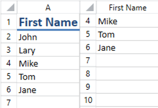
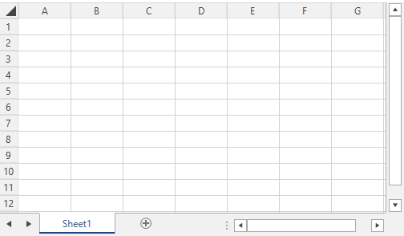
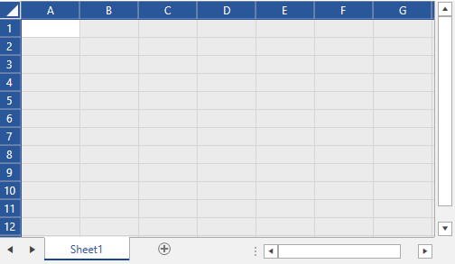

# Row and Column Headers

This article describes how you can customize the row and column headings of `RadSpreadsheet` and how to show or hide the row and column headers and the worksheet gridlines.

## Customizing Row and Column Headings

Giving your data meaningful names helps you better understand it. For example, if your document contains a column with the first names of your employees, the column name A does not necessarily help you understand the meaning of the data contained in that column. For the same reason, you probably are likely to have one header row in the document that will store the names of your columns. But when a user scrolls down, the content of the header row would be hidden and the user would not see the names.

It is useful to set the column heading name when the first row is not visible, as shown in the image below.

__Column with a Custom Heading Name__

### Change the Row and Column Headings

Each worksheet has a property called __RenderNameConverter__, which provides a mechanism for changing the row and column headings for UI purposes, including PDF export and [Printing](). Create a custom name converter and assign an instance of it to the RenderNameConverter property. The converter class must inherit from __HeaderNameRenderingConverterBase__.

The following example shows a simple implementation for the converter class used for creating the snapshots above.

__Creating a Custom Name Converter__

<snippet id='radspreadsheet-howto-customize-row-column-headers-block_1-cs' />

After implementing your custom name converter, instantiate it and assign it to the worksheet's __RenderNameConverter__ property. The following example sets a new instance of the custom name converter to a __RadSpreadsheet__'s worksheet.

__Instantiating and Assigning a Custom Converter__

<snippet id='radspreadsheet-howto-customize-row-column-headers-block_2-cs' />

>tip You can download a runnable project of the previous example from our online SDK repository [here](https://github.com/telerik/xaml-sdk/tree/master/Spreadsheet/WPF/CustomRowAndColumnHeadings).

## States of the Row and Column Headings

The headings of the rows and columns have different states. You can use these states to apply different styles to the items depending on whether they appear in a selection. This section describes the possible states of the headings in RadSpreadsheet.

* **HeadingState**: A property of type RowColumnHeadingBase that gets or sets the heading state. It is an enum and it can have the following values:
	* **Normal**: The heading is not included in any selection.

	* **Selected**: A cell from the row/column appears in a selection. 

	* **FullySelected**: All the cells included in the row/column are selected. 

* **SelectAllControlState**: A property of the SelectAllControl which is of type SelectAllControlState. The property gets or sets a value indicating whether the control is selected. It is an enum and it can have the following values:

	* **Normal**: The control is not selected.

		__SelectAllControl in Normal State__
		

	* **Selected**: The control is selected.

		__SelectAllControl in Selected State__
		

## Showing or Hiding Row and Column Headings

Row and column headings, as well as worksheet gridlines, are handy when creating or editing a document in __RadSpreadsheet__. However, at times you would want to hide them in order to make the spreadsheet more clean and presentable.

The __RadWorksheetEditor__ exposes a Boolean property __ShowRowColumnHeadings__. Its default value is true and this makes the row and column headings visible. Setting the property to false, as demonstrated in the following example, hides them.

__Hiding Row and Column Headers__

<snippet id='radspreadsheet-howto-hide-row-column-headers-and-gridlines-block_1-cs' />

## Showing or Hiding Gridlines

To show or hide the gridlines of __RadSpreadsheet__, set the __ShowGridlines__ Boolean property of __RadWorksheetEditor__ to true for showing the gridlines or false for hiding them. The following example shows how to disable the gridlines.

__Hiding Gridlines__

<snippet id='radspreadsheet-howto-hide-row-column-headers-and-gridlines-block_2-cs' />

>tip Find a runnable project of the previous example in the [WPF Samples GitHub repository](https://github.com/telerik/xaml-sdk/tree/master/Spreadsheet/WPF/CustomRowAndColumnHeadings).

## See Also

* [Hidden Rows and Columns]()
* [Selection]()
