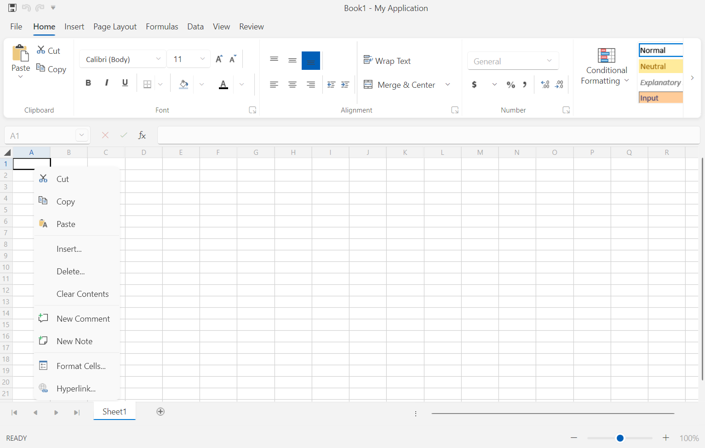
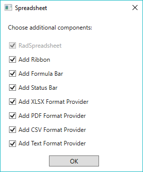
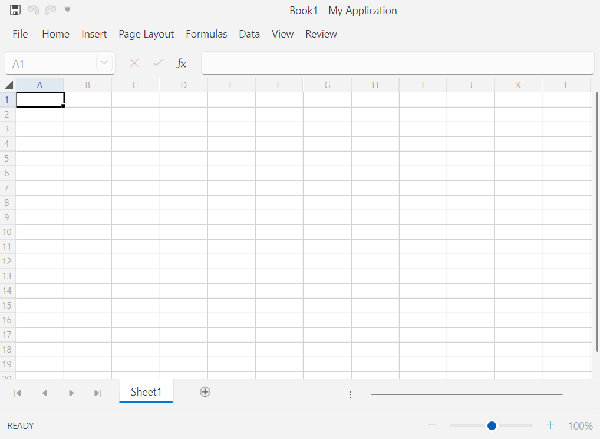

# Spreadsheet UI

`RadSpreadsheet` comes with pre-defined UI that is automatically wired with all of the commands provided by the control and shows its full potential. `RadSpreadsheetRibbon` automatically registers the UI components of RadSpreadsheet and keeps them up-to-date after each upgrade.

__RadSpreadsheet with default UI and context menu__

## Add RadSpreadsheet with Predefined UI to Your Application

`RadSpreadsheetRibbon` control compliments RadSpreadsheet with convenient ribbon exposing the variety of features the latter supports. With few lines of XAML you get all the UI expected from a standard spreadsheet editing application, including multiple ribbon tabs full of commands, styles gallery, formula and status bar. When updating from version to version, you'll automatically get UI for all the new commands we expose.

After dragging the RadRadSpreadsheet control from the Toolbox to the Designer of Visual Studio, you will be prompted to choose the UI components you would like to use in your application. The available options are as follows:

>This functionality is available since R1 2018 and supported in Visual Studio 2012 and later versions.

* __Add Ribbon__

* __Add Formula Bar__

* __Add Status Bar__

	> The different visual elements of RadSpreadsheet are described in the [Visual Structure]() help article.

* __Add XLSX Format Provider__: Registers the [__XlsxFormatProvider__](https://docs.telerik.com/devtools/document-processing/libraries/radspreadprocessing/formats-and-conversion/xlsx/xlsxformatprovider) in the __FormatProviders__ collection of RadSpreadsheet.

* __Add PDF Format Provider__: Registers the [__PdfFormatProvider__](https://docs.telerik.com/devtools/document-processing/libraries/radspreadprocessing/formats-and-conversion/pdf/pdfformatprovider) in the __FormatProviders__ collection of RadSpreadsheet.

* __Add CSV Format Provider__: Registers the [__CsvFormatProvider__](https://docs.telerik.com/devtools/document-processing/libraries/radspreadprocessing/formats-and-conversion/csv/csvformatprovider) in the __FormatProviders__ collection of RadSpreadsheet.

* __Add Text Format Provider__: Registers the [__TxtFormatProvider__](https://docs.telerik.com/devtools/document-processing/libraries/radspreadprocessing/formats-and-conversion/txt/txtformatprovider) in the __FormatProviders__ collection of RadSpreadsheet.

	> More information about the __FormatProviders__ property of __RadSpreadsheet__ is available in the [Import/Export]() topic.

__Choose the components you would like to use__

The following example shows how the XAML generated after enabling all options looks like.

#### __[XAML] Default Look__
{{region radspreadsheet-getting-started-spreadsheet-ui-0}}
	<Grid x:Name="spreadsheetLayoutRoot">
	    <Grid.RowDefinitions>
	        <RowDefinition Height="Auto"/>
	        <RowDefinition Height="Auto"/>
	        <RowDefinition/>
	        <RowDefinition Height="Auto"/>
	    </Grid.RowDefinitions>
	    <telerik:RadSpreadsheetRibbon BackstageClippingElement="{Binding ElementName=spreadsheetLayoutRoot, Mode=OneTime}" RadSpreadsheet="{Binding ElementName=radSpreadsheet, Mode=OneTime}"/>
	    <Controls:RadSpreadsheetFormulaBar Grid.Row="1" RadSpreadsheet="{Binding ElementName=radSpreadsheet, Mode=OneTime}"/>
	    <telerik:RadSpreadsheet x:Name="radSpreadsheet" Grid.Row="2">
	        <telerik:RadSpreadsheet.FormatProviders>
	            <Txt:TxtFormatProvider/>
	            <Csv:CsvFormatProvider/>
	            <Pdf:PdfFormatProvider/>
	            <Xlsx:XlsxFormatProvider/>
	        </telerik:RadSpreadsheet.FormatProviders>
	    </telerik:RadSpreadsheet>
	    <Controls:RadSpreadsheetStatusBar Grid.Row="3" RadSpreadsheet="{Binding ElementName=radSpreadsheet, Mode=OneTime}"/>
	</Grid>
{{endregion}}

To build the above example, you should add the following namespaces:

#### Namespaces

#### __[XAML]__
{{region radspreadsheet-getting-started-spreadsheet-ui-1}}
	xmlns:telerik="http://schemas.telerik.com/2008/xaml/presentation" 
    xmlns:Controls="clr-namespace:Telerik.Windows.Controls.Spreadsheet.Controls;assembly=Telerik.Windows.Controls.Spreadsheet" 
    xmlns:Txt="clr-namespace:Telerik.Windows.Documents.Spreadsheet.FormatProviders.TextBased.Txt;assembly=Telerik.Windows.Documents.Spreadsheet"
    xmlns:Csv="clr-namespace:Telerik.Windows.Documents.Spreadsheet.FormatProviders.TextBased.Csv;assembly=Telerik.Windows.Documents.Spreadsheet" 
    xmlns:Pdf="clr-namespace:Telerik.Windows.Documents.Spreadsheet.FormatProviders.Pdf;assembly=Telerik.Windows.Documents.Spreadsheet.FormatProviders.Pdf"
    xmlns:Xlsx="clr-namespace:Telerik.Windows.Documents.Spreadsheet.FormatProviders.OpenXml.Xlsx;assembly=Telerik.Windows.Documents.Spreadsheet.FormatProviders.OpenXml" 
{{endregion}}

## Minimization

The RadSpreadsheetRibbon element support minimizing its content so that only the tab headers remain visible. This is done via the `IsMinimized` property. 

#### __[XAML] Minimizing the RadSpreadsheetRibbon__
{{region radspreadsheet-getting-started-spreadsheet-ui-2}}
	<Grid x:Name="spreadsheetLayoutRoot">
	    <Grid.RowDefinitions>
	        <RowDefinition Height="Auto"/>
	        <RowDefinition Height="Auto"/>
	        <RowDefinition/>
	        <RowDefinition Height="Auto"/>
	    </Grid.RowDefinitions>
	    <telerik:RadSpreadsheetRibbon IsMinimized="True" BackstageClippingElement="{Binding ElementName=spreadsheetLayoutRoot, Mode=OneTime}" RadSpreadsheet="{Binding ElementName=radSpreadsheet, Mode=OneTime}"/>
	    <Controls:RadSpreadsheetFormulaBar Grid.Row="1" RadSpreadsheet="{Binding ElementName=radSpreadsheet, Mode=OneTime}"/>
	    <telerik:RadSpreadsheet x:Name="radSpreadsheet" Grid.Row="2">
	        <telerik:RadSpreadsheet.FormatProviders>
	            <Txt:TxtFormatProvider/>
	            <Csv:CsvFormatProvider/>
	            <Pdf:PdfFormatProvider/>
	            <Xlsx:XlsxFormatProvider/>
	        </telerik:RadSpreadsheet.FormatProviders>
	    </telerik:RadSpreadsheet>
	    <Controls:RadSpreadsheetStatusBar Grid.Row="3" RadSpreadsheet="{Binding ElementName=radSpreadsheet, Mode=OneTime}"/>
	</Grid>
{{endregion}}

__Minimized RadSpreadsheetRibbon__

## Customizing the Template of RadSpreadsheetRibbon

When you would like to change the way RadSpreadsheetRibbon looks like, or add custom functionality to it, you can extract its template. This can be achieved through the __Replace RadSpreadsheetRibbon with Editable XAML__ option of the Visual Studio Designer's context menu.

__Replace RadSpreadsheetRibbon with Editable XAML option of the Visual Studio Designer's context menu__

> Note that in this scenario, the RadSpreadsheetRibbon is replaced by its XAML code. Doing this, you will not be able to receive updates for the control and will not be able to take advantage of the styling functionalities. 

## Customizing the Template of the Default Context Menu

Extracting the template of the default context menu can be done using a pretty similar approach to the one described for RadSpreadsheetRibbon. Just right-click on RadSpreadsheet in the designer of Visual Studio and choose __Replace Default Context Menu with Editable XAML__.

You can also disable the default Context Menu or replace it with a custom implementation.

#### __[XAML] Disable Context Menu__
{{region radspreadsheet-getting-started-spreadsheet-ui-3}}
	<telerik:RadSpreadsheet x:Name="radSpreadsheet">
	    <telerik:RadSpreadsheet.WorksheetEditorContextMenu>
	        <x:Null/>
	    </telerik:RadSpreadsheet.WorksheetEditorContextMenu>
	</telerik:RadSpreadsheet>
{{endregion}}

#### __[C#] Disable Context Menu__
{{region radspreadsheet-getting-started-spreadsheet-ui-4}}
	this.radSpreadsheet.WorksheetEditorContextMenu = null;
{{endregion}}

#### __[VB.NET] Disable Context Menu__
{{region radspreadsheet-getting-started-spreadsheet-ui-5}}
	Me.radSpreadsheet.WorksheetEditorContextMenu = Nothing
{{endregion}}

## See Also

* [Getting Started with RadSpreadsheet]()
* [Visual Structure]()
* [Import/Export]()