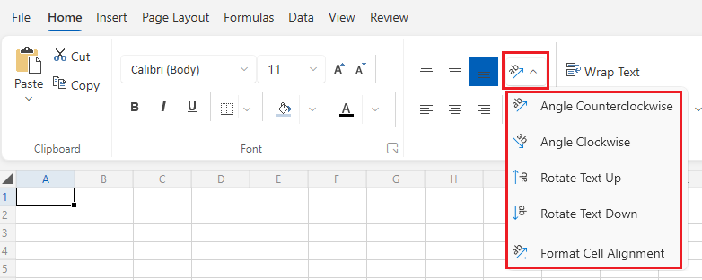
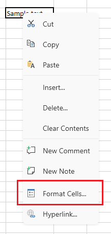
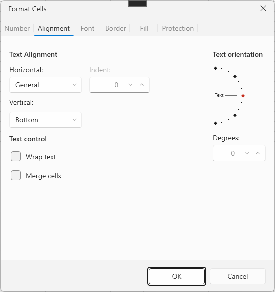

# Cell Text Rotation

__RadSpreadsheet__ allows you to change the orientation of the text displayed inside a cell by rotating it. This is useful, for example, when you want to fit narrow column headers by displaying their text at an angle or vertically instead of horizontally.

The text orientation of the selected cells can be changed through the [ribbon](), the worksheet editor's [context menu]() that can be used to open the __Format Cells__ dialog. It can also be set programmatically through the API of `RadWorksheetEditor`.

## Changing the Text Orientation through the UI

The __Home__ tab of the ribbon exposes a __Text Orientation__ drop-down button in the __Alignment__ group. It provides four predefined orientations and a shortcut to the __Format Cells__ dialog for setting a custom angle:

* __Angle Counterclockwise__&mdash;Rotates the text 45 degrees counterclockwise.
* __Angle Clockwise__&mdash;Rotates the text 45 degrees clockwise.
* __Rotate Text Up__&mdash;Rotates the text 90 degrees, so it reads vertically from bottom to top.
* __Rotate Text Down__&mdash;Rotates the text -90 degrees, so it reads vertically from top to bottom.
* __Format Cell Alignment__&mdash;Opens the __Alignment__ tab of the __Format Cells__ dialog.

__RadSpreadsheet Text Orientation Ribbon Button__



Rotation options are available also in the __Alignment__ tab of the __Format Cells__ dialog. The text orientation element lets you drag to any angle between -90 and 90 degrees, or type the exact number of degrees.

__RadSpreadsheet Text Orientation via the Format Cells Dialog__





Setting the rotation angle to __0__ (either from the dial or by typing it) clears any existing rotation and restores the default horizontal text.

## Setting the Text Orientation Programmatically

The rotation options available in the UI map to the `TextOrientationType` enumeration, exposed in the `Telerik.Windows.Controls.Spreadsheet` namespace:

* `AngleCounterclockwise`&mdash;Corresponds to a 45-degree rotation.
* `AngleClockwise`&mdash;Corresponds to a -45-degree rotation.
* `RotateTextUp`&mdash;Corresponds to a 90-degree rotation.
* `RotateTextDown`&mdash;Corresponds to a -90-degree rotation.

### Using the SetTextOrientationCommand

`RadWorksheetEditor` exposes the `SetTextOrientationCommand` through its `Commands` property. The command applies the requested orientation to the currently selected cells and is the same command used by the ribbon and the context menu.

__Rotating the Text of the Selected Cells through a Command__

```C#
RadWorksheetEditor editor = this.radSpreadsheet.ActiveWorksheetEditor;
editor.Selection.Select(new CellRange(0, 0, 0, 0));

editor.Commands.SetTextOrientationCommand.Execute(TextOrientationType.RotateTextUp);
```

The command is also exposed as a `SetTextOrientation` command descriptor on `WorksheetCommandDescriptors`, which lets you bind the `IsEnabled` state of a custom button to the current selection and protection state. For more information on command descriptors, see the [Command Descriptors]() article.

__Binding a Custom Menu Item to the Text Orientation Command Descriptor__

```XAML
<telerik:RadMenuItem Header="Rotate Text Up"
                      Command="{Binding Path=SetTextOrientation.Command}"
                      CommandParameter="{x:Static spreadsheet:TextOrientationType.RotateTextUp}" />
```

The `spreadsheet` namespace prefix used above maps to `clr-namespace:Telerik.Windows.Controls.Spreadsheet;assembly=Telerik.Windows.Controls.Spreadsheet`.

### Setting an Arbitrary Rotation Angle Directly on the Cells

To set a custom rotation angle without going through the command (for example, when generating a workbook in code), use the `SetTextRotation()`, `GetTextRotation()`, and `ClearTextRotation()` methods exposed on a cell selection.

__Reading and Changing the Rotation of a Cell__

```C#
Worksheet worksheet = this.radSpreadsheet.ActiveWorksheet;
CellSelection cell = worksheet.Cells[0, 0];

// The rotation angle must be between -90 and 90 degrees.
cell.SetTextRotation(30);

int currentRotation = cell.GetTextRotation().Value;

// Clears the rotation and restores the default horizontal text.
// cell.ClearTextRotation();
```

> The `TextRotation` property is also available on `CellStyle` instances, so a rotation angle can be included when you define a reusable cell style through the __Style__ dialog.

## See Also

* [Working with Selection]()
* [Command Descriptors]()
* [Protection]()
* [Worksheet Editor Dialogs]()
