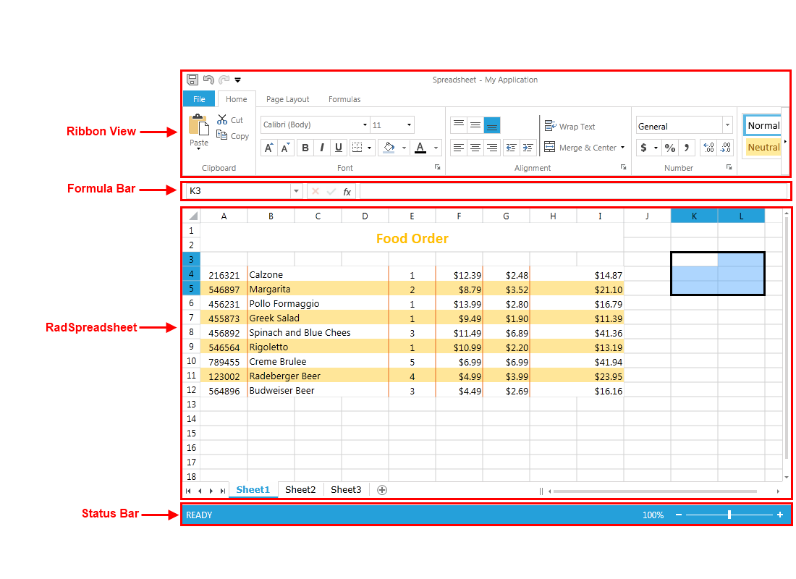
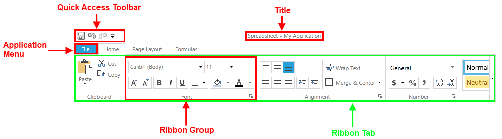
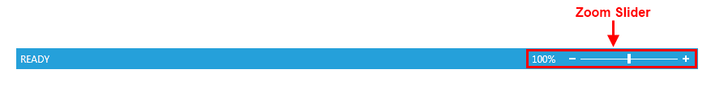

# Visual Structure

This section defines terms and concepts used in the scope of __RadSpreadsheet__ that will help you get familiar with the control. We highly encourage you to read the article before you continue with the rest of the documentation of __RadSpreadsheet__.      

__RadSpreadsheet__ is a control that allows editing tabular data utilizing a variety of cell formatting options, styles and themes. It can contain one or more Worksheets, each of which with its own [Scale Factor](). Every worksheet contains cells that are identified by a row number (rows are represented by numbers - 1, 2, 3) and a column number (columns are represented by letters of the alphabet in the UI).      

## Spreadsheet UI Visual Structure

* __Ribbon View__: An instance of RadRibbonView filled with controls which allow you to perform different actions on RadSpreadsheet. Some of the commands include open/save different types of files, undo/redo, copy/paste, apply different types of format or styles, even insert complex formulas.
            

* __Formula Bar__: It is located above the work area of the RadSpreadsheet. It holds three main components each one containing information about the active cell/cell range.
            

* __RadSpreadsheet__: A control that has a number of built-in features and tools, such as functions, formulas and data analysis tools that make it easier to work with large amounts of data.
            

* __Status Bar__: It is located along the bottom edge of the Spreadsheet UI. It contains information about the current state of the RadSpreadsheet. Also, it allows you to perform various actions upon it.
            

## RadSpradsheet's Ribbon View Visual Structure

* __Title__: The title allows you to specify the name of the application or the current document. In this case we have chosen the name "Spreadsheet".
            

* __Ribbon Tab__: RadSpradsheet comes with a RibbonView full of controls for manipulating it. Those controls are grouped logically in tabs. Every tab has a name and it pretty much describes what can be achieved with its content.
            

* __Ribbon Group__: Furthermore every tab is divided into groups. Groups allow for finer grained distribution of the controls among the tabs.
            

* __Quick Access Toolbar__: It is located in the upper left corner of the Spreadsheet UI above the individual tabs of the Ribbon View. It contains shortcuts to a number of commonly performed tasks such as save, undo and redo.
            

* __Application Menu__: It is placed to the left of the Quick Access Toolbar. It enables you to open spreadsheet files, create new ones or save them to different file formats.
            

## RadSpreadsheet's Formula Bar Visual Structure

* __Name Box__: It displays the cell reference of the active cell or the active cell range.
            

* __Buttons Box__: Contains three buttons. The first one, which cancels the edit action, and the second one, which accepts the edit action, are active only when editing a cell. The third button is always active and it opens the Insert Function dialog.
            

* __Formula Box__: Displays the data or formula stored in the active cell. It can be used to enter or edit a formula, a function, or data in a cell.
            

## RadSpreadsheet Visual Structure

* __Worksheet__: A grid or table composed of columns and rows that make it convenient to enter, organize, calculate and consolidate data. It is composed of cells where you actually keep and manipulate data.
            

* __Rows__: Rows run horizontally in a worksheet. Each row is identified by a number in the row header. There are more than one million rows in each worksheet.
            

* __Row Header__: It is the left-most column containing the numbers used to identify each row in a worksheet. It is located to the left of column A in the worksheet.
            

* __Column__: Columns run vertically in a worksheet. Each column is identified by a letter in the column header starting with A and running through to XFD.
            

* __Column Header__: It is the top-most row containing the letters used to identify each column in a worksheet. It is located above row 1 in the worksheet.
            

* __Cell__: Cell is the intersection point between a row and a column. It is the basic storage unit for data in RadSpreadsheet. In a cell name the row numbers always comes after the column letter.
            

* __Merged Cell__: Multiple adjacent cells combined into a single larger cell. When merging multiple cells, only the value of the top-left cell is preserved.
            

* __Selection__: can occur either using the mouse pointer or through code behind. All actions performed on data, including formatting must be executed using selection.
            

* __Select All Control__: Allows you to quickly select all cells in a worksheet. It is located in the top left corner of the worksheet where the row header and column header meet.
            

* __Sheet Selector__: Allows you to change the currently selected sheet or create a new one. In addition you can change the name of a given worksheet or the color of the corresponding tab.
            

## Status Bar Visual Structure

* __Zoom Slider__: It allows you to change the zoom level of the RadSpreadsheet. It can vary from 50% to 400%.
            
