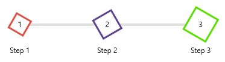
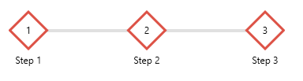

# Customizing Step Appearance

RadStepProgressBar allows you to customize the appearance of the [step item]() visual.

The parts that can be customized are the step shape (which is an ellipse by default) and also the content inside of the shape.

The shape appearance can be changed with the __ShapeGeometry__, __ShapeWidth__, __ShapeHeight__, __ShapeStroke__ and __ShapeStrokeThickness__ properties of __RadStepProgressBarItem__.

__Customizing step shape with direct property settings__
```XAML
	<telerik:RadStepProgressBar TrackThickness="4">            
		<telerik:RadStepProgressBarItem Content="Step 1"
										ShapeWidth="40" ShapeHeight="40"
										ShapeStroke="#DD5246" ShapeStrokeThickness="3">                
			<telerik:RadStepProgressBarItem.ShapeGeometry>
				<RectangleGeometry Rect="0,0,1,1">
					<RectangleGeometry.Transform>
						<RotateTransform Angle="-60" />
					</RectangleGeometry.Transform>
				</RectangleGeometry>
			</telerik:RadStepProgressBarItem.ShapeGeometry>
		</telerik:RadStepProgressBarItem>
		<telerik:RadStepProgressBarItem Content="Step 2"
										ShapeWidth="50" ShapeHeight="50"
										ShapeStroke="#5D438E" ShapeStrokeThickness="3">
			<telerik:RadStepProgressBarItem.ShapeGeometry>
				<RectangleGeometry Rect="0,0,1,1">
					<RectangleGeometry.Transform>
						<RotateTransform Angle="60" />
					</RectangleGeometry.Transform>
				</RectangleGeometry>
			</telerik:RadStepProgressBarItem.ShapeGeometry>
		</telerik:RadStepProgressBarItem>
		<telerik:RadStepProgressBarItem Content="Step 3"
										ShapeWidth="60" ShapeHeight="60"
										ShapeStroke="#59DE00" ShapeStrokeThickness="3">
			<telerik:RadStepProgressBarItem.ShapeGeometry>
				<RectangleGeometry Rect="0,0,1,1">
					<RectangleGeometry.Transform>
						<RotateTransform Angle="120" />
					</RectangleGeometry.Transform>
				</RectangleGeometry>
			</telerik:RadStepProgressBarItem.ShapeGeometry>
		</telerik:RadStepProgressBarItem>
	</telerik:RadStepProgressBar>
```



__Customizing step shapes with an implicit style__
```XAML
	<telerik:RadStepProgressBar TrackThickness="4">
		<telerik:RadStepProgressBar.Resources>
			<Style TargetType="telerik:RadStepProgressBarItem">
				<Setter Property="ShapeGeometry">
					<Setter.Value>
						<RectangleGeometry Rect="0,0,1,1">
							<RectangleGeometry.Transform>
								<RotateTransform Angle="45" />
							</RectangleGeometry.Transform>
						</RectangleGeometry>
					</Setter.Value>
				</Setter>
				<Setter Property="ShapeWidth" Value="50" />
				<Setter Property="ShapeHeight" Value="50" />
				<Setter Property="ShapeStroke" Value="#DD5246"/>
				<Setter Property="ShapeStrokeThickness" Value="3" />
			</Style>
		</telerik:RadStepProgressBar.Resources>  
		
		<telerik:RadStepProgressBarItem Content="Step 1" />
		<telerik:RadStepProgressBarItem Content="Step 2" />
		<telerik:RadStepProgressBarItem Content="Step 3" />
	</telerik:RadStepProgressBar>
```



The contents inside the shape can be changed with the __NotStartedIndicatorContent__, __CompletedIndicatorContent__, __IndeterminateIndicatorContent__ and the corresponding DataTemplate properties of RadStepProgressBarItem. Read more in the [Step Item Contents]() article.

The spacing between the items is controlled with the __StepSpacing__ property of RadStepProgressBar. Read more in the [Layout]() article.

## See Also
* [Getting Started]()
* [Customizing Track Appearance]()
* [Data Binding]()