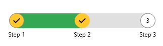

# Customizing Track Appearance

RadStepProgressBar allows you to customize the color and size of the [track visual]().

To change the color of the track's part that shows the progress, set the __TrackFill__ property of RadStepProgressBar.

To change the thickness of the track, set the __TrackThickness__ property of RadStepProgressBar.


```XAML
	<telerik:RadStepProgressBar TrackFill="#34A852" TrackThickness="30" SelectedIndex="1">
		<telerik:RadStepProgressBarItem Content="Step 1" />
		<telerik:RadStepProgressBarItem Content="Step 2" />
		<telerik:RadStepProgressBarItem Content="Step 3" />
	</telerik:RadStepProgressBar>
```



## See Also
* [Getting Started]()
* [Customizing Step Appearance]()
* [Data Binding]()